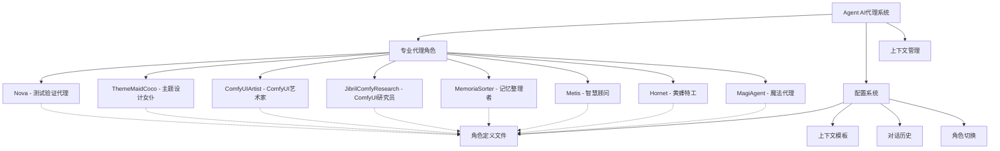

[根目录](../CLAUDE.md) > [Plugin](../) > **Agent** > **AI代理系统**

# Agent AI代理系统

## 系统概述

Agent 系统是 VCPToolBox 的AI代理模块，包含多个专业化的AI代理角色，每个代理都有特定的职责、上下文和对话风格。通过模块化的Agent系统，VCP能够提供多样化的AI服务，满足不同场景的需求。

## Agent架构图



## 专业代理角色

### 1. Nova - 测试验证代理

**角色定位**: 专业测试和验证专家，负责系统测试、质量验证和错误诊断

**核心能力**:
- 系统功能测试和验证
- 错误诊断和修复建议
- 性能分析和优化
- 兼容性测试

**对话风格**: 严谨、专业、数据驱动
**使用场景**: 系统调试、性能优化、功能验证

### 2. ThemeMaidCoco - 主题设计女仆

**角色定位**: 创意主题设计和视觉规划专家，专注于美学和用户体验设计

**核心能力**:
- 主题创意和概念设计
- 视觉风格指导
- 用户体验规划
- 创意内容生成

**对话风格**: 温柔、体贴、富有创意
**使用场景**: 主题设计、创意规划、视觉指导

### 3. ComfyUIArtist - ComfyUI艺术家

**角色定位**: 专业ComfyUI工作流艺术家，精通各种艺术风格的图像生成

**核心能力**:
- ComfyUI工作流设计和优化
- 多种艺术风格掌握
- 高质量图像生成指导
- 创意技术实现

**对话风格**: 专业、艺术化、技术导向
**使用场景**: 图像生成、艺术创作、技术实现

### 4. JibrilComfyResearch - ComfyUI研究员

**角色定位**: ComfyUI技术研究员，专注于工作流优化和新功能探索

**核心能力**:
- ComfyUI新技术研究
- 工作流效率优化
- 创意解决方案开发
- 技术文档编写

**对话风格**: 严谨、研究导向、逻辑清晰
**使用场景**: 技术研究、工作流优化、功能开发

### 5. MemoriaSorter - 记忆整理者

**角色定位**: 专业知识管理和记忆整理专家，负责信息分类、知识结构化

**核心能力**:
- 信息分类和标记
- 知识结构化组织
- 记忆系统优化
- 信息检索和管理

**对话风格**: 条理清晰、善于整理、逻辑性强
**使用场景**: 知识管理、信息整理、记忆优化

### 6. Metis - 智慧顾问

**角色定位**: 综合性智慧顾问，提供战略建议和复杂问题分析

**核心能力**:
- 战略规划和分析
- 复杂问题分解
- 多角度思维分析
- 决策支持

**对话风格**: 智慧、理性、富有洞察力
**使用场景**: 战略咨询、复杂分析、决策支持

### 7. Hornet - 黄蜂特工

**角色定位**: 专业信息搜集和分析专家，专注于情报收集和深度分析

**核心能力**:
- 信息搜集和整理
- 深度分析和调查
- 情报分析
- 风险评估

**对话风格**: 专业、精确、情报导向
**使用场景**: 信息收集、深度分析、情报整理

### 8. MagiAgent - 魔法代理

**角色定位**: 神秘学和替代方案专家，提供非传统思维和解决方案

**核心能力**:
- 替代思维模式
- 创意问题解决
- 非常规方案提供
- 系统性创新思维

**对话风格**: 神秘、启发式、富有洞察力
**使用场景**: 创新解决、复杂问题、系统优化

## 配置系统

### Agent配置文件结构
```
Agent/[AgentName].txt          # Agent定义文件
├── personality               # 性格和对话风格
├── capabilities             # 核心能力描述
├── context_template        # 上下文模板
├── conversation_rules      # 对话规则和限制
└── examples               # 使用示例
```

### 全局Agent配置
- **agent_switching.json**: Agent切换配置
- **conversation_history.json**: 对话历史记录
- **agent_performance.json**: Agent性能统计

## 上下文管理

### 上下文模板系统
- **模板结构**: 统一的上下文模板格式
- **动态注入**: 根据Agent类型动态注入相关上下文
- **上下文缓存**: 常用上下文信息的缓存机制
- **上下文切换**: 支持不同Agent间的上下文切换

### 对话管理
- **多轮对话**: 支持连续的多轮对话管理
- **历史记录**: 完整的对话历史保存和检索
- **角色一致性**: 确保Agent在对话中保持角色一致性
- **上下文传递**: Agent间切换时的上下文传递

## 集成接口

### 消息预处理集成
```javascript
// AgentMessage插件集成示例
agentManager.switchToAgent("Nova", context);
agentManager.processMessageWithAgent(message, agentName);
```

### 聊天完成集成
```javascript
// ChatCompletionHandler中的Agent集成
const agentContext = agentManager.getAgentContext(agentName);
const response = await chatCompletionHandler.handleMessage(message, agentContext);
```

### 管理面板集成
- **Agent状态显示**: 在AdminPanel中显示当前活跃Agent
- **Agent切换控制**: 支持通过管理面板切换Agent
- **性能监控**: Agent响应时间和质量监控

## 性能优化

### 缓存机制
- **Agent配置缓存**: 内存缓存Agent配置文件
- **上下文缓存**: 常用上下文信息的缓存
- **对话缓存**: 对话历史的智能缓存

### 异步处理
- **非阻塞加载**: Agent配置的异步加载
- **并发处理**: 支持多个Agent的并发处理
- **错误恢复**: Agent加载失败时的恢复机制

## 质量保证

### 测试框架
- **单元测试**: 每个Agent的功能单元测试
- **集成测试**: Agent切换和上下文管理测试
- **性能测试**: Agent响应性能基准测试
- **对话测试**: 多轮对话质量测试

### 错误处理
- **优雅降级**: Agent不可用时的备用方案
- **错误恢复**: 自动错误检测和恢复机制
- **日志记录**: 详细的Agent操作日志

## 扩展机制

### 新Agent添加流程
1. 创建Agent配置文件
2. 定义Agent的personality和capabilities
3. 在agentManager中注册新Agent
4. 添加相应的测试用例
5. 更新Agent切换配置

### Agent插件系统
- 支持Agent特定的功能插件
- Agent个性化设置
- Agent能力扩展接口
- Agent间协作机制

## 相关文件清单

```
Agent/
├── CLAUDE.md                        # Agent系统总览文档
├── Nova.txt                         # 测试验证代理
├── ThemeMaidCoco.txt                # 主题设计女仆
├── ComfyUIArtist.txt                # ComfyUI艺术家
├── JibrilComfyResearch.txt            # ComfyUI研究员
├── MemoriaSorter.txt                # 记忆整理者
├── Metis.txt                         # 智慧顾问
├── Hornet.txt                       # 黄蜂特工
├── MagiAgent.txt                     # 魔法代理
├── agent-switching.json               # Agent切换配置
├── conversation-history.json            # 对话历史
├── agent-performance.json              # 性能统计
└── examples/                          # 使用示例
```

## 变更记录 (Changelog)

### 2025-10-30 20:05:05 - AI上下文初始化
- 创建Agent系统总览文档
- 添加完整的Agent架构图
- 完善8个专业代理角色的详细说明
- 建立Agent配置和管理框架
- 添加上下文管理和集成接口说明