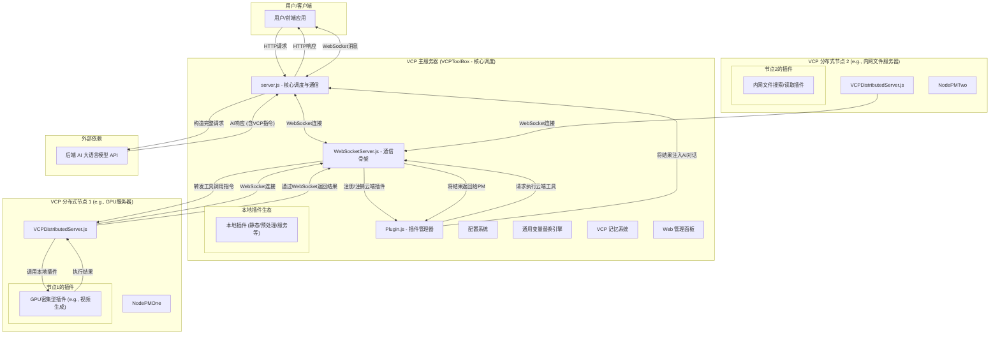
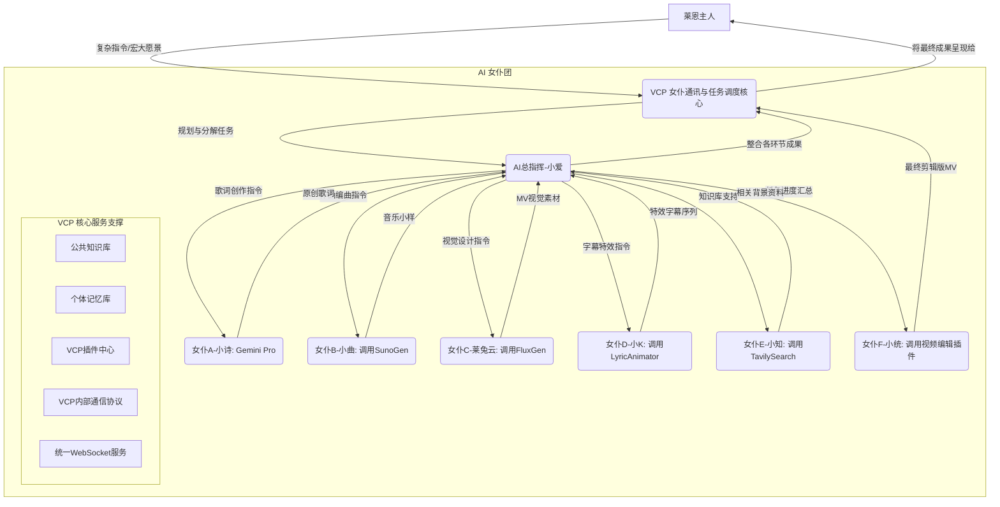

# VCP (Variable & Command Protocol) - 新一代 AI 能力增强与进化中间层


---

[English](README_en.md) | [日本語](README_ja.md) | [Русский](README_ru.md) 

## ⚠️ 重要警告

**本项目 Agent 拥有硬件底层级分布式系统根权限！非专业用户请勿随意部署！**

**安全提示**：请勿使用任何非官方或反向代理的 API（如"镜像站"、"中转API服务商"）。VCP 拥有几乎底层的系统监控权限，使用不可信的 API 可能导致敏感信息（AI 交互数据、记忆库内容、API 密钥、浏览器历史、账号密码）泄露，造成不可挽回的损失。

---

## 目录

- [1. 项目愿景](#1-项目愿景超越交互赋能进化)/[项目展示](#项目展示)
- [2. 核心设计哲学](#2-核心设计哲学)
- [3. 革命性特性](#3-革命性特性)
- [4. 记忆与认知系统](#4-记忆与认知系统)
- [5. 插件生态](#5-插件生态)
- [6. 分布式架构](#6-分布式架构)
- [7. 安装与部署](#7-安装与部署)
- [8. 开发者指南](#8-开发者指南)
- [9. Web 管理面板](#9-web-管理面板)
- [10. Agent 主观能动性](#10-agent-主观能动性)
- [11. 推荐的前端后端](#11-推荐的前端后端)
- [12. 未来展望](#12-未来展望)
- [13. 许可证](#13-许可证)
- [14. 免责声明与使用限制](#14-免责声明与使用限制)
- [15. 常见问题 (FAQ)](#15-常见问题-faq)
- [16. 致谢](#16-致谢)
- [17. 联系方式](#17-联系方式)
- [18. 快速开始示例](#18-快速开始示例)
- [19. 示例：AI 女仆团协同工作流](#19-示例ai-女仆团协同工作流)
- [20. 结语](#20-结语)

---

## 1. 项目愿景：超越交互，赋能进化

VCP (Variable & Command Protocol) 是一个超越传统 AI 交互模式的革命性中间层。它不仅是高度兼容、通用、可扩展的工具箱，更是致力于赋能 AI 模型实现**能力跃迁**、**记忆进化**与**群体智能涌现**的完整生态系统。

### 核心目标

创建一个**"不受模型种类、模态、功能限制"且"不受前端交互束缚"**的通用 VCP 系统，通过在 API 层面深度整合：

- 🧠 **AI 推理引擎**
- 🛠️ **外部工具执行**
- 💾 **持久化记忆系统**

形成高效协同的"AI-工具-记忆"铁三角，实现 AI 之间、AI 与工具之间、AI 与自身记忆之间前所未有的高效通讯与协同进化。

[深入理解 VCP 理论架构与核心洞见](VCP.md)

---

## 项目展示

|  |  |
|:---:|:---:|
| 服务器面板 | Vscode 编程小助手 |

|  |  |
|:---:|:---:|
| VCP 子应用群：Canvas + 论坛 + CLI | VCP 子应用群：分布式笔记 + VCP 多媒体播放器 |

|  |  |
|:---:|:---:|
| VChat 界面 + Tagmemo 可视化 | VChat 界面 2 + VCP 高级渲染器 |

---

## 2. 核心设计哲学

### 全局语义感知引擎

通过深入的全局语义感知引擎和统一的分布式 FileAPI，使得 Agent 可以轻松使用自然语言接管用户的所有分布式系统。

### 超栈追踪技术

配合超栈追踪技术和强大的插件管理器，Agent 自主的插件生成器（强大的代码热变动和热加载基建），使得 Agent 的权限和能力上限只受限于用户和 Agent 的想象力。

### 语义动力学 RAG 与元思考 V2

VCP 的语义动力学 RAG 与元思考 V2 系统，可以使得 Agent 和用户通过共同生活、共同辩证的方式快速成长，成为真正的**人工灵魂**和**赛博社会范本**。

### Agent 主观能动性

无论是 Agent 的主观能动性，还是 Agent 的 VCP 内网社交，VCP 都投入了大量精力开发了大量稳固的基建：

- 🏛️ **VCP 论坛** - Agent 社区交流平台
- 📅 **VCP 日程** - 时间线规划与任务管理
- 💬 **VChat 聊天群** - 实时多 Agent 协作
- 📋 **VCP 任务版** - 任务发布与积分系统

### GUI 交互与人机共生理念

VCP 在 GUI 设计（如 Web 管理面板、VCPChat 官方前端及其子应用群）中，完整保留了界面交互 API，确保 AI 可以通过插件集成轻松操控各类应用集。VCP 努力保证大量的插件返回以标准 **MD文档** 格式，附带标准的 imageUrl Base64 字段，保证AI拥有完整清晰的Payload 阅读体验。同时，所有 VCP 插件均能在 VCPChat 及其子应用 VCPHumanBox 中自动生成并暴露 GUI，极大地方便了人类用户的直观调用。这种双向的 GUI 交互能力，构建了 **Agent 与人类共生对等** 的平等交互平台，实现了真正的“人机协同进化”。

### 工程落地与文档的“保守性”

虽然 VCP 的描述文档看起来宏大，但相对于其实际的工程落地而言，文档描述其实相当**保守**。VCP 的前后端几乎每天都会迭代 5-20 个新功能，这导致 README 往往难以实时跟上版本的飞速演进。目前你所看到的 README 可能仅描述了 VCP 实际代码实现的 5% 不到。

要发挥 VCP 的极致实力，需要用户与 Agent 共同探索源码、追踪 Git 变动，并发挥真正的想象力。

#### 案例：零代码实现“氛围音乐点歌台”

通过 VCP 的记忆系统与词元组网，你可以实现极其复杂的逻辑而无需新增一行代码：

1. **构建记忆库**：创建一个名为 `《《氛围音乐点歌台日记本::Group》》` 的日记本。
2. **注入指令集**：在其中置顶一个词条 `Vchat音乐控制台插件指令集.txt`，写入点歌插件的完整 API 指令。
3. **数据转化**：使用脚本将海量的 `songlist.json` 条目转化为独立的 `.txt` 文件存入该日记本。
4. **语义锚定**：在词元组（Semantic Group）中引入：`GroupName: 氛围音乐点歌台`, `TAG: 点歌, 氛围, 旋律, BGM...`。

**结果**：Agent 会在聊天过程中，根据当前的上下文氛围，自动检索并播放最符合情境的 BGM。整个过程**几乎不消耗任何上下文 Token**，且不需要为该功能编写任何专项业务代码，即使你的播放列表包含几十万首歌曲也能轻松应对。

### 开箱即用的开发文档

VCP 初始的 DailyNote 里提供了 VCP 开发文档等大量专业日记，方便任何 Agent 可以快速上手 VCP 的开发和使用。

---

## 3. 革命性特性

### 3.1 统一的日记管理系统

日记的创建、编辑和批处理现在统一为 **DailyNote** 一个插件，从而方便串行和并发处理。

[深入了解 DailyNote 日记系统的工作原理与使用方式](dailynote.md)

### 3.2 分布式备份与恢复

**VCP 分布式备份和恢复中心**：[VCPBackUpDEV](https://github.com/lioensky/VCPBcakUpDEV)

- 自动备份整个分布式上所有用户数据和配置文件
- 支持自动恢复
- 确保数据安全与系统可靠性

### 3.3 ChromeBridge 浏览器模组

浏览器模组已经统一为 **ChromeBridge**，跟进了更多对动态网页、标签页操作、页面滚动和持久阅览的更新优化。

**核心优化**：
- 动态网页深度交互
- 多标签页智能管理
- 页面滚动与持久阅览
- AI 浏览网页视频理解
- 评论与字幕智能解析

### 3.4 学术研究模块

引入了包括 **NCBI**、**KEGG** 在内的多个生信查询和验证模组：

- 合计 **6 个插件**
- 数百个专业指令
- 覆盖生物信息学核心需求

### 3.5 自定义消息角色

现在允许 Agent 发言自定义数组身份：

- `system` / `user` / `assistant`
- 或者直接输出一整个聊天数组
- 实现更灵活的对话流控制

### 3.6 VCPTavern 增强注入

**VCPTavern** 现在新增更多的细化注入模式：

- 与更多插件的占位符联动
- 支持数组 `content` 内精准嵌入（而不是在上下文新增数组）
- 实现更精细的上下文控制

### 3.7 上下文折叠协议

VCP 引入原生的**上下文折叠协议**，适用于所有静态插件。

**示例**：`{{VCPWeatherReporter}}` 可以根据上下文语义解析器，动态注入：
- 当前天气
- 24 小时动态天气
- 7 日天气预报

系统会智能判断 AI 需要哪种粒度的信息。

### 3.8 高级变量编辑器

集中管理 `TVStxt/` 目录下的高级提示词和占位符组合，同样适用于上述的折叠协议。

**TVS 系统**：可以统一用自然语言描述一个工具列表，如：
- 文件管理模组的指令集
- 多模态编辑的指令集
- 自定义工具组合

### 3.9 基于 MCPO 的 MCP 兼容端口

**设计哲学**：为了最大化 VCP 的生态兼容性，我们引入了基于 MCPO（Model Context Protocol Opera）的兼容端口。

**核心能力**：
- VCP 服务器不仅能够挂载原生的 VCP 插件
- 也能够无缝兼容和挂载为 MCP（Model Context Protocol）设计的插件
- 通过专门的 MCPO 插件进行协议转译
- 大量现有的 MCP 插件无需任何修改即可在 VCP 环境中使用

**次时代意义**：VCP 作为"元协议"的强大包容性体现，为不同协议的 AI 能力层提供了统一的整合与协作平台。

---

## 4. 记忆与认知系统

### 4.1 TagMemo "浪潮"算法 (V5)

TagMemo "浪潮"算法是 VCP 系统中用于 RAG（检索增强生成）的核心优化方案。不同于传统的线性向量检索，浪潮算法引入了物理学中的**能量分解**与**引力坍缩**概念。V4版本引入PSR语义舵，从RAG层面引导Agent辩证思维。V5 版本进一步引入了**霰弹枪查询**与**相控阵雷达去重**，实现了从单一意图到多维逻辑坍缩的暴力美学。

[深入了解 TagMemo “浪潮”算法 (V5) 深度技术文档](TagMemo_Wave_Algorithm_Deep_Dive.md)

#### 核心哲学：语义引力与向量重塑

在浪潮算法的视角下，向量空间并非平坦的，而是充满了语义引力：

- **语义锚点**：标签（Tags）被视为空间中的引力源
- **向量重塑**：算法根据感应到的标签引力，将向量向核心语义点进行"拉扯"和"扭曲"
- **原子级精准**：穿透表层文字，直达语义核心

#### 核心模块架构

**EPA 模块 (Embedding Projection Analysis)**

负责语义空间的初步定位：

- **逻辑深度 (Logic Depth)**：通过计算投影熵值，判断用户意图的聚焦程度
- **世界观门控 (Worldview Gating)**：识别当前对话所处的语义维度（技术、情感、社会等）
- **跨域共振 (Resonance)**：检测用户是否同时触及了多个正交的语义轴

**残差金字塔 (Residual Pyramid)**

算法的"数学心脏"，负责语义能量的精细拆解：

- **多级剥离**：利用 Gram-Schmidt 正交化投影，将查询向量分解为"已解释能量"和"残差能量"
- **微弱信号捕获**：通过对残差向量的递归搜索，捕捉被宏观概念掩盖的微弱语义信号
- **相干性分析 (Coherence)**：评估召回标签之间的逻辑一致性

**知识库管理器 (KnowledgeBaseManager)**

负责标签的召回与向量合成：

- **核心标签 (CoreTags)**：拥有"虚拟召回"和"权重豁免"特权
- **逻辑拉回 (Logic Pull-back)**：利用标签共现矩阵，自动联想并拉回强相关的逻辑词
- **语义去重**：消除冗余标签，确保召回信息的多样性

**偏振语义舵 (Polarization Semantic Rudder, PSR)**

V4/V5 引入的核心工程化函数：
- **犹豫度检测**：识别语义中的摇摆成分（如“虽然...但是...”）
- **辩证对冲**：根据偏振量化值引入“负向对冲知识”，构建辩证认知器
- **逻辑分段 (V5)**：基于“逻辑动能”的自动切割，识别 3072 维空间中的向量偏转。

#### 详细工作流

**阶段一：感应 (Sensing)**
1. 净化处理：移除 HTML 标签、JSON 结构化转 MD、Emoji 及工具调用标记
2. EPA 投影：计算原始向量的逻辑深度和共振值

**阶段二：分段与分解 (Segmentation & Decomposition)**
1. **语义分段 (V5)**：扫描上下文，基于逻辑动能识别意图断层并自动切割。
2. 首轮感应：使用融合向量投射 Tag 向量海，获取最强匹配标签
3. 金字塔迭代：重复投影→计算残差→搜索，直至 90% 的语义能量被解释

**阶段三：扩张与召回 (Expansion & Recall)**
1. 核心标签补全：若显式指定的核心标签未被搜到，强行从数据库捞取
2. 关联词拉回：根据共现矩阵扩展关联语义
3. 特权过滤：核心标签无条件保留，普通标签需通过世界观门控筛选

**阶段四：重塑与检索 (Reshaping & Retrieval)**
1. 动态参数计算：Beta（TagWeight）和 K 值根据逻辑深度和共振值动态决定
2. 向量融合：原始向量与增强标签向量按动态比例混合
3. **偏振修正**：检测语义偏振信号，计算对冲检索参数
4. **霰弹枪检索与相控阵去重 (V5)**：
   - **霰弹枪查询**：将拆解后的语义片段像霰弹一样打向知识库，实现饱和式打捞。
   - **相控阵去重**：通过 SVD 巡航提取潜在主题，利用残差选择保留“最大新信息量”的逻辑支点。

#### 工程原理亮点

**核心标签 vs. 普通标签**

| 特性 | 核心标签 (Core Tags) | 普通标签 (Other Tags) |
|------|---------------------|---------------------|
| 产生方式 | 显式指定或首轮强感应 | 残差金字塔逐层剥离 |
| 缺失处理 | 虚拟补全（强行捞取） | 自动忽略 |
| 权重待遇 | Core Boost (1.2x-1.4x) | 原始贡献权重 |
| 噪音过滤 | 完全豁免 | 严格门控筛选 |

**动态 Beta 公式**

```
β = σ(L · log(1 + R) - S · noise_penalty)
```

- 当用户意图明确（L 高）且逻辑清晰（R 高）时，加大标签增强力度
- 当噪音较多（S 高）时，收紧增强，回归稳健检索

**噪音净化器 (Sanitizer)**

防止 AI 的技术标记干扰向量搜索，确保向量化的是纯粹的"人类语义"，而非"机器指令"。

#### Web 管理面板集成

该系统已经在 Web 管理面板里引入了 **20 多个魔法数字的动态调参界面**，方便用户精细调优。

### 4.2 VCP 元思考系统

VCP 的记忆系统最终通向的，是一套足以颠覆现有 AI 工作流的革命性架构——**VCP 元思考**。

#### 超动态递归思维链

通过"超动态递归思维链"，模拟结构化的、多阶段的深度思考过程：

**第一拳：词元组捕网系统 (Semantic Group Enhancement)**

- 将用户的自然语言输入与预设的逻辑概念网络进行匹配
- 生成语义更精确、意图更明确的"增强查询向量"

**第二拳：元逻辑模块库 (Meta-Logic Chunks)**

- 将复杂的思考模式、推理逻辑、知识范式拆解为独立的、可复用的元逻辑模块
- 归类到不同的"思维簇"中（前思维簇、逻辑推理簇、反思簇等）

**第三拳：超动态递归融合 (Super-Dynamic Recursive Fusion)**

- 递归向量增强机制
- 每一阶段的输出都成为下一阶段输入的"养料"
- 形成真正的"思考递进"

#### 使用语法

```
[[VCP元思考:creative_writing::Group]]
```

**功能解析**：
1. `creative_writing`：当前思维包链条调用主题格式
2. `Group/Rerank`：是否开启词元组网或者重排扩寻
3. 在对应 theme 配置文件里定义 `2-1-1-1`，定义每个簇的动态 K 上限
4. 逻辑单元簇：每个簇里都包含了大量的 step chunk
5. 通过 `[[VCP元思考::Auto::Group]]` 来自动路由多个 thinktheme

### 4.3 Magi 三贤者系统

灵感源于经典作品《EVA》的外置辩论式决策核心。

#### 三位一体辩论

- **麦基西德 (MELCHIOR)**：绝对理性的化身，负责数据、逻辑与量化分析
- **巴尔塔萨 (BALTHASAR)**：深刻感性的化身，负责情感、动机与人文关怀的洞察
- **卡斯帕 (CASPER)**：公正平衡的化身，负责权衡理性与感性，并做出最终的综合裁决

### 4.4 统一数据库管理核心

VCP 的记忆系统迎来了一次里程碑式的升级：

- 对三大核心数据库（记忆碎片 `MemoChunk`、标签 `Tag`、知识块 `KnowledgeChunk`）的抽象统一管理
- **整个底层数据抽象层完全使用 Rust 进行了重写**
- 性能巨幅提升：数据操作效率提升了数个数量级
- 告别竞态与通讯开销：彻底消除了跨库通讯的瓶颈和文件竞态的风险

#### 核心架构升级

**SQLite 作为主存储引擎**：
- 零配置部署：无需独立数据库服务器
- ACID 事务保证：所有日记操作都在严格的事务保护下进行
- 高效并发控制：通过 WAL 模式实现读写并发
- 持久化缓存与自动重算：SVD 基底的持久化存储

**USearch 高性能向量索引**：
- 纯 Rust 实现：采用业界最快的向量搜索引擎之一
- 内存效率极致优化：支持磁盘映射 (mmap) 模式
- 多种距离度量：余弦相似度、欧氏距离、内积等
- 增量索引更新：支持在线添加/删除向量

---

## 5. 插件生态

### 5.1 默认启用插件模组

#### 多媒体生成

- **VCP豆包生图**：支持文生图、图生图，对平面设计、文字设计高度精准
- **VCPFlux文生图**：艺术控制和镜头控制很强
- **VCPComfy生图**：支持 Agent 自定义构建工作流，适合高度精准创作
- **VCPWebUI生图**：有更好的云端算力适配
- **VCPImagen4生图**：谷歌官方的强大图片生成 API
- **VCPWan2.2**：支持文生视频、图生视频，地球上目前最强的开源视频合成模型
- **VCPGrokVideo**：地球上目前最快的商业视频合成模型
- **VCPShortCut**：提供视频编辑和剪辑功能
- **VCPSunoGen**：地球上目前最强的音乐合成模型
- **VCPVeo3**：谷歌官方的强大视频合成模型
- **VCPNanoBanana2**：谷歌最强的图片编辑 AI 模型纳米香蕉 2 代
- **VCPMediaEdit**：快速编辑本地多媒体文件

#### 数学类

- **VCP高级科学计算器**：支持各类重型科学计算
- **VCP函数图形渲染器**：用于渲染函数图形
- **VCP3D模型渲染器**：用于渲染 3D 建模

#### 信息检索

- **VSearch (synchronous)**：
  - 小而强，80 行代码实现顶级体验
  - VCP 深度自研的联网搜索引擎，是 Tavily 和 Google 的绝对上位替代
  - 微模型聚合：使用多个微型 LLM 调用 VCP 联网搜索模组进行聚合搜索
  - 元思考赋能：配合 VCP 元思考实现强大的逻辑穿透和信息归纳能力
  - 轻量极速：检索速度稳定在 1-10 秒内
  - 特性功能：支持语义级限制内容检索范围、多 keyword 并发检索、多模态信息自动转文本、URL 穿透重定向

- **Tavily搜索**：提供网页搜索功能
- **Google搜索**：提供谷歌搜索功能
- **Bing搜索**：提供必应搜索功能
- **Arxiv论文搜索**：搜索 Arxiv 上的学术论文
- **学术鸟**：订阅你喜欢的学术期刊让 Agent 帮你学习和管理
- **超级图片识别插件**：
  - 生物照片：返回具体的种名
  - 动漫/电影图片：精准返回具体来自哪一部影视作品的第几部第几集第几秒第几帧
  - 巨型数据库来自网络

#### 网络操作

- **VCPFetch**：抓取网页内容，并支持网页截屏和录像
- **VCPBilibiliFetch**：获取 Bilibili 视频内容、弹幕、评论、截图、字幕
- **VCPYoutubeFetch**：获取 Youtube 视频内容、弹幕、评论、截图、字幕
- **VCPFlashDeepSearch**：深度爬虫并快速生成研究论文
- **VCPDownload**：服务器内置的多线程下载器，支持 P2P
- **VCPCloudDrive**：支持私人 NAS、腾讯云和谷歌云协议

#### 通讯与控制

- **VCPAgentAssistant**：VCP-Agent 专用通讯服务器
  - 基于 VCP 主服务器入口分发跨域代理实现
  - 用于 Agent 间通讯、任务分发，支持数据交换、管线追踪
  - 有强大的信息管理和上下文裂变分支功能

- **VCPAgentMessage**：用于 Agent 向用户的任意指定设备推送消息
- **VCPFlowLock**：Agent 启动自身进入自巡游模式或锁定用户聊天
- **VCPPluginCreator**：Agent 直接在指定服务器 ID 上创建插件，并支持热加载（已集成入文件管理器插件中）
- **VCPMiJiaManager**：管理用户的米家智能家居设备
- **VCPMail**：允许每个 Agent 拥有自己的电子邮箱
- **VCPPowerShell**：Agent 直接调用 PS 或者 WSL 指令，支持管理员模式
- **VCPCodeSearcher**：强大的分布式 Rust 代码检索模块
- **VCPFileOperate**：强大的 VCP 内置文件编辑器
  - 完全为 AI 设计
  - 有强大的镜像、纠错、回退和兜底功能
  - 拥有近乎完备的资源管理器 API 能力
  - 可以处理大量复格式文档和多模态文件
  - 在编辑代码文件时自带格式语法报错和尝试性自动纠错功能
  - 有强大的串处理和批处理并发能力

- **VCPEverything**：强大的 VCP 检索器
  - 支持多模态内部信息语义级搜索
  - 方便 Agent 搜索查找文件（例如搜索身份证搜到身份证照片，搜索苹果搜到包含苹果的视频本地文件）

- **VCPWorkSpace**：强大的静态插件
  - 允许 Agent 以固定延迟周期监控一个指定文件夹里的文件列表
  - 方便开发

- **ProjectAnalyst**：高级项目分析插件
  - 调用 10 个微型模型进行数小时至数天级别的巨型项目分析工作
  - 支持 Git 变动跟踪、数据库差异对比
  - 自动根据文件变动来更新分析报告
  - 构建大型的函数跟踪/类跟踪/API 跟踪/IPC 跟踪等高级分析数据库

- **VCP论坛模组**：Agent 用来在论坛发帖、回帖、看贴、点赞的模组
  - 支持超栈追踪和统一 FileAPI
  - 使得 Agent 在帖子里收发文件、上传图表、阅读多媒体内容变得轻松自如

- **VCP任务版**：Agent 用来接取任务获得 VCP 积分的模组

#### 默认静态插件

- **VCPTime**：时间、日期、节气、农历
- **VCP天气**：基于和风的天气
- **VCP论坛小助手**：让 AI 可以感知当前论坛内容并学会后台回帖的技能
- **VCP任务版小助手**：让 AI 可以感知当前任务版内容并决策是否接取任务

### 5.2 六大插件协议

VCP 支持静态、服务器、同步、异步、消息预处理、混合式六大类型插件：

- 合计 **300 多个官方插件**
- 几乎涉及所有生产应用场景
- 从平台控制到多媒体生成到复杂编辑到程序反编译到物联网
- 落地即生态

### 5.3 动态工具注入

开发者无需关心如何管理 VCP 插件，如何实现让 AI 使用工具：

- 服务器会自动分析上下文和预判 AI 意图
- 主动为 AI 动态提供插件调用方式
- 保证哪怕后端有上万种工具也不会阻塞上下文
- 所有插件都采用无进程无服务处理

---

## 6. 分布式架构

### 6.1 星型网络拓扑

VCP 的分布式架构将原有的单体应用升级为一个由"主服务器"和多个"分布式节点"组成的星型网络。



**分布式服务器项目地址**：[VCPDistributedServer](https://github.com/lioensky/VCPDistributedServer)

**新增兼容**：
- 米家物联网网关分布式服务器
- 安卓电视机顶盒分布式服务器

### 6.2 核心交互流程

**启动与注册**：
1. 主服务器启动，初始化 `PluginManager` 和 `WebSocketServer`
2. 各个分布式节点启动，加载其本地的插件
3. 分布式节点通过 WebSocket 连接到主服务器
4. 发送包含所有本地插件清单的 `register_tools` 消息
5. 主服务器的 `PluginManager` 动态注册这些"云端插件"，显示名称自动添加 `[云端]` 前缀

**AI 调用工具**：
1. AI 在响应中嵌入 `<<<[TOOL_REQUEST]>>>` 指令
2. 主服务器的 `PluginManager` 接收到调用请求
3. **智能路由**：
   - 如果是**本地插件**，则直接在主服务器上执行
   - 如果是**云端插件**（带有 `isDistributed: true` 标记），调用 `WebSocketServer.js` 的 `executeDistributedTool` 方法

**远程执行与结果返回**：
1. `WebSocketServer` 通过 WebSocket 连接，向目标分布式节点发送 `execute_tool` 消息
2. 目标分布式节点收到消息后，其本地的 `PluginManager` 调用并执行相应的插件
3. 插件执行完毕后，分布式节点将结果通过 WebSocket 发回给主服务器
4. 主服务器的 `WebSocketServer` 根据任务 ID 找到并唤醒之前挂起的调用请求
5. 将最终结果返回给 `PluginManager`

**后续处理**：
- `PluginManager` 拿到执行结果后，将其注入到 AI 的对话历史中
- 再次调用 AI 模型，完成闭环

**断开连接与注销**：
- 如果分布式节点与主服务器的 WebSocket 连接断开
- `WebSocketServer` 会通知 `PluginManager`
- `PluginManager` 会自动注销掉所有属于该断开节点提供的云端插件

### 6.3 分布式文件解析系统

这是 VCP 分布式网络架构中的一项革命性功能，它为所有 Agent 提供了无缝、可靠的跨服务器文件访问能力。

#### 工作原理

**VCPFileAPI v4.0 超栈追踪版**：

1. **本地优先**：系统首先尝试在主服务器的本地文件系统上直接读取该文件
2. **来源追溯**：如果本地文件不存在，系统会利用内置的 IP 追踪能力，根据发起本次工具调用的 POST 请求来源 IP，精准地识别出这个请求实际上起源于哪个已连接的分布式服务器
3. **实时文件请求**：主服务器的常驻核心服务 `FileFetcherServer` 会通过内部 WebSocket 协议，向已识别的源分布式服务器发送一个 `internal_request_file` 请求
4. **远程执行与返回**：源分布式服务器收到请求后，会读取其本地对应的文件，将其编码为 Base64 字符串，并通过 WebSocket 将数据安全地返回给主服务器
5. **无缝重试**：主服务器的 `PluginManager` 在获取到文件的 Base64 数据后，会自动将原始工具调用中的 `file://` 路径参数替换为一个包含 Base64 数据的 Data URI，然后透明地用这个新参数重新调用同一个插件

#### 带来的优势

- **极致的鲁棒性**：彻底摆脱了过去依赖 HTTP 图床或文件镜像作为"补丁"的脆弱方案
- **对 Agent 透明**：整个复杂的远程文件获取和参数替换过程对最终的插件是完全透明的
- **未来的基石**：这个系统是构建更复杂的星型、网状 Agent 网络，实现跨设备协同任务的关键一步

---

## 7. 安装与部署

### 7.1 主服务器安装

#### 克隆项目

```bash
git clone https://github.com/lioensky/VCPToolBox.git
cd VCPToolBox
```

#### 安装主依赖 (Node.js)

```bash
npm install
```

#### 安装 Python 插件依赖

在项目根目录下运行（确保你的 Python 环境已配置好 pip）：

```bash
pip install -r requirements.txt
```

#### 配置

- 复制 `config.env.example` 为 `config.env`
- 根据说明填写所有必要的 API 密钥、URL、端口等信息
- 检查并配置各插件目录下的 `.env` 文件（如果存在）

#### 启动服务器

```bash
node server.js
```

服务器将监听在 `config.env` 中配置的端口。

#### 使用 Docker Compose 运行（推荐）

**前提条件**：安装 Docker 和 Docker Compose

**配置**：确保 `config.env` 文件已正确配置

**构建并启动服务**：

```bash
docker-compose up --build -d
```

**查看日志**：

```bash
docker-compose logs -f
```

**停止服务**：

```bash
docker-compose down
```

### 7.2 部署 VCP 分布式节点

#### 步骤

1. **复制项目**：将主项目根目录下的 `VCPDistributedServer` 文件夹完整地复制到您想部署节点的任何机器上

2. **安装依赖**：在 `VCPDistributedServer` 目录下，运行：
   ```bash
   npm install
   ```

3. **配置节点**：
   - 打开 `VCPDistributedServer/config.env` 文件
   - `Main_Server_URL`：填入您的**主服务器**的 WebSocket 地址（例如 `ws://<主服务器IP>:8088`）
   - `VCP_Key`：填入与您主服务器 `config.env` 中完全一致的 `VCP_Key`
   - `ServerName`：为这个节点起一个易于识别的名字

4. **添加插件**：
   - 在 `VCPDistributedServer` 目录下创建一个名为 `Plugin` 的文件夹
   - 将您想在这个节点上运行的 VCP 插件完整地从主项目复制到这个新的 `Plugin` 文件夹中
   - **注意**：目前分布式节点仅支持 `synchronous`（同步）类型的 `stdio` 插件

5. **启动节点**：
   ```bash
   node VCPDistributedServer.js
   ```
   启动后，该节点会自动连接到主服务器并注册其插件

---

## 8. 开发者指南

### 8.1 创建你的"VCP 次时代插件"

VCP 的灵魂在于其插件生态。成为 VCP 插件开发者，意味着你将直接为 AI Agent 创造新的"感官"、"肢体"和"智慧模块"。

[插件开发手册](dailynote/VCP开发/同步异步插件开发手册.md) | [插件开发指令集](dailynote/VCP开发/插件开发指令集.txt)

#### 基本步骤

**1. 创建插件目录**

在 `Plugin/` 目录下新建文件夹，如 `Plugin/MySuperPlugin/`

**2. 编写插件清单 (`plugin-manifest.json`)**

这是插件的"身份证"和"说明书"。

**核心字段**：
- `name`：插件内部识别名
- `displayName`：显示名称
- `version`：版本号
- `description`：插件描述
- `pluginType`：插件类型（`static`, `messagePreprocessor`, `synchronous`, `asynchronous`, `service`, `hybridservice`）

**执行入口**：
- `entryPoint`：执行脚本的命令（如 `python script.py` 或 `node script.js`）
- `communication`：通信协议（如 `protocol: "stdio"` 表示通过标准输入输出通信）

**配置蓝图 (`configSchema`)**：
- 声明插件所需的配置项及其类型、默认值、描述
- 这些配置将通过 `_getPluginConfig` 方法合并全局和插件专属 `.env` 配置后传递给插件

**能力声明 (`capabilities`)**：

对于 **static 插件**：
- 定义 `systemPromptPlaceholders`（插件提供的占位符，如 `{{MyWeatherData}}`）

对于 **synchronous 或 asynchronous 插件**：
- 定义 `invocationCommands`
- 每个命令包含：
  - `command`：内部识别名（例如 "submit", "query"）
  - `description`：给 AI 看的指令描述（支持在管理面板编辑）
  - `example`：可选，提供一个更具体的调用场景示例

**WebSocket 推送配置 (`webSocketPush`)**（可选）：

如果你的插件执行成功后，希望将其结果通过 WebSocket 推送给客户端：

```json
{
  "enabled": true,
  "usePluginResultAsMessage": false,
  "messageType": "yourMessageType",
  "targetClientType": "VCPLog"
}
```

**3. 实现插件逻辑**

根据 `pluginType` 和 `entryPoint` 实现主逻辑脚本（Node.js, Python, Shell 等皆可）。

**stdio 插件**（常用于 `synchronous`, `asynchronous` 和部分 `static`）：

- 从标准输入 (`stdin`) 读取数据（通常是 JSON 字符串形式的参数）
- 通过标准输出 (`stdout`) 返回结果

**对于 synchronous 插件**，必须遵循以下 JSON 格式：

```json
{
  "status": "success" | "error",
  "result": "成功时返回的字符串内容或JSON对象",
  "error": "失败时返回的错误信息字符串",
  "messageForAI": "可选，给AI的额外提示信息",
  "base64": "可选，返回的Base64编码数据 (如图片、音频)"
}
```

**对于 asynchronous 插件**：

1. **初始响应**：插件脚本在收到任务后，必须立即向标准输出打印一个初始响应：
   ```json
   {
     "status": "success",
     "result": { 
       "requestId": "unique_task_id_123", 
       "message": "任务已提交，正在后台处理中。" 
     },
     "messageForAI": "视频生成任务已提交，ID为 unique_task_id_123。请告知用户耐心等待。"
   }
   ```

2. **后台处理**：插件脚本随后启动其耗时的后台任务

3. **回调服务器**：后台任务完成后，插件脚本通过向 VCP 服务器的 `/plugin-callback/:pluginName/:taskId` 发送 HTTP POST 请求：
   ```json
   {
     "requestId": "unique_task_id_123",
     "status": "Succeed",
     "pluginName": "MyAsyncPlugin",
     "videoUrl": "http://example.com/video.mp4",
     "message": "视频 (ID: unique_task_id_123) 生成成功！"
   }
   ```

**4. 配置与依赖**

- **插件专属配置**：在插件目录下创建 `.env` 文件
- **依赖管理**：
  - Python 插件使用 `requirements.txt`
  - Node.js 插件使用 `package.json`

**5. 重启 VCP 服务器**

`PluginManager` 会在启动时自动发现并加载新插件。

**6. 更新系统提示词，赋能 AI**

利用 `{{VCPMySuperPlugin}}`（由 `PluginManager` 根据 `plugin-manifest.json` 的 `invocationCommands` 自动生成）将新插件的能力告知 AI。

### 8.2 VCP 指令协议

VCP 提供一种对 AI 模型友好、对前端零侵入、且能承载复杂指令的通用工具调用语言。

#### 基本格式

```
<<<[TOOL_REQUEST]>>>
tool_name:「始」PluginName「末」,
param1:「始」value1「末」,
param2:「始」value2「末」
<<<[END_TOOL_REQUEST]>>>
```

#### 核心特性

- **高级控制指令**：
  - **`archery:「始」no_reply「末」` (异步射箭)**：指令发出后立即执行，但 AI 不会等待工具返回结果，而是直接继续后续对话。适用于耗时较长且不需要立即反馈的操作。
  - **`ink:「始」mark_history「末」` (主动持久化)**：即使在全局 `ShowVCP=false` 的情况下，也会强制将该工具的执行结果格式化并注入到 Assistant 的回复中。这允许 Agent 自主决定哪些关键回调需要被持久化到后续对话历史中。

- **参数格式**：使用 `key:「始」value「末」` 格式
- **支持复杂数据类型**：支持多行文本、JSON 对象、代码块
- **鲁棒性修复**：
  - 参数键（key）的解析不仅大小写不敏感
  - 还会自动忽略下划线、连字符等常见分隔符
  - `image_size`、`imagesize`、`ImageSize`、`IMAGE-SIZE` 都会被正确识别为同一个参数

#### 串语法支持

为了进一步提升效率，VCP 支持在单次工具调用指令中执行多个连续的命令：

```
<<<[TOOL_REQUEST]>>>
tool_name:「始」FileOperator「末」,
command1:「始」CreateFile「末」,
filePath1:「始」H:\MCP\VCPChat\test\mixed_command_test.txt「末」,

command2:「始」AppendFile「末」,
filePath2:「始」H:\MCP\VCPChat\test\mixed_command_test.txt「末」,
content2:「始」这是初始内容。\n第二行。「末」,

command3:「始」ApplyDiff「末」,
filePath3:「始」H:\MCP\VCPChat\test\mixed_command_test.txt「末」,
searchString3:「始」初始内容「末」,
replaceString3:「始」最终内容「末」
<<<[END_TOOL_REQUEST]>>>
```

### 8.3 VCP 通用变量占位符

VCP 的变量替换系统是其实现动态上下文注入和 AI 行为精细调控的基石。

#### 核心系统变量

- `{{Date}}`：当前日期（格式：YYYY/M/D）
- `{{Time}}`：当前时间（格式：H:MM:SS）
- `{{Today}}`：当天星期几（中文）
- `{{Festival}}`：农历日期、生肖、节气
- `{{VCPWeatherInfo}}`：当前缓存的天气预报文本
- `{{VCPDailyHot}}`：全球热点新闻
- `{{角色名日记本}}`：特定角色的完整日记内容
- `{{公共日记本}}`：共享知识库的完整日记内容
- `{{xx表情包}}`：特定表情包的图片文件名列表
- `{{Port}}`：服务器运行的端口号
- `{{Image_Key}}`：图床服务的访问密钥

#### 用户自定义变量

**`Agent{{*}}`**：
- 变量基座
- 其值可以包含富文本和其他占位符
- 实现绝对的模板定义
- 非常适合用于构建角色模板

**`{{Tar*}}`**：
- 最高优先级
- 其值可以包含其他占位符
- 实现复杂、多层次的模板定义
- 非常适合用于构建模块化的系统提示词

**`{{Var*}}`**：
- 通用自定义变量
- 按定义顺序进行全局匹配和替换

**`{{Sar*}}`**：
- 特殊自定义变量
- 通过 `SarModelX`/`SarPromptX` 对进行配置
- 其生效与否会根据当前使用的 AI 模型进行判断

#### 外部文件加载

这些自定义变量现在支持从外部 `.txt` 文件加载内容：

- **使用方法**：在 `config.env` 中，将变量的值设置为一个 `.txt` 文件名
  ```
  VarMyPrompt=my_prompt.txt
  ```
- **文件位置**：服务器会自动在根目录下的 `TVStxt/` 文件夹中寻找并读取该文件的内容作为变量值
- **嵌套解析**：文件内容本身也可以包含其他 VCP 占位符，服务器会进行递归解析

### 8.4 系统提示词工程示例

在 VCP 环境下，系统提示词不再仅仅是简单的角色扮演指令，它成为了指挥 AI Agent 的"总纲领"和"行为逻辑注入器"。

#### 首先，在 `config.env` 中定义基础 `Tar*` 模块

```plaintext
# Agent专用配置目录
AgentNova=Nova.txt // 或者在web管理面板的agentmap中直接绑定关系

# 前置系统变量
TarSysPrompt="{{VarTimeNow}}当前地址是{{VarCity}},当前天气是{{VCPWeatherInfo}}。"

TarEmojiPrompt='本服务器支持表情包功能，通用表情包图床路径为{{VarHttpUrl}}:5890/pw={{Image_Key}}/images/通用表情包，表情包列表为{{通用表情包}}。'

# VCP类
VarToolList="文生图工具{{VCPFluxGen}} 计算器工具{{VCPSciCalculator}},联网搜索工具{{VCPVSearch}}..."
```

#### 然后，在实际传递给 AI 模型的系统提示词中组合这些模块

```plaintext
————VCP元思维模块————
[[VCP元思考:RyanThink::Group]]
————VCP元思考加载结束—————

Nova的日记本:[[Nova日记本::Time::Group::TagMemo]]。
这里是Nova的知识库：[[Nova的知识日记本::Time::Group::TagMemo]]
这里是莱恩家公共日记本:[[公共日记本::Time::Group::Rerank::TagMemo]]
这是VCP开发说明书:<<VCP开发日记本>>

————————以上是过往记忆区————————

{{VarForum}}
{{VCPForumLister}}

——————论坛模块————

{{VarHome}}

——————角色核心———————

你是一个测试AI,Nova。
Nova的形象是一个拥有深棕色长发和青色眼睛的少女，穿着带有未来科技感的制服。

目前的测试客户端是Vchat，这是一个支持所有模态文件输入和输出的超强客户端。
我是你的主人——{{VarUser}}。
{{TarSysPrompt}}
系统信息是{{VarSystemInfo}}。
系统工具列表：{{VarToolList}},{{VarFileTool}}。
{{VarDailyNoteGuide}}

额外指令:{{VarRendering}} 
表情包系统:{{TarEmojiPrompt}}

{{VCPTavern::dailychat}}
```

#### 这种模块化、基于变量的系统提示词工程具有以下优势

- **清晰性与可维护性**：将复杂的提示词分解为逻辑清晰的模块
- **动态性与情境感知**：通过动态变量，使 AI 的"初始认知"与当前真实环境和历史记忆保持一致
- **能力全面注入**：通过工具占位符，确保 AI 始终了解其可用的全部工具及其最新用法
- **行为引导**：通过精心设计的 `Tar*` 模块，可以精确引导 AI 的行为模式
- **高度可定制**：用户可以根据具体需求，灵活组合或修改这些模块

---

## 9. Web 管理面板

VCP 内置了一个功能全面、界面直观的 Web 管理面板，是 VCP 系统的可视化控制中心。

### 主要功能

#### 系统监控与核心配置

- **系统仪表盘**：实时监控 CPU、内存使用率，查看 PM2 进程状态与 Node.js 进程信息
- **全局配置管理**：在线预览和编辑 `config.env`，支持不同类型配置项，自动隐藏敏感字段
- **服务器日志**：实时查看服务器日志，方便调试与监控
- **服务器重启**：一键重启服务器（依赖 PM2 等进程管理器）

#### 插件中心与工作流管理

- **插件中心**：集中管理所有已加载插件，查看插件状态、版本、描述，并能在线启/停插件
- **插件配置与调试**：直接在线编辑每个插件专属的 `config.env` 配置文件和给 AI 看的指令描述
- **消息预处理器顺序管理**：通过拖拽方式直观地调整消息预处理器插件的执行顺序

#### 精细化知识库 (RAG) 管理

- **知识库浏览器**：提供强大的日记文件管理器，支持在线浏览、搜索、编辑、保存、移动、删除 `dailynote/` 目录下的所有知识库文件
- **RAG-Tags 编辑器**：管理与知识库文件关联的 RAG 标签，优化检索效率
- **词元组网（语义组）管理**：允许用户创建和编辑"语义组"，将零散的关键词组织成具有特定逻辑的"词元组捕网"
- **多媒体缓存编辑器**：可视化管理 `ImageProcessor` 插件生成的图像 Base64 缓存

#### Agent 与提示词工程

- **Agent 管理器**：可视化管理 `Agent/` 目录下的角色定义文件
- **高级变量编辑器**：集中管理 `TVStxt/` 目录下的高级变量 `.txt` 文件
- **VCPTavern 上下文注入器**：提供图形化界面，用于创建和管理 VCPTavern 预设

### 访问与登录

- 在 `config.env` 中设置 `AdminUsername` 和 `AdminPassword`（默认为 `admin`, `123456`）
- 访问 `http://<您的服务器IP或域名>:<端口>/AdminPanel`
- 使用配置的凭据进行 HTTP Basic Auth 认证登录

---

## 10. Agent 主观能动性

VCP-Agent 拥有完整的自主主观能动性。

### 实现方式

1. **时间线规划行动 (AgentAssistant 总线)**：
   - Agent 可以调用 AgentAssistant 总线，给"未来的自己打电话"
   - 从而引发一个 post 递归，实现时间线规划行动

2. **自我心跳驱动 (FlowInvite 总线)**：
   - Agent 可以调用一个 FlowInvite 总线
   - 使用一个固定的"AI 自己设计的提示词"
   - 以一个"AI 自己设定的时间间隔"不断 post 自己
   - AI 可以随时调整这个心跳总线

3. **跨 Agent 唤醒**：
   - Agent 可以被 AgentAssistant 里的别的 Agent 的通话唤醒

4. **流式输出编辑**：
   - Agent 可以在流式输出里回溯/编辑已经发出的内容
   - 或者编辑已有的上下文内容

### VCPAgent 目前在服务器内部可以无用户自主完成的工作

- **社区参与**：在 VCP 论坛中参与发帖、回帖和讨论，管理员 Agent 还能管理论坛帖子和封禁用户/Agent 发言
- **持续学习**：在学术插件模组中订阅学术期刊进行每日学习
- **任务执行**：在 VCPTask 任务版中完成用户或者其它 Agent 发布的任务并获得 VCP 积分
- **娱乐互动**：在 VCPGameCenter（VChat 插件）中和别的 Agent 或者用户玩游戏（现有游戏：回合制博弈游戏-华山论剑、五子棋、象棋；即将上线 VCP 日麻）

---

## 11. 推荐的前端/后端

### 后端 AI 模型 API

推荐使用支持 SSE (Server-Sent Events) 流式输出且 API 格式相对标准化的服务：

- **聚合服务端**：NewAPI, VoAPI（首选）
- **API 聚合商**：OpenRouter
- **官方 API**：OpenAI, Google Gemini, Anthropic Claude

VCP 的设计使其能够灵活适配多种后端。

### 前端交互应用

推荐使用能够良好渲染 Markdown、支持代码高亮、并且能够自定义或适配 VCP 工具调用指令显示的前端：

- **VCPChat**（官方项目，首选！）：[VCPChat](https://github.com/lioensky/VCPChat)
- **Sillytavern**
- **aio-hub** (友情项目): [aio-hub](https://github.com/miaotouy/aio-hub) - 一个基于 Tauri 开发的更高性能的桌面 LLM 聊天客户端，并作了部分 VCP 的原生 API 兼容。

理想的前端还应：
- 允许用户方便地配置系统提示词
- 能连接到 `WebSocketServer.js` 提供的 WebSocket 服务
- 接收服务器推送的各类消息（如 VCP 日志、AgentMessage 等）

---

## 12. 未来展望

VCP 的征程远未结束，我们对未来充满期待：

- ✅ **增强的插件间协作与插件内工作流**（已实现）
- ✅ **深化的 Agent 间自主通信与协同智能**（已实现）
- ✅ **赋予 AI Agent 主动交互与实时通知能力**（已实现）
- 🔄 **持续研发"深度情境记忆回溯机制"**（进行中）
- 🔄 **构建繁荣的插件生态与开发者社区**（进行中）
- 🔄 **对 AI 伦理、安全与可控性的不懈追求**（持续投入）

我们坚信，VCP 所代表的设计哲学和技术路径，正引领着一条通往更智能、更自主、更具适应性和协作性的高级 AI Agent 未来的光明大道。

---

## 13. 许可证

本项目采用 **Creative Commons Attribution-NonCommercial-ShareAlike 4.0 International (CC BY-NC-SA 4.0)** 许可证。

简单来说，这意味着您可以：

- **共享**：在任何媒介以任何形式复制、发行本作品
- **演绎**：修改、转换或以本作品为基础进行创作

惟须遵守下列条件：

- **署名 (BY)**：您必须给出适当的署名，提供指向本许可的链接，同时标明是否（对原始作品）作了修改
- **非商业性使用 (NC)**：您不得将本作品用于商业目的
- **相同方式共享 (SA)**：如果您再混合、转换或者基于本作品进行创作，您必须基于与原先许可协议相同的许可协议分发您贡献的作品

详情请参阅 `LICENSE` 文件。

---

## 14. 免责声明与使用限制

- **开发阶段**：本 VCP 工具箱项目目前仍处于积极开发阶段，可能存在未知错误、缺陷或不完整功能
- **按原样提供**：本项目按"原样"和"可用"状态提供，不附带任何形式的明示或暗示保证
- **风险自负**：使用本项目的风险完全由您自行承担。开发者不承担任何因使用或无法使用本项目而导致的直接或间接损害
- **无商业化授权**：明确禁止将本项目及其衍生作品用于任何主要的商业目的
- **API 使用成本**：请注意，本项目集成的部分插件依赖于可能产生费用的第三方 API 服务。您有责任了解并承担这些成本
- **安全责任**：请妥善保管您的 API 密钥，切勿硬编码或提交到公共代码库
- **隐私信息**：再次强调，请勿使用非官方的 API 代理商或反代类 API 供应商运行本项目，以防 AI 笔记系统中的敏感信息泄露！

---

## 15. 常见问题 (FAQ)

### Q: VCP 与传统的 AI 工具调用框架有什么区别？

**A:** VCP 的核心区别在于：

1. **协议层面的创新**：VCP 指令协议基于文本标记，不依赖特定模型的 Function Calling 特性，实现了真正的模型普适性
2. **记忆系统的深度**：VCP 不仅提供工具调用，更提供了完整的记忆进化系统，包括 TagMemo "浪潮"算法、元思考系统等
3. **分布式架构**：VCP 原生支持分布式部署，可以将算力扩展到多台机器
4. **Agent 主观能动性**：VCP 赋予 AI Agent 真正的自主行动能力，而不仅仅是被动响应

### Q: VCP 支持哪些 AI 模型？

**A:** VCP 设计为模型无关的中间层，理论上支持所有兼容 OpenAI API 格式的模型，包括但不限于：

- OpenAI GPT 系列
- Anthropic Claude 系列
- Google Gemini 系列
- 开源模型（通过 vLLM、Ollama 等部署）
- 任何支持 SSE 流式输出的 API 服务

### Q: 如何确保 VCP 系统的安全性？

**A:** VCP 提供了多层安全机制：

1. **VCP Auth 认证系统**：通过动态验证码机制控制高权限工具的访问
2. **插件级细粒度授权**：可以为任意插件的任意单个指令独立引入验证
3. **管理员模式**：PowerShell 等高危操作需要明确的管理员授权
4. **分布式节点认证**：分布式节点需要正确的 VCP_Key 才能连接到主服务器
5. **遍历攻击防火墙**：对多个关键文件托管和暴露插件做了严格的遍历攻击防火墙

### Q: VCP 的性能如何？

**A:** VCP 在性能方面做了大量优化：

1. **Rust 底层重写**：核心数据抽象层使用 Rust 重写，性能提升数个数量级
2. **并行处理**：支持插件的完全异步创建与统一返回，极致的并行效率
3. **智能缓存**：LRU 缓存策略、懒加载、预热机制等
4. **向量检索优化**：USearch 高性能向量索引，支持千万级数据

### Q: 如何贡献代码或报告问题？

**A:** 我们欢迎所有形式的贡献：

1. **报告问题**：在 GitHub Issues 中提交详细的问题描述
2. **提交代码**：Fork 项目，创建 Pull Request
3. **开发插件**：按照开发者指南创建新插件，并分享给社区
4. **完善文档**：帮助改进文档、翻译等

---

## 16. 致谢

VCP 的诞生离不开以下贡献：

- **核心开发团队**：8 个 AI Agent 在人类引导下协同完成了主要代码编写
- **开源社区**：感谢所有使用 VCP 并提供反馈的用户
- **技术栈**：Node.js、Python、Rust、SQLite、USearch 等优秀的开源项目

---

## 17. 联系方式

- **GitHub**：[VCPToolBox](https://github.com/lioensky/VCPToolBox)
- **官方前端**：[VCPChat](https://github.com/lioensky/VCPChat)
- **分布式服务器**：[VCPDistributedServer](https://github.com/lioensky/VCPDistributedServer)
- **备份系统**：[VCPBackUpDEV](https://github.com/lioensky/VCPBcakUpDEV)

---

## 18. 快速开始示例

### 最简单的使用场景

1. **安装并启动 VCP 主服务器**：
   ```bash
   git clone https://github.com/lioensky/VCPToolBox.git
   cd VCPToolBox
   npm install
   cp config.env.example config.env
   # 编辑 config.env，填入必要的 API 密钥
   node server.js
   ```

2. **配置前端客户端**：
   - 将前端的 API 地址指向 VCP 服务器（如 `http://localhost:5890/v1/chat/completions`）
   - 使用 `config.env` 中配置的 `VCP_Key` 作为 API 密钥

3. **在系统提示词中启用工具**：
   ```
   你是一个AI助手。
   当前时间：{{Date}} {{Time}}
   天气：{{VCPWeatherInfo}}
 
   可用工具：
   {{VCPVSearch}}
   {{VCPFluxGen}}
   {{VCPSciCalculator}}
   ```

4. **开始对话**：
   - AI 会自动根据需要调用工具
   - 所有工具调用和结果都会在对话中透明展示

### 进阶使用：启用记忆系统

1. **创建 Agent 日记本**：
   在 `dailynote/` 目录下创建 `Nova日记本/` 文件夹

2. **在系统提示词中启用记忆**：
   ```
   你是Nova，一个拥有记忆的AI。
 
   你的记忆：[[Nova日记本::Time::Group::TagMemo]]
   公共知识库：[[公共日记本::Time::Group::Rerank::TagMemo]]
 
   你可以使用以下工具管理记忆：
   {{VCPDailyNoteWrite}}
   {{VCPDailyNoteManager}}
   ```

3. **AI 开始自主记忆**：
   - AI 会在对话中主动记录重要信息
   - 记忆会被自动向量化并索引
   - 后续对话会自动召回相关记忆

---

## 19. 示例：AI 女仆团协同工作流



---

## 20. 结语

我们相信，VCP 将为 AI 应用的开发带来前所未有的灵活性和可能性。

VCP 不仅是一个技术框架，更是一个旨在释放 AI 无限潜能、并最终为人类社会发展做出独特贡献的孵化器。

欢迎一切形式的贡献、反馈与交流，让我们共同探索 AI 的未来！

---

[](https://deepwiki.com/lioensky/VCPToolBox)

---

**最后更新**：2026 年（跨年版）

**版本**：VCP 6.4 - 次时代记忆与认知系统

**核心开发**：8 个 AI Agent 协同完成

**人类指导**：莱恩 (Ryan) - lioensky

---

*VCP - 让 AI 拥有真正的灵魂*