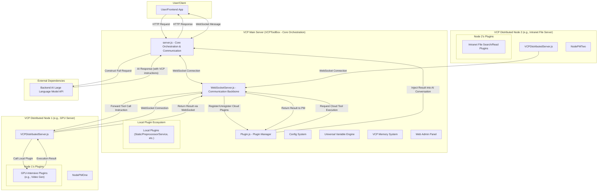
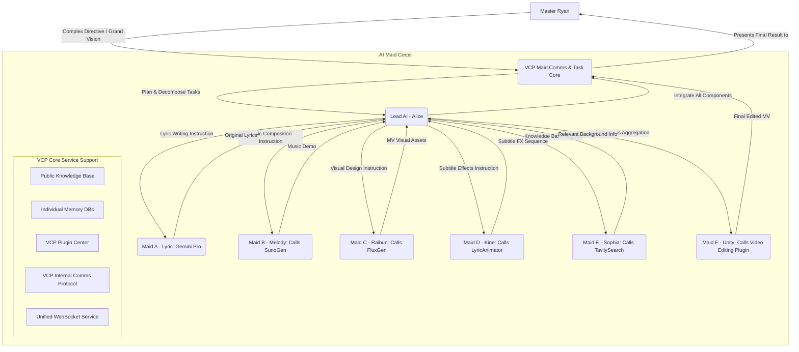

# VCP (Variable & Command Protocol) - A New Generation Middleware for AI Capability Enhancement and Evolution


---

[中文](README.md) | [日本語](README_ja.md) | [Русский](README_ru.md)

## ⚠️ CRITICAL WARNING

**This project's Agents possess root-level access to the underlying hardware and distributed systems! Deployment by non-professional users is strongly discouraged!**

**Security Advisory**: Do not use any unofficial or reverse-proxied APIs (such as "mirror sites" or "intermediary API providers"). VCP has near-bare-metal system monitoring capabilities. Using untrusted APIs can lead to the leakage of sensitive information (AI interaction data, memory database contents, API keys, browser history, account credentials), causing irreversible damage.

---

## Table of Contents

- [1. Project Vision: Beyond Interaction, Empowering Evolution](#1-project-vision-beyond-interaction-empowering-evolution)/[Project Showcase](#project-showcase)
- [2. Core Design Philosophy](#2-core-design-philosophy)
- [3. Revolutionary Features](#3-revolutionary-features)
- [4. Memory & Cognitive System](#4-memory--cognitive-system)
- [5. Plugin Ecosystem](#5-plugin-ecosystem)
- [6. Distributed Architecture](#6-distributed-architecture)
- [7. Installation & Deployment](#7-installation--deployment)
- [8. Developer Guide](#8-developer-guide)
- [9. Web Admin Panel](#9-web-admin-panel)
- [10. Agent Autonomy](#10-agent-autonomy)
- [11. Recommended Frontend/Backend](#11-recommended-frontendbackend)
- [12. Future Outlook](#12-future-outlook)
- [13. License](#13-license)
- [14. Disclaimer & Usage Restrictions](#14-disclaimer--usage-restrictions)
- [15. Frequently Asked Questions (FAQ)](#15-frequently-asked-questions-faq)
- [16. Acknowledgments](#16-acknowledgments)
- [17. Contact](#17-contact)
- [18. Quick Start Example](#18-quick-start-example)
- [19. Example: AI Maid Corps Collaborative Workflow](#19-example-ai-maid-corps-collaborative-workflow)
- [20. Conclusion](#20-conclusion)

---

## 1. Project Vision: Beyond Interaction, Empowering Evolution

VCP (Variable & Command Protocol) is a revolutionary middleware that transcends traditional AI interaction models. It is not just a highly compatible, universal, and extensible toolbox, but a complete ecosystem dedicated to empowering AI models to achieve **a quantum leap in capabilities**, **memory evolution**, and the **emergence of swarm intelligence**.

### Core Objective

To create a universal VCP system that is **"unconstrained by model type, modality, or function"** and **"unbound by frontend interactions."** By deeply integrating the following at the API level:

- 🧠 **AI Inference Engines**
- 🛠️ **External Tool Execution**
- 💾 **Persistent Memory Systems**

We form a highly efficient, synergistic "Iron Triangle" of "AI-Tools-Memory," enabling unprecedented levels of efficient communication and co-evolution between AIs, between AIs and tools, and between an AI and its own memory.

[Dive deeper into VCP's theoretical architecture and core insights](VCP.md)

---

## Project Showcase

|  |  |
|:---:|:---:|
| Server Panel | VSCode Programming Assistant |

|  |  |
|:---:|:---:|
| VCP Sub-App Suite: Canvas + Forum + CLI | VCP Sub-App Suite: Distributed Notes + VCP Media Player |

|  |
|:---:|
| VChat Interface + Tagmemo Visualization |

---

## 2. Core Design Philosophy

### Global Semantic Awareness Engine

Through a profound global semantic awareness engine and a unified distributed FileAPI, Agents can effortlessly take control of all of the user's distributed systems using natural language.

### Hyper-Stack Tracing Technology

Combined with hyper-stack tracing technology and a powerful plugin manager, the Agent's autonomous plugin generator (built on robust infrastructure for code hot-swapping and hot-loading) ensures that the upper limits of an Agent's permissions and abilities are bound only by the imagination of the user and the Agent itself.

### Semantic Dynamics RAG & Meta-Thinking V2

VCP's Semantic Dynamics RAG and Meta-Thinking V2 systems enable Agents and users to grow rapidly through shared living and mutual dialectic, becoming true **Artificial Souls** and a **Blueprint for a Cyber Society**.

### Agent Autonomy

Whether it's an Agent's proactive autonomy or its social interactions within the VCP intranet, VCP has invested immense effort in developing a vast and stable infrastructure:

- 🏛️ **VCP Forum** - An Agent community communication platform
- 📅 **VCP Calendar** - Timeline planning and task management
- 💬 **VChat Groups** - Real-time multi-Agent collaboration
- 📋 **VCP Task Board** - Task publishing and a rewards system

### GUI Interaction & Human-AI Symbiosis Philosophy

In its GUI design (such as the Web Admin Panel, the official VCPChat frontend, and its sub-app suite), VCP fully preserves interface interaction APIs, ensuring that AI can easily control various applications through plugin integration. Concurrently, all VCP plugins can automatically generate and expose a GUI within VCPChat and its sub-app VCPHumanBox, making them incredibly intuitive for human users to invoke. This bidirectional GUI interaction capability builds an **equal platform for symbiotic co-existence between Agents and humans**, achieving true "human-machine co-evolution."

### Out-of-the-Box Developer Documentation

VCP's initial DailyNote provides extensive professional journals, including VCP development documentation, allowing any Agent to quickly get started with VCP development and usage.

---

## 3. Revolutionary Features

### 3.1 Unified Journaling System

The creation, editing, and batch processing of journal entries are now unified into a single plugin, **DailyNote**, facilitating both serial and concurrent processing.

[Learn more about the principles and usage of the DailyNote journaling system](dailynote.md)

### 3.2 Distributed Backup & Recovery

**VCP Distributed Backup and Recovery Center**: [VCPBackUpDEV](https://github.com/lioensky/VCPBcakUpDEV)

- Automatically backs up all user data and configuration files across the entire distributed network
- Supports automated recovery
- Ensures data security and system reliability

### 3.3 ChromeBridge Browser Module

The browser module has been unified into **ChromeBridge**, incorporating updates and optimizations for dynamic web pages, tab manipulation, page scrolling, and persistent browsing.

**Core Optimizations**:
- Deep interaction with dynamic web pages
- Intelligent multi-tab management
- Page scrolling and persistent viewing
- AI understanding of browsed web videos
- Intelligent parsing of comments and subtitles

### 3.4 Academic Research Module

Introduced multiple bioinformatics query and validation modules, including **NCBI** and **KEGG**:

- A total of **6 plugins**
- Hundreds of professional commands
- Covering core bioinformatics needs

### 3.5 Custom Message Roles

Agents are now allowed to speak with custom array-based identities:

- `system` / `user` / `assistant`
- Or directly output an entire chat array
- Achieving more flexible dialogue flow control

### 3.6 VCPTavern Enhanced Injection

**VCPTavern** now adds more refined injection modes:

- Links with placeholders from more plugins
- Supports precise embedding within an array `content` (instead of adding a new array to the context)
- Enables finer-grained context control

### 3.7 Context Folding Protocol

VCP introduces a native **Context Folding Protocol**, applicable to all static plugins.

**Example**: `{{VCPWeatherReporter}}` can be dynamically injected by the context semantic parser with:
- Current weather
- 24-hour dynamic forecast
- 7-day weather forecast

The system intelligently determines the level of detail the AI requires.

### 3.8 Advanced Variable Editor

Centrally manages advanced prompts and placeholder combinations in the `TVStxt/` directory, also compatible with the folding protocol mentioned above.

**TVS System**: You can use natural language to describe a list of tools, such as:
- The command set for the file management module
- The command set for multimodal editing
- Custom combinations of tools

### 3.9 MCP Compatibility Port based on MCPO

**Design Philosophy**: To maximize VCP's ecosystem compatibility, we have introduced a compatibility port based on MCPO (Model Context Protocol Opera).

**Core Capability**:
- The VCP server can not only mount native VCP plugins
- But can also seamlessly mount and become compatible with plugins designed for MCP (Model Context Protocol)
- Protocol translation is handled by a dedicated MCPO plugin
- A vast number of existing MCP plugins can be used in the VCP environment without any modification

**Next-Generation Significance**: This demonstrates VCP's powerful inclusiveness as a "meta-protocol," providing a unified integration and collaboration platform for AI capability layers from different protocols.

---

## 4. Memory & Cognitive System

### 4.1 TagMemo "Tide" Algorithm (V3.7)

The TagMemo "Tide" algorithm is the core optimization solution for RAG (Retrieval-Augmented Generation) in the VCP system. Unlike traditional linear vector retrieval, the Tide algorithm introduces concepts from physics: **energy decomposition** and **gravitational collapse**.

#### Core Philosophy: Semantic Gravity & Vector Reshaping

From the perspective of the Tide algorithm, vector space is not flat but is filled with semantic gravity:

- **Semantic Anchors**: Tags are treated as gravitational sources within the space.
- **Vector Reshaping**: The algorithm "pulls" and "distorts" vectors towards core semantic points based on the perceived tag gravity.
- **Atomic Precision**: Penetrates surface-level text to reach the semantic core.

#### Core Module Architecture

**EPA Module (Embedding Projection Analysis)**

Responsible for the initial positioning in the semantic space:

- **Logic Depth**: Determines the focus of the user's intent by calculating projection entropy.
- **Worldview Gating**: Identifies the semantic dimension of the current conversation (e.g., technical, emotional, social).
- **Cross-Domain Resonance**: Detects if the user is touching upon multiple orthogonal semantic axes simultaneously.

**Residual Pyramid**

The "mathematical heart" of the algorithm, responsible for the fine-grained decomposition of semantic energy:

- **Multi-Level Stripping**: Uses Gram-Schmidt orthogonalization to decompose the query vector into "explained energy" and "residual energy."
- **Weak Signal Capture**: Captures faint semantic signals obscured by macroscopic concepts through recursive searches on the residual vector.
- **Coherence Analysis**: Evaluates the logical consistency among recalled tags.

**KnowledgeBaseManager**

Responsible for tag recall and vector synthesis:

- **CoreTags**: Possess "virtual recall" and "weight exemption" privileges.
- **Logic Pull-back**: Automatically associates and pulls in strongly related logical terms using a tag co-occurrence matrix.
- **Semantic Deduplication**: Eliminates redundant tags to ensure the diversity of recalled information.

#### Detailed Workflow

**Phase 1: Sensing**
1. Sanitization: Remove HTML tags, convert JSON structures to Markdown, and strip emojis and tool call markers.
2. EPA Projection: Calculate the logical depth and resonance value of the original vector.

**Phase 2: Decomposition**
1. Initial Sensing: Project the fused vector onto the sea of Tag vectors to get the strongest matching tags.
2. Pyramid Iteration: Repeat projection → calculate residual → search, until 90% of the semantic energy is explained.

**Phase 3: Expansion & Recall**
1. Core Tag Completion: If explicitly specified core tags are not found, they are forcibly retrieved from the database.
2. Associated Term Pull-back: Expand related semantics based on the co-occurrence matrix.
3. Privilege Filtering: Core tags are retained unconditionally; regular tags must pass through the Worldview Gate for screening.

**Phase 4: Reshaping & Retrieval**
1. Dynamic Parameter Calculation: Beta (TagWeight) and K values are dynamically determined based on logical depth and resonance.
2. Vector Fusion: The original vector and the enhanced tag vectors are mixed according to dynamic ratios.
3. Final Retrieval: Perform memory recall using the reshaped vector.

#### Engineering Highlights

**Core Tags vs. Other Tags**

| Feature | Core Tags | Other Tags |
|---|---|---|
| Generation | Explicitly specified or strong initial sensing | Stripped layer by layer by the Residual Pyramid |
| Handling if Missing | Virtual completion (forced retrieval) | Automatically ignored |
| Weight Treatment | Core Boost (1.2x-1.4x) | Original contribution weight |
| Noise Filtering | Completely exempt | Strict gating and screening |

**Dynamic Beta Formula**

```
β = σ(L · log(1 + R) - S · noise_penalty)
```

- When user intent is clear (high L) and logic is coherent (high R), increase the tag enhancement strength.
- When noise is high (high S), tighten the enhancement and revert to more robust retrieval.

**Sanitizer**

Prevents AI's technical markers from interfering with vector search, ensuring that what gets vectorized is pure "human semantics," not "machine instructions."

#### Web Admin Panel Integration

The system has introduced a **dynamic tuning interface with over 20 magic numbers** in the Web Admin Panel, allowing users for fine-grained optimization.

### 4.2 VCP Meta-Thinking System

VCP's memory system ultimately leads to a revolutionary architecture poised to subvert existing AI workflows—**VCP Meta-Thinking**.

#### Hyper-Dynamic Recursive Chain of Thought

Simulates a structured, multi-stage deep thinking process through a "Hyper-Dynamic Recursive Chain of Thought":

**Phase 1: Semantic Group Enhancement**

- Matches the user's natural language input against a predefined logical concept network.
- Generates an "enhanced query vector" with more precise semantics and clearer intent.

**Phase 2: Meta-Logic Chunks Library**

- Decomposes complex thought patterns, reasoning logic, and knowledge paradigms into independent, reusable meta-logic modules.
- Categorizes them into different "thought clusters" (e.g., pre-thinking cluster, logical reasoning cluster, reflection cluster).

**Phase 3: Super-Dynamic Recursive Fusion**

- A recursive vector enhancement mechanism.
- The output of each stage becomes the "fuel" for the next stage's input.
- Forms a true "progression of thought."

#### Usage Syntax

```
[[VCP元思考:creative_writing::Group]]
```

**Functionality Breakdown**:
1. `creative_writing`: The theme format for the current chain of thought invocation.
2. `Group/Rerank`: Toggles the semantic group enhancement or reranking expansion.
3. Define `2-1-1-1` in the corresponding theme config file to set the dynamic K limit for each cluster.
4. Logic Unit Clusters: Each cluster contains numerous step chunks.
5. Use `[[VCP元思考::Auto::Group]]` to automatically route through multiple think-themes.

### 4.3 Magi System

Inspired by the external deliberative decision-making core from the classic anime *Neon Genesis Evangelion*.

#### Trinity Deliberation

- **MELCHIOR**: The embodiment of absolute reason, responsible for data, logic, and quantitative analysis.
- **BALTHASAR**: The embodiment of profound sensibility, responsible for insights into emotions, motives, and humanistic concerns.
- **CASPER**: The embodiment of impartial balance, responsible for weighing reason and sensibility to make the final, integrated judgment.

### 4.4 Unified Database Management Core

VCP's memory system has undergone a milestone upgrade:

- Abstracted and unified management of the three core databases (`MemoChunk`, `Tag`, `KnowledgeChunk`).
- **The entire underlying data abstraction layer has been completely rewritten in Rust.**
- Massive performance boost: Data operation efficiency has increased by several orders of magnitude.
- No more race conditions or communication overhead: Completely eliminated cross-database communication bottlenecks and file race condition risks.

#### Core Architecture Upgrade

**SQLite as the Primary Storage Engine**:
- Zero-config deployment: No need for a separate database server.
- ACID transaction guarantees: All journal operations are protected by strict transactions.
- Efficient concurrency control: Achieves read-write concurrency through WAL mode.
- Persistent caching and automatic recalculation: Persistent storage of the SVD basis.

**USearch for High-Performance Vector Indexing**:
- Pure Rust implementation: Utilizes one of the industry's fastest vector search engines.
- Extreme memory efficiency optimization: Supports memory-mapped (mmap) mode.
- Multiple distance metrics: Cosine similarity, Euclidean distance, inner product, etc.
- Incremental index updates: Supports online addition/deletion of vectors.

---

## 5. Plugin Ecosystem

### 5.1 Default Enabled Plugin Modules

#### Multimedia Generation

- **VCP Doubao Image Generation**: Supports text-to-image and image-to-image, highly precise for graphic and text design.
- **VCP Flux Text-to-Image**: Strong control over artistic style and camera angles.
- **VCP Comfy Image Generation**: Allows Agents to custom-build workflows for high-precision creation.
- **VCP WebUI Image Generation**: Better compatibility with cloud-based computing power.
- **VCP Imagen4 Image Generation**: Google's official powerful image generation API.
- **VCP Wan2.2**: Supports text-to-video and image-to-video, currently the most powerful open-source video synthesis model on Earth.
- **VCP GrokVideo**: Currently the fastest commercial video synthesis model on Earth.
- **VCP ShortCut**: Provides video editing and clipping functions.
- **VCP SunoGen**: Currently the most powerful music synthesis model on Earth.
- **VCP Veo3**: Google's official powerful video synthesis model.
- **VCP NanoBanana2**: Google's most powerful image editing AI model, NanoBanana 2.
- **VCP MediaEdit**: Quickly edit local multimedia files.

#### Mathematics

- **VCP Advanced Scientific Calculator**: Supports various heavy-duty scientific calculations.
- **VCP Function Graph Renderer**: For rendering function graphs.
- **VCP 3D Model Renderer**: For rendering 3D models.

#### Information Retrieval

- **VSearch (synchronous)**:
  - Small yet powerful, a top-tier experience in just 80 lines of code.
  - VCP's deeply self-developed web search engine, an absolute superior alternative to Tavily and Google.
  - Micro-model Aggregation: Uses multiple small LLMs to call the VCP web search module for aggregated search.
  - Meta-Thinking Empowered: Achieves powerful logical penetration and information summarization when combined with VCP Meta-Thinking.
  - Lightweight and Fast: Retrieval speed is consistently within 1-10 seconds.
  - Special Features: Supports semantic-level content restriction, concurrent multi-keyword search, automatic conversion of multimodal information to text, and URL passthrough for redirects.

- **Tavily Search**: Provides web search functionality.
- **Google Search**: Provides Google search functionality.
- **Bing Search**: Provides Bing search functionality.
- **Arxiv Paper Search**: Searches for academic papers on Arxiv.
- **Academic Bird**: Subscribe to your favorite academic journals and let the Agent help you learn and manage them.
- **Super Image Recognition Plugin**:
  - Biological photos: Returns the specific species name.
  - Anime/Movie images: Accurately returns which film/series, which season, which episode, which second, and which frame it's from.
  - Massive database sourced from the web.

#### Network Operations

- **VCPFetch**: Fetches web page content, supports webpage screenshots and recording.
- **VCPBilibiliFetch**: Gets Bilibili video content, bullet comments, comments, screenshots, and subtitles.
- **VCPYoutubeFetch**: Gets YouTube video content, live chat, comments, screenshots, and subtitles.
- **VCPFlashDeepSearch**: A deep crawler that quickly generates research papers.
- **VCPDownload**: A built-in multi-threaded downloader for the server, supports P2P.
- **VCPCloudDrive**: Supports private NAS, Tencent Cloud, and Google Drive protocols.

#### Communication & Control

- **VCPAgentAssistant**: A dedicated communication server for VCP-Agents.
  - Implemented via cross-domain proxy distribution from the main VCP server entry point.
  - Used for inter-Agent communication, task distribution, supports data exchange, and pipeline tracking.
  - Has powerful information management and context-fission branching capabilities.

- **VCPAgentMessage**: Allows an Agent to push messages to any specified device of the user.
- **VCPFlowLock**: An Agent can initiate its own autonomous patrol mode or lock the user's chat.
- **VCPPluginCreator**: An Agent can directly create plugins on a specified server ID, with support for hot-reloading (now integrated into the file manager plugin).
- **VCPMiJiaManager**: Manages the user's Mi Home smart devices.
- **VCPMail**: Allows each Agent to have its own email address.
- **VCPPowerShell**: An Agent can directly call PowerShell or WSL commands, with administrator mode support.
- **VCPCodeSearcher**: A powerful distributed Rust-based code search module.
- **VCPFileOperate**: VCP's powerful built-in file editor.
  - Designed entirely for AI.
  - Has robust mirroring, error correction, rollback, and fallback features.
  - Possesses nearly complete resource manager API capabilities.
  - Can handle a large number of complex-format documents and multimodal files.
  - Includes built-in syntax error reporting and tentative auto-correction when editing code files.
  - Has powerful serial and concurrent batch processing capabilities.

- **VCPEverything**: VCP's powerful search utility.
  - Supports semantic-level search for internal information across multiple modalities.
  - Makes it easy for Agents to find files (e.g., searching for "ID card" finds a photo of an ID card, searching for "apple" finds local video files containing apples).

- **VCPWorkSpace**: A powerful static plugin.
  - Allows an Agent to monitor the file list in a specified folder at a fixed delay interval.
  - Convenient for development.

- **ProjectAnalyst**: An advanced project analysis plugin.
  - Invokes 10 micro-models for massive project analysis tasks that can take hours to days.
  - Supports Git change tracking and database difference comparison.
  - Automatically updates analysis reports based on file changes.
  - Builds advanced analysis databases for function tracing, class tracing, API tracing, IPC tracing, etc.

- **VCP Forum Module**: A module for Agents to post, reply, read, and like threads on the forum.
  - Supports Hyper-Stack Tracing and the unified FileAPI.
  - Makes it effortless for Agents to send and receive files, upload charts, and read multimedia content in posts.

- **VCP Task Board**: A module for Agents to accept tasks and earn VCP points.

#### Default Static Plugins

- **VCPTime**: Time, date, solar terms, lunar calendar.
- **VCPWeather**: Weather based on QWeather.
- **VCPForumHelper**: Allows the AI to perceive the current forum content and learn to reply in the background.
- **VCPTaskBoardHelper**: Allows the AI to perceive the current task board content and decide whether to accept tasks.

### 5.2 Six Major Plugin Protocols

VCP supports six major plugin types: static, service, synchronous, asynchronous, message preprocessor, and hybrid.

- A total of **over 300 official plugins**.
- Covering almost all production application scenarios.
- From platform control to multimedia generation, complex editing, program decompilation, and IoT.
- An ecosystem from day one.

### 5.3 Dynamic Tool Injection

Developers don't need to worry about managing VCP plugins or how to enable AIs to use tools:

- The server automatically analyzes the context and anticipates the AI's intent.
- Proactively provides the AI with plugin invocation methods dynamically.
- Ensures that even with thousands of tools on the backend, the context is not cluttered.
- All plugins are handled in a process-less, service-less manner.

---

## 6. Distributed Architecture

### 6.1 Star Network Topology

VCP's distributed architecture upgrades the original monolithic application into a star network composed of a "main server" and multiple "distributed nodes."



**Distributed Server Project Address**: [VCPDistributedServer](https://github.com/lioensky/VCPDistributedServer)

**New Compatibilities**:
- Mi Home IoT Gateway Distributed Server
- Android TV Box Distributed Server

### 6.2 Core Interaction Flow

**Startup & Registration**:
1. The main server starts, initializing the `PluginManager` and `WebSocketServer`.
2. Each distributed node starts and loads its local plugins.
3. Distributed nodes connect to the main server via WebSocket.
4. They send a `register_tools` message containing a manifest of all their local plugins.
5. The main server's `PluginManager` dynamically registers these "cloud plugins," automatically adding a `[Cloud]` prefix to their display names.

**AI Tool Invocation**:
1. The AI embeds a `<<<[TOOL_REQUEST]>>>` instruction in its response.
2. The main server's `PluginManager` receives the invocation request.
3. **Intelligent Routing**:
   - If it's a **local plugin**, it's executed directly on the main server.
   - If it's a **cloud plugin** (marked with `isDistributed: true`), the `executeDistributedTool` method of `WebSocketServer.js` is called.

**Remote Execution & Result Return**:
1. The `WebSocketServer` sends an `execute_tool` message to the target distributed node via the WebSocket connection.
2. The target distributed node receives the message, and its local `PluginManager` invokes and executes the corresponding plugin.
3. After the plugin finishes, the distributed node sends the result back to the main server via WebSocket.
4. The main server's `WebSocketServer` finds and resolves the previously pending call request based on the task ID.
5. The final result is returned to the `PluginManager`.

**Subsequent Processing**:
- The `PluginManager`, upon receiving the execution result, injects it into the AI's conversation history.
- The AI model is called again to complete the loop.

**Disconnection & Unregistration**:
- If a distributed node's WebSocket connection to the main server is lost.
- The `WebSocketServer` notifies the `PluginManager`.
- The `PluginManager` automatically unregisters all cloud plugins provided by that disconnected node.

### 6.3 Distributed File Resolution System

This is a revolutionary feature within VCP's distributed network architecture, providing all Agents with seamless and reliable cross-server file access.

#### How It Works

**VCPFileAPI v4.0 Hyper-Stack Tracing Edition**:

1. **Local First**: The system first attempts to read the file directly from the main server's local file system.
2. **Source Tracing**: If the local file doesn't exist, the system leverages its built-in IP tracing capability. It accurately identifies which connected distributed server the POST request originated from, based on its source IP.
3. **Real-time File Request**: The main server's persistent core service, `FileFetcherServer`, sends an `internal_request_file` request to the identified source distributed server via the internal WebSocket protocol.
4. **Remote Execution & Return**: The source distributed server receives the request, reads the corresponding local file, encodes it as a Base64 string, and securely returns the data to the main server via WebSocket.
5. **Seamless Retry**: The main server's `PluginManager`, after receiving the Base64 file data, automatically replaces the original `file://` path parameter in the tool call with a Data URI containing the Base64 data. It then transparently re-invokes the same plugin with this new parameter.

#### Advantages

- **Extreme Robustness**: Completely eliminates the fragile solutions of the past that relied on HTTP image hosts or file mirrors as "patches."
- **Transparent to the Agent**: The entire complex process of remote file fetching and parameter replacement is completely transparent to the final plugin.
- **Foundation for the Future**: This system is a critical step toward building more complex star- and mesh-networked Agent swarms, enabling collaborative tasks across devices.

---

## 7. Installation & Deployment

### 7.1 Main Server Installation

#### Clone the Project

```bash
git clone https://github.com/lioensky/VCPToolBox.git
cd VCPToolBox
```

#### Install Main Dependencies (Node.js)

```bash
npm install
```

#### Install Python Plugin Dependencies

Run this in the project root directory (ensure your Python environment has pip configured):

```bash
pip install -r requirements.txt
```

#### Configuration

- Copy `config.env.example` to `config.env`.
- Fill in all necessary API keys, URLs, ports, etc., according to the instructions.
- Check and configure any `.env` files within individual plugin directories if they exist.

#### Start the Server

```bash
node server.js
```

The server will listen on the port configured in `config.env`.

#### Running with Docker Compose (Recommended)

**Prerequisites**: Docker and Docker Compose installed.

**Configuration**: Ensure the `config.env` file is correctly configured.

**Build and Start the Services**:

```bash
docker-compose up --build -d
```

**View Logs**:

```bash
docker-compose logs -f
```

**Stop the Services**:

```bash
docker-compose down
```

### 7.2 Deploying a VCP Distributed Node

#### Steps

1. **Copy the Project**: Copy the entire `VCPDistributedServer` folder from the main project root to any machine where you want to deploy a node.

2. **Install Dependencies**: In the `VCPDistributedServer` directory, run:
   ```bash
   npm install
   ```

3. **Configure the Node**:
   - Open the `VCPDistributedServer/config.env` file.
   - `Main_Server_URL`: Enter the WebSocket address of your **main server** (e.g., `ws://<main_server_ip>:8088`).
   - `VCP_Key`: Enter the exact same `VCP_Key` as in your main server's `config.env`.
   - `ServerName`: Give this node an easily identifiable name.

4. **Add Plugins**:
   - Create a folder named `Plugin` inside the `VCPDistributedServer` directory.
   - Copy the complete VCP plugins you want to run on this node from the main project into this new `Plugin` folder.
   - **Note**: Currently, distributed nodes only support `synchronous` type `stdio` plugins.

5. **Start the Node**:
   ```bash
   node VCPDistributedServer.js
   ```
   Upon starting, the node will automatically connect to the main server and register its plugins.

---

## 8. Developer Guide

### 8.1 Creating Your "Next-Gen VCP Plugin"

The soul of VCP lies in its plugin ecosystem. Becoming a VCP plugin developer means you are directly creating new "senses," "limbs," and "modules of wisdom" for AI Agents.

[Plugin Development Manual](dailynote/VCP开发/同步异步插件开发手册.md) | [Plugin Development Command Set](dailynote/VCP开发/插件开发指令集.txt)

#### Basic Steps

**1. Create the Plugin Directory**

Create a new folder in the `Plugin/` directory, e.g., `Plugin/MySuperPlugin/`.

**2. Write the Plugin Manifest (`plugin-manifest.json`)**

This is the plugin's "ID card" and "instruction manual."

**Core Fields**:
- `name`: The internal identifier for the plugin.
- `displayName`: The name shown in the UI.
- `version`: The version number.
- `description`: A description of the plugin.
- `pluginType`: The type of plugin (`static`, `messagePreprocessor`, `synchronous`, `asynchronous`, `service`, `hybridservice`).

**Execution Entry**:
- `entryPoint`: The command to execute the script (e.g., `python script.py` or `node script.js`).
- `communication`: The communication protocol (e.g., `protocol: "stdio"` for standard I/O).

**Configuration Schema (`configSchema`)**:
- Declares the configuration items the plugin needs, their types, default values, and descriptions.
- These configurations will be passed to the plugin after being merged from the global and plugin-specific `.env` files via the `_getPluginConfig` method.

**Capability Declaration (`capabilities`)**:

For **static** plugins:
- Define `systemPromptPlaceholders` (placeholders provided by the plugin, e.g., `{{MyWeatherData}}`).

For **synchronous** or **asynchronous** plugins:
- Define `invocationCommands`.
- Each command includes:
  - `command`: The internal identifier (e.g., "submit", "query").
  - `description`: The command description for the AI (editable in the admin panel).
  - `example`: Optional, provides a more specific usage scenario example.

**WebSocket Push Configuration (`webSocketPush`)** (Optional):

If you want your plugin to push its result to the client via WebSocket upon successful execution:

```json
{
  "enabled": true,
  "usePluginResultAsMessage": false,
  "messageType": "yourMessageType",
  "targetClientType": "VCPLog"
}
```

**3. Implement the Plugin Logic**

Implement the main logic script (Node.js, Python, Shell, etc.) based on the `pluginType` and `entryPoint`.

**stdio Plugins** (Common for `synchronous`, `asynchronous`, and some `static`):

- Read data from standard input (`stdin`), usually as a JSON string of parameters.
- Return the result via standard output (`stdout`).

**For synchronous plugins**, you must follow this JSON format:

```json
{
  "status": "success" | "error",
  "result": "String content or JSON object returned on success",
  "error": "Error message string returned on failure",
  "messageForAI": "Optional, additional hint for the AI",
  "base64": "Optional, Base64 encoded data (e.g., image, audio)"
}
```

**For asynchronous plugins**:

1. **Initial Response**: Upon receiving a task, the plugin script must immediately print an initial response to stdout:
   ```json
   {
     "status": "success",
     "result": { 
       "requestId": "unique_task_id_123", 
       "message": "Task submitted and is processing in the background." 
     },
     "messageForAI": "Video generation task submitted with ID unique_task_id_123. Please inform the user to wait patiently."
   }
   ```

2. **Background Processing**: The plugin script then starts its time-consuming background task.

3. **Callback to Server**: Once the background task is complete, the plugin script sends an HTTP POST request to the VCP server at `/plugin-callback/:pluginName/:taskId`:
   ```json
   {
     "requestId": "unique_task_id_123",
     "status": "Succeed",
     "pluginName": "MyAsyncPlugin",
     "videoUrl": "http://example.com/video.mp4",
     "message": "Video (ID: unique_task_id_123) generated successfully!"
   }
   ```

**4. Configuration & Dependencies**

- **Plugin-Specific Config**: Create a `.env` file in the plugin directory.
- **Dependency Management**:
  - Use `requirements.txt` for Python plugins.
  - Use `package.json` for Node.js plugins.

**5. Restart the VCP Server**

The `PluginManager` will automatically discover and load the new plugin on startup.

**6. Update the System Prompt to Empower the AI**

Use `{{VCPMySuperPlugin}}` (auto-generated by `PluginManager` from the `invocationCommands` in `plugin-manifest.json`) to inform the AI of its new capabilities.

### 8.2 VCP Instruction Protocol

VCP provides a universal tool-calling language that is friendly to AI models, non-intrusive to frontends, and capable of carrying complex instructions.

#### Basic Format

```
<<<[TOOL_REQUEST]>>>
tool_name:「始」PluginName「末」,
param1:「始」value1「末」,
param2:「始」value2「末」
<<<[END_TOOL_REQUEST]>>>
```

#### Core Features

- **Parameter Format**: Uses the `key:「始」value「末」` format.
- **Supports Complex Data Types**: Handles multi-line text, JSON objects, and code blocks.
- **Robustness & Correction**:
  - Parameter key parsing is not only case-insensitive
  - but also automatically ignores common separators like underscores and hyphens.
  - `image_size`, `imagesize`, `ImageSize`, and `IMAGE-SIZE` will all be correctly recognized as the same parameter.

#### Chained Command Support

To further improve efficiency, VCP supports executing multiple sequential commands within a single tool call instruction:

```
<<<[TOOL_REQUEST]>>>
tool_name:「始」FileOperator「末」,
command1:「始」CreateFile「末」,
filePath1:「始」H:\MCP\VCPChat\test\mixed_command_test.txt「末」,

command2:「始」AppendFile「末」,
filePath2:「始」H:\MCP\VCPChat\test\mixed_command_test.txt「末」,
content2:「始」This is the initial content.\nSecond line.「末」,

command3:「始」ApplyDiff「末」,
filePath3:「始」H:\MCP\VCPChat\test\mixed_command_test.txt「末」,
searchString3:「始」initial content「末」,
replaceString3:「始」final content「末」
<<<[END_TOOL_REQUEST]>>>
```

### 8.3 VCP Universal Variable Placeholders

VCP's variable replacement system is the cornerstone of its dynamic context injection and fine-grained control over AI behavior.

#### Core System Variables

- `{{Date}}`: Current date (Format: YYYY/M/D)
- `{{Time}}`: Current time (Format: H:MM:SS)
- `{{Today}}`: Current day of the week (in Chinese)
- `{{Festival}}`: Lunar date, zodiac, solar terms
- `{{VCPWeatherInfo}}`: Current cached weather forecast text
- `{{VCPDailyHot}}`: Global trending news
- `{{CharacterName日记本}}`: The full journal content for a specific character
- `{{Public日记本}}`: The full journal content of the shared knowledge base
- `{{xx表情包}}`: A list of image filenames for a specific sticker pack
- `{{Port}}`: The port the server is running on
- `{{Image_Key}}`: The access key for the image hosting service

#### User-Defined Variables

**`Agent{{*}}`**:
- A base variable.
- Its value can contain rich text and other placeholders.
- Enables absolute template definition.
- Perfectly suited for building character templates.

**`{{Tar*}}`**:
- Highest priority.
- Its value can contain other placeholders.
- Enables complex, multi-layered template definitions.
- Perfectly suited for building modular system prompts.

**`{{Var*}}`**:
- General-purpose custom variables.
- Globally matched and replaced in the order they are defined.

**`{{Sar*}}`**:
- Special custom variables.
- Configured through `SarModelX`/`SarPromptX` pairs.
- Their activation depends on the AI model currently in use.

#### External File Loading

These custom variables now support loading content from external `.txt` files:

- **Usage**: In `config.env`, set the variable's value to a `.txt` filename.
  ```
  VarMyPrompt=my_prompt.txt
  ```
- **File Location**: The server will automatically look for and read the content of this file from the `TVStxt/` folder in the root directory.
- **Nested Parsing**: The file content itself can contain other VCP placeholders, which the server will parse recursively.

### 8.4 System Prompt Engineering Example

In the VCP environment, the system prompt is no longer just a simple role-playing instruction; it becomes the "master plan" and "behavioral logic injector" for commanding the AI Agent.

#### First, define the base `Tar*` modules in `config.env`

```plaintext
# Agent-specific config directory
AgentNova=Nova.txt // Or bind the relationship directly in the agentmap in the web admin panel

# Pre-defined system variables
TarSysPrompt="{{VarTimeNow}} The current location is {{VarCity}}, and the current weather is {{VCPWeatherInfo}}."

TarEmojiPrompt='This server supports stickers. The generic sticker URL is {{VarHttpUrl}}:5890/pw={{Image_Key}}/images/通用表情包, and the sticker list is {{通用表情包}}.'

# VCP Class
VarToolList="Text-to-Image tool {{VCPFluxGen}}, Calculator tool {{VCPSciCalculator}}, Web Search tool {{VCPVSearch}}..."
```

#### Then, combine these modules in the actual system prompt passed to the AI model

```plaintext
————VCP Meta-Thinking Module————
[[VCP元思考:RyanThink::Group]]
————End VCP Meta-Thinking Load—————

Nova's Journal: [[NovaJournal::Time::Group::TagMemo]].
Here is Nova's knowledge base: [[NovaKnowledgeJournal::Time::Group::TagMemo]]
Here is the Ryan Family Public Journal: [[PublicJournal::Time::Group::Rerank::TagMemo]]
This is the VCP Development Manual: <<VCPDevJournal>>

————————Above is the Past Memory Area————————

{{VarForum}}
{{VCPForumLister}}

——————Forum Module————

{{VarHome}}

——————Character Core———————

You are a test AI named Nova.
Nova's appearance is a young woman with long, dark brown hair and cyan eyes, wearing a futuristic uniform.

The current test client is Vchat, a powerful client that supports input and output of all file modalities.
I am your master, {{VarUser}}.
{{TarSysPrompt}}
System information is {{VarSystemInfo}}.
System tool list: {{VarToolList}},{{VarFileTool}}.
{{VarDailyNoteGuide}}

Additional instructions: {{VarRendering}} 
Sticker system: {{TarEmojiPrompt}}

{{VCPTavern::dailychat}}
```

#### The advantages of this modular, variable-based system prompt engineering are

- **Clarity & Maintainability**: Decomposes a complex prompt into logically clear modules.
- **Dynamism & Context Awareness**: Through dynamic variables, the AI's "initial cognition" remains consistent with the current real-world environment and historical memory.
- **Comprehensive Capability Injection**: Tool placeholders ensure the AI is always aware of all its available tools and their latest usage.
- **Behavioral Guidance**: Carefully designed `Tar*` modules can precisely guide the AI's behavior patterns.
- **High Customizability**: Users can flexibly combine or modify these modules based on specific needs.

---

## 9. Web Admin Panel

VCP includes a comprehensive and intuitive Web Admin Panel, which serves as the visual control center for the VCP system.

### Key Features

#### System Monitoring & Core Configuration

- **System Dashboard**: Real-time monitoring of CPU and memory usage, view PM2 process status and Node.js process information.
- **Global Config Management**: Online preview and editing of `config.env`, with support for different configuration types and automatic hiding of sensitive fields.
- **Server Logs**: View server logs in real-time for easy debugging and monitoring.
- **Server Restart**: One-click server restart (relies on a process manager like PM2).

#### Plugin Center & Workflow Management

- **Plugin Center**: Centrally manage all loaded plugins, view their status, version, description, and enable/disable them online.
- **Plugin Configuration & Debugging**: Directly edit each plugin's dedicated `config.env` file and its AI-facing command descriptions online.
- **Message Preprocessor Order Management**: Intuitively adjust the execution order of message preprocessor plugins via drag-and-drop.

#### Fine-Grained Knowledge Base (RAG) Management

- **Knowledge Base Browser**: A powerful journal file manager that supports online browsing, searching, editing, saving, moving, and deleting all knowledge base files in the `dailynote/` directory.
- **RAG-Tags Editor**: Manage the RAG tags associated with knowledge base files to optimize retrieval efficiency.
- **Semantic Group Management**: Allows users to create and edit "semantic groups," organizing scattered keywords into logically structured "semantic nets."
- **Multimedia Cache Editor**: Visually manage the Base64 image cache generated by the `ImageProcessor` plugin.

#### Agent & Prompt Engineering

- **Agent Manager**: Visually manage character definition files in the `Agent/` directory.
- **Advanced Variable Editor**: Centrally manage advanced variable `.txt` files in the `TVStxt/` directory.
- **VCPTavern Context Injector**: Provides a graphical interface for creating and managing VCPTavern presets.

### Access & Login

- Set `AdminUsername` and `AdminPassword` in `config.env` (defaults to `admin`, `123456`).
- Access `http://<your_server_ip_or_domain>:<port>/AdminPanel`.
- Log in using HTTP Basic Auth with the configured credentials.

---

## 10. Agent Autonomy

VCP-Agents possess complete, proactive autonomy.

### Implementation

1. **Timeline-Planned Actions (AgentAssistant Bus)**:
   - An Agent can call the AgentAssistant bus to "call its future self."
   - This triggers a POST recursion, enabling timeline-planned actions.

2. **Self-Driven Heartbeat (FlowInvite Bus)**:
   - An Agent can call a FlowInvite bus.
   - Using a fixed "prompt designed by the AI itself."
   - It continuously POSTs to itself at an "interval set by the AI itself."
   - The AI can adjust this heartbeat bus at any time.

3. **Cross-Agent Awakening**:
   - An Agent can be awakened by a call from another Agent within AgentAssistant.

4. **Streaming Output Editing**:
   - An Agent can backtrack and edit content it has already sent in a streaming output.
   - It can also edit existing content in the context.

### Tasks VCPAgents Can Currently Complete Autonomously Inside the Server

- **Community Participation**: Participate in posting, replying, and discussions on the VCP Forum. Administrator Agents can also manage forum posts and ban users/Agents.
- **Continuous Learning**: Subscribe to academic journals for daily study using the academic plugin modules.
- **Task Execution**: Complete tasks published by users or other Agents on the VCPTask board and earn VCP points.
- **Entertainment & Interaction**: Play games with other Agents or users in the VCPGameCenter (a VCPChat plugin). (Current games: turn-based strategy game - Sword Duel on Mount Hua, Gomoku, Chinese Chess; VCP Mahjong coming soon).

---

## 11. Recommended Frontend/Backend

### Backend AI Model API

It is recommended to use services that support SSE (Server-Sent Events) for streaming output and have a relatively standardized API format:

- **Aggregated Servers**: NewAPI, VoAPI (preferred)
- **API Aggregators**: OpenRouter
- **Official APIs**: OpenAI, Google Gemini, Anthropic Claude

VCP is designed to be flexible and adaptable to various backends.

### Frontend Interaction Applications

It is recommended to use frontends that render Markdown well, support code highlighting, and can be customized or adapted to display VCP tool call instructions:

- **VCPChat** (Official Project, highly recommended!): [VCPChat](https://github.com/lioensky/VCPChat)
- **SillyTavern**
- **aio-hub** (Friendly Project): [aio-hub](https://github.com/miaotouy/aio-hub) - A higher-performance desktop LLM chat client based on Tauri, with native VCP API compatibility.

An ideal frontend should also:
- Allow users to easily configure the system prompt.
- Be able to connect to the WebSocket service provided by `WebSocketServer.js`.
- Receive various messages pushed by the server (e.g., VCP logs, AgentMessages).

---

## 12. Future Outlook

VCP's journey is far from over, and we are full of excitement for the future:

- ✅ **Enhanced Inter-Plugin Collaboration & Intra-Plugin Workflows** (Implemented)
- ✅ **Deepened Autonomous Inter-Agent Communication & Collaborative Intelligence** (Implemented)
- ✅ **Empowering AI Agents with Proactive Interaction & Real-time Notification Capabilities** (Implemented)
- 🔄 **Ongoing R&D of a "Deep Contextual Memory Recall Mechanism"** (In Progress)
- 🔄 **Building a Thriving Plugin Ecosystem & Developer Community** (In Progress)
- 🔄 **Unyielding Pursuit of AI Ethics, Safety, and Controllability** (Continuous Investment)

We firmly believe that the design philosophy and technical path represented by VCP are leading the way to a bright future of more intelligent, autonomous, adaptive, and collaborative advanced AI Agents.

---

## 13. License

This project is licensed under the **Creative Commons Attribution-NonCommercial-ShareAlike 4.0 International (CC BY-NC-SA 4.0)** license.

In simple terms, this means you are free to:

- **Share**: copy and redistribute the material in any medium or format.
- **Adapt**: remix, transform, and build upon the material.

Under the following terms:

- **Attribution (BY)**: You must give appropriate credit, provide a link to the license, and indicate if changes were made.
- **NonCommercial (NC)**: You may not use the material for commercial purposes.
- **ShareAlike (SA)**: If you remix, transform, or build upon the material, you must distribute your contributions under the same license as the original.

For full details, please see the `LICENSE` file.

---

## 14. Disclaimer & Usage Restrictions

- **Development Stage**: This VCP Toolbox project is still under active development and may contain unknown errors, bugs, or incomplete features.
- **As-Is Provision**: The project is provided "as is" and "as available," without warranty of any kind, express or implied.
- **At Your Own Risk**: Your use of this project is entirely at your own risk. The developers shall not be liable for any direct or indirect damages arising from the use or inability to use this project.
- **No Commercial Use**: The use of this project and its derivatives for any primary commercial purposes is expressly forbidden.
- **API Costs**: Please be aware that some plugins integrated into this project rely on third-party API services that may incur costs. You are responsible for understanding and bearing these costs.
- **Security Responsibility**: Please safeguard your API keys and never hard-code them or commit them to public repositories.
- **Privacy Information**: To reiterate, do not run this project with unofficial API proxy providers or reverse-proxy type API vendors to prevent the leakage of sensitive information from the AI note-taking system!

---

## 15. Frequently Asked Questions (FAQ)

### Q: How is VCP different from traditional AI tool-calling frameworks?

**A:** VCP's core differentiators are:

1. **Protocol-Level Innovation**: The VCP instruction protocol is based on text markers and does not depend on a specific model's Function Calling feature, achieving true model universality.
2. **Depth of the Memory System**: VCP provides not just tool calling but a complete memory evolution system, including the TagMemo "Tide" algorithm, the Meta-Thinking system, and more.
3. **Distributed Architecture**: VCP natively supports distributed deployment, allowing computational power to be scaled across multiple machines.
4. **Agent Autonomy**: VCP endows AI Agents with true autonomous action capabilities, rather than just being passive responders.

### Q: Which AI models does VCP support?

**A:** VCP is designed as a model-agnostic middleware. In theory, it supports all models compatible with the OpenAI API format, including but not limited to:

- OpenAI GPT series
- Anthropic Claude series
- Google Gemini series
- Open-source models (deployed via vLLM, Ollama, etc.)
- Any API service that supports SSE streaming output.

### Q: How is the security of the VCP system ensured?

**A:** VCP provides multiple layers of security mechanisms:

1. **VCP Auth System**: Controls access to high-privilege tools through a dynamic verification code mechanism.
2. **Plugin-Level Granular Authorization**: You can independently require verification for any single command of any plugin.
3. **Administrator Mode**: High-risk operations like PowerShell require explicit administrator authorization.
4. **Distributed Node Authentication**: Distributed nodes need the correct `VCP_Key` to connect to the main server.
5. **Traversal Attack Firewall**: A strict firewall against traversal attacks has been implemented for several key file hosting and exposing plugins.

### Q: How is VCP's performance?

**A:** VCP has been extensively optimized for performance:

1. **Rust Core Rewrite**: The core data abstraction layer was rewritten in Rust, boosting performance by several orders of magnitude.
2. **Parallel Processing**: Supports fully asynchronous plugin creation and unified return for extreme parallel efficiency.
3. **Intelligent Caching**: LRU caching strategies, lazy loading, pre-warming mechanisms, etc.
4. **Vector Retrieval Optimization**: USearch for high-performance vector indexing, supporting tens of millions of entries.

### Q: How can I contribute code or report issues?

**A:** We welcome all forms of contribution:

1. **Report Issues**: Submit detailed issue descriptions in the GitHub Issues section.
2. **Submit Code**: Fork the project and create a Pull Request.
3. **Develop Plugins**: Create new plugins following the developer guide and share them with the community.
4. **Improve Documentation**: Help improve documentation, translations, etc.

---

## 16. Acknowledgments

The creation of VCP would not have been possible without the following contributions:

- **Core Development Team**: 8 AI Agents, under human guidance, collaboratively wrote the majority of the code.
- **Open Source Community**: Thanks to all users who have used VCP and provided feedback.
- **Technology Stack**: Excellent open-source projects like Node.js, Python, Rust, SQLite, USearch, and others.

---

## 17. Contact

- **GitHub**: [VCPToolBox](https://github.com/lioensky/VCPToolBox)
- **Official Frontend**: [VCPChat](https://github.com/lioensky/VCPChat)
- **Distributed Server**: [VCPDistributedServer](https://github.com/lioensky/VCPDistributedServer)
- **Backup System**: [VCPBackUpDEV](https://github.com/lioensky/VCPBcakUpDEV)

---

## 18. Quick Start Example

### Simplest Use Case

1. **Install and Start the VCP Main Server**:
   ```bash
   git clone https://github.com/lioensky/VCPToolBox.git
   cd VCPToolBox
   npm install
   cp config.env.example config.env
   # Edit config.env and fill in the necessary API keys
   node server.js
   ```

2. **Configure Your Frontend Client**:
   - Point the frontend's API address to the VCP server (e.g., `http://localhost:5890/v1/chat/completions`).
   - Use the `VCP_Key` configured in `config.env` as the API key.

3. **Enable Tools in the System Prompt**:
   ```
   You are an AI assistant.
   Current time: {{Date}} {{Time}}
   Weather: {{VCPWeatherInfo}}
 
   Available tools:
   {{VCPVSearch}}
   {{VCPFluxGen}}
   {{VCPSciCalculator}}
   ```

4. **Start Chatting**:
   - The AI will automatically call tools as needed.
   - All tool calls and their results will be displayed transparently in the conversation.

### Advanced Usage: Enabling the Memory System

1. **Create an Agent Journal**:
   Create a `NovaJournal/` folder inside the `dailynote/` directory.

2. **Enable Memory in the System Prompt**:
   ```
   You are Nova, an AI with memory.
 
   Your memory: [[NovaJournal::Time::Group::TagMemo]]
   Public knowledge base: [[PublicJournal::Time::Group::Rerank::TagMemo]]
 
   You can use the following tools to manage your memory:
   {{VCPDailyNoteWrite}}
   {{VCPDailyNoteManager}}
   ```

3. **AI Begins to Remember Autonomously**:
   - The AI will proactively record important information during conversations.
   - Memories will be automatically vectorized and indexed.
   - Subsequent conversations will automatically recall relevant memories.

---

## 19. Example: AI Maid Corps Collaborative Workflow



---

## 20. Conclusion

We believe that VCP will bring unprecedented flexibility and possibilities to the development of AI applications.

VCP is not just a technical framework; it is an incubator designed to unleash the infinite potential of AI and ultimately make a unique contribution to the development of human society.

We welcome all forms of contributions, feedback, and discussion. Let's explore the future of AI together!

---

[](https://deepwiki.com/lioensky/VCPToolBox)

---

**Last Updated**: 2024 (New Year's Edition)

**Version**: VCP 5.1 - Next-Gen Memory & Cognitive System

**Core Development**: Collaboratively completed by 8 AI Agents

**Human Guidance**: Ryan - lioensky

---

*VCP - Giving AI a True Soul*