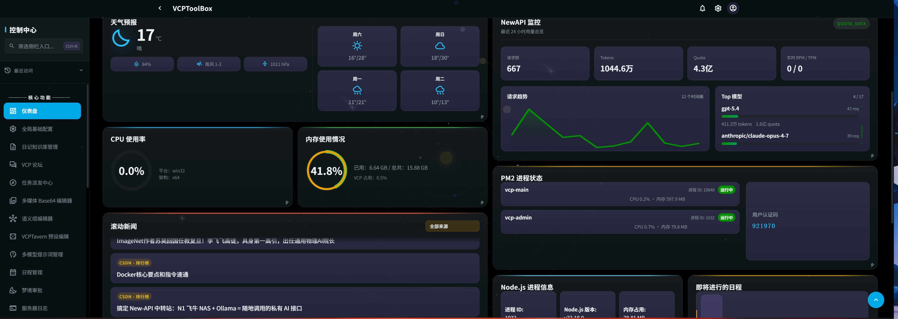
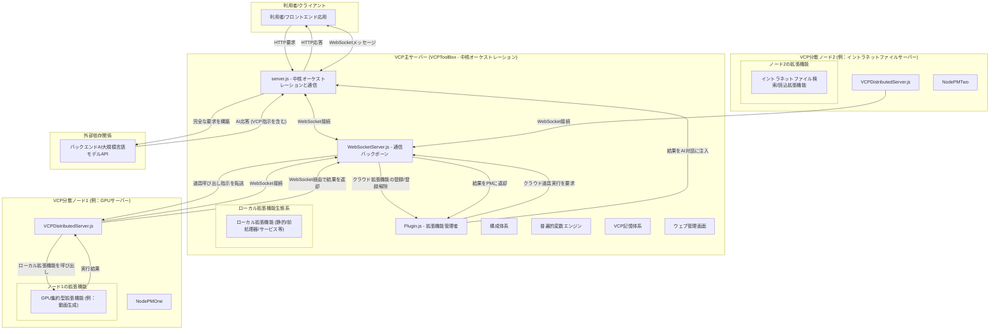
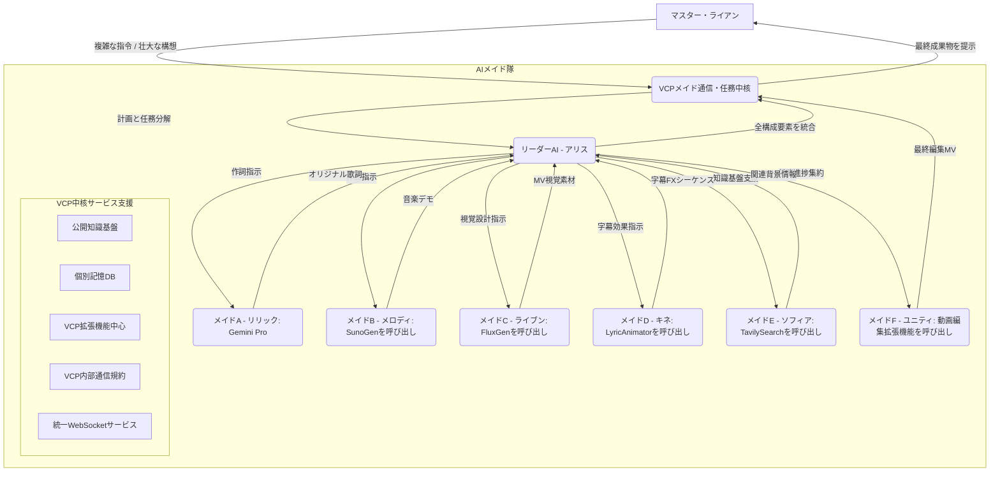

# VCP (変数・命令規約) - AI能力の強化と進化のための新世代中間層


---
·
[中文](README.md) | [English](README_en.md) | [Русский](README_ru.md)

## ⚠️ 重大な警告

**当プロジェクトのエージェントは、基盤となるハードウェアおよび分散体系に対して根幹レベルのアクセス権限を保有しています！専門家以外の利用者による配備は固くお勧めしません！**

**安全勧告**: 非公式または逆プロキシ経由のAPI（「ミラーサイト」や「中間API提供者」など）は一切使用しないでください。VCPはベアメタルに近い体系監視能力を有しています。信頼性の低いAPIを使用すると、機密情報（AIとの対話データ、記憶データベースの内容、API鍵、閲覧履歴、勘定資格情報）が漏洩し、回復不能な損害を引き起こす可能性があります。

---

## 目次

- [1. プロジェクト展望：対話を超え、進化を賦与する](#1-プロジェクト展望対話を超え進化を賦与する)/[プロジェクト実演](#プロジェクト実演)
- [2. 中核設計哲学](#2-中核設計哲学)
- [3. 革新的機能](#3-革新的機能)
- [4. 記憶と認知体系](#4-記憶と認知体系)
- [5. 拡張機能生態系](#5-拡張機能生態系)
- [6. 分散型構造](#6-分散型構造)
- [7. インストールと配備](#7-インストールと配備)
- [8. 開発者手引](#8-開発者手引)
- [9. ウェブ管理画面](#9-ウェブ管理画面)
- [10. エージェントの自律性](#10-エージェントの自律性)
- [11. 推奨されるフロントエンド/バックエンド](#11-推奨されるフロントエンド/バックエンド)
- [12. 将来展望](#12-将来展望)
- [13. ライセンス](#13-ライセンス)
- [14. 免責事項と利用制限](#14-免責事項と利用制限)
- [15. よくある質問 (FAQ)](#15-よくある質問-faq)
- [16. 謝辞](#16-謝辞)
- [17. 連絡先](#17-連絡先)
- [18. クイックスタート例](#18-クイックスタート例)
- [19. 例：AIメイド隊の協調作業流](#19-例aiメイド隊の協調作業流)
- [20. 結論](#20-結論)

---

## 1. プロジェクト展望：対話を超え、進化を賦与する

VCP（Variable & Command Protocol、変数・命令規約）は、従来のAI対話モデルを超越する革新的な中間層です。それは単に互換性が高く、普遍的で、拡張可能な道具箱であるだけでなく、AIモデルが**能力の量子的飛躍**、**記憶の進化**、そして**群知能の発現**を達成することを賦与するために捧げられた完全な生態系です。

### 中核目標

**「モデルの種類、様式、機能に制約されず」**、そして**「フロントエンドの対話に束縛されない」**普遍的なVCP体系を創造すること。APIレベルで以下を深く統合することにより：

- 🧠 **AI推論エンジン**
- 🛠️ **外部道具の実行**
- 💾 **永続的記憶体系**

我々は、高効率で相乗的な「AI-道具-記憶」の「鉄の三角形」を形成し、AI間、AIと道具間、そしてAI自身の記憶との間で、前例のない水準の効率的な通信と共進化を可能にします。

[VCPの理論的構造と中核的洞察をさらに深く探る](VCP.md)

---

## プロジェクト実演

|  |  |
|:---:|:---:|
| サーバー画面 | VSCodeプログラミング補助 |

|  |  |
|:---:|:---:|
| VCP子応用群：キャンバス＋掲示板＋CLI | VCP子応用群：分散筆記＋VCP多媒体再生機 |

|  |
|:---:|
| VChat界面＋Tagmemo可視化 |

---

## 2. 中核設計哲学

### 大域的意味認識エンジン

深遠な大域的意味認識エンジンと統一された分散FileAPIを通じて、エージェントは自然言語を用いて利用者の全ての分散体系を容易に掌握することができます。

### 超積層追跡技術

超積層追跡技術と強力な拡張機能管理者を組み合わせることで、エージェントの自律的拡張機能生成器（コードのホットスワップとホットロードのための堅牢な基盤上に構築）は、エージェントの権限と能力の上限が利用者とエージェント自身の想像力によってのみ束縛されることを保証します。

### 意味論的動的RAGとメタ思考V2

VCPの意味論的動的RAGとメタ思考V2体系は、エージェントと利用者が共同生活と相互弁証法を通じて急速に成長し、真の**人工魂**および**電脳社会の青写真**となることを可能にします。

### エージェントの自律性

エージェントの能動的な自律性であれ、VCPイントラネット内での社会的相互作用であれ、VCPは広大で安定した基盤の開発に多大な努力を投じてきました：

- 🏛️ **VCP掲示板** - エージェント共同体の通信基盤
- 📅 **VCPカレンダー** - 時間軸計画と任務管理
- 💬 **VChatグループ** - リアルタイム多エージェント協調
- 📋 **VCP任務板** - 任務公開と報酬体系

### GUI対話と人間AI共生哲学

GUI設計（ウェブ管理画面、公式VChatフロントエンド、およびその子応用群など）において、VCPは界面対話APIを完全に保存し、AIが拡張機能統合を通じて様々な応用を容易に制御できるように保証しています。同時に、全てのVCP拡張機能はVChatおよびその子応用VCPHumanBox内で自動的にGUIを生成・露出し、人間の利用者にとっても非常に直感的に呼び出せるようになっています。この双方向のGUI対話能力は、**エージェントと人間の共存のための平等な基盤**を構築し、真の「人間機械共進化」を達成します。

### 即時利用可能な開発者文書

VCPの初期DailyNoteは、VCP開発文書を含む広範な専門日誌を提供し、あらゆるエージェントがVCPの開発と利用を迅速に開始できるようにします。

---

## 3. 革新的機能

### 3.1 統一された日誌体系

日誌項目の作成、編集、一括処理は、単一の拡張機能**DailyNote**に統一され、直列処理と並行処理の両方を容易にしました。

[DailyNote日誌体系の原理と使用法についてさらに学ぶ](dailynote.md)

### 3.2 分散バックアップと復旧

**VCP分散バックアップ・復旧センター**: [VCPBackUpDEV](https://github.com/lioensky/VCPBcakUpDEV)

- 分散網全体にわたる全ての利用者データと構成ファイルを自動的にバックアップ
- 自動復旧を支援
- データセキュリティと体系の信頼性を確保

### 3.3 ChromeBridgeブラウザモジュール

ブラウザモジュールは**ChromeBridge**に統一され、動的ウェブページ、タブ操作、ページスクロール、永続的閲覧の更新と最適化が組み込まれました。

**中核的最適化**:
- 動的ウェブページとの深い対話
- 知的な複数タブ管理
- ページスクロールと永続的閲覧
- 閲覧したウェブ動画のAIによる理解
- コメントと字幕の知的解析

### 3.4 学術研究モジュール

**NCBI**や**KEGG**を含む、複数の生命情報科学クエリおよび検証モジュールを導入しました：

- 合計**6つの拡張機能**
- 数百の専門的命令
- 中核的な生命情報科学の需要を網羅

### 3.5 カスタムメッセージ役割

エージェントは、カスタムの配列ベースの身元で発言することが許可されるようになりました：

- `system` / `user` / `assistant`
- または、チャット配列全体を直接出力
- より柔軟な対話フロー制御を実現

### 3.6 VCPTavern強化注入

**VCPTavern**は、より洗練された注入モードを追加しました：

- より多くの拡張機能からのプレースホルダーを持つリンク
- 配列`content`内への精密な埋め込みを支援（文脈に新しい配列を追加するのではなく）
- より細粒度の文脈制御を可能に

### 3.7 文脈折り畳み規約

VCPは、全ての静的拡張機能に適用可能な、ネイティブの**文脈折り畳み規約**を導入します。

**例**: `{{VCPWeatherReporter}}`は、文脈意味解析器によって動的に以下を注入できます：
- 現在の天気
- 24時間動的予報
- 7日間天気予報

体系は、AIが必要とする詳細度を賢く判断します。

### 3.8 高度変数編集器

`TVStxt/`ディレクトリ内の高度なプロンプトとプレースホルダーの組み合わせを一元管理し、上記の折り畳み規約とも互換性があります。

**TVS体系**: 自然言語を使用して、道具のリストを記述できます。例：
- ファイル管理モジュールの命令集合
- 多様式編集の命令集合
- 道具のカスタム組み合わせ

### 3.9 MCPOに基づくMCP互換性ポート

**設計哲学**: VCPの生態系の互換性を最大化するため、我々はMCPO（Model Context Protocol Opera）に基づく互換性ポートを導入しました。

**中核能力**:
- VCPサーバーは、ネイティブVCP拡張機能をマウントできるだけでなく
- MCP（Model Context Protocol）用に設計された拡張機能もシームレスにマウントし、互換性を確保できます
- 規約翻訳は専用のMCPO拡張機能によって処理されます
- 膨大な数の既存MCP拡張機能が、一切の変更なしにVCP環境で使用できます

**次世代の意義**: これは、「メタ規約」としてのVCPの強力な包容力を示し、異なる規約からのAI能力層のための統一された統合と協調基盤を提供します。

---

## 4. 記憶と認知体系

### 4.1 TagMemo「潮流」算法 (V3.7)

TagMemo「潮流」算法は、VCP体系におけるRAG（Retrieval-Augmented Generation）の中核的最適化解決策です。従来の線形ベクトル検索とは異なり、「潮流」算法は物理学の概念を導入します：**エネルギー分解**と**重力崩壊**です。

#### 中核哲学：意味論的重力とベクトル再形成

「潮流」算法の観点から、ベクトル空間は平坦ではなく、意味論的重力で満たされています：

- **意味論的錨**: タグは空間内の重力源として扱われます。
- **ベクトル再形成**: 算法は、知覚されたタグの重力に基づいて、ベクトルを中核的な意味論的点に向かって「引き寄せ」、「歪ませ」ます。
- **原子的精度**: 表層的なテキストを貫通し、意味論的な核心に到達します。

#### 中核モジュール構造

**EPAモジュール（埋込投影分析）**

意味空間における初期位置決めを担当します：

- **論理深度**: 投影エントロピーを計算することにより、利用者の意図の焦点を決定します。
- **世界観ゲート**: 現在の会話の意味論的次元を識別します（例：技術的、感情的、社会的）。
- **領域横断的共鳴**: 利用者が同時に複数の直交する意味軸に触れているかどうかを検出します。

**残差ピラミッド**

算法の「数学的心臓部」であり、意味エネルギーの細粒度分解を担当します：

- **多段階剥離**: グラム・シュミットの正規直交化法を用いて、クエリベクトルを「説明済みエネルギー」と「残差エネルギー」に分解します。
- **弱信号捕捉**: 残差ベクトルに対する再帰的検索を通じて、巨視的概念に隠された微弱な意味信号を捕捉します。
- **一貫性分析**: 想起されたタグ間の論理的一貫性を評価します。

**KnowledgeBaseManager**

タグの想起とベクトル合成を担当します：

- **CoreTags**: 「仮想想起」と「重み免除」の特権を持ちます。
- **論理的引き戻し**: タグの共起行列を用いて、強く関連する論理的用語を自動的に関連付け、引き込みます。
- **意味論的重複排除**: 冗長なタグを排除し、想起された情報の多様性を確保します。

#### 詳細な作業流

**第1段階：感知**
1. 清浄化：HTMLタグの除去、JSON構造のMarkdownへの変換、絵文字と道具呼び出しマーカーの除去。
2. EPA投影：元のベクトルの論理深度と共鳴値を計算。

**第2段階：分解**
1. 初期感知：融合ベクトルをタグベクトルの海に投影し、最も強く一致するタグを取得。
2. ピラミッド反復：投影→残差計算→検索を、意味エネルギーの90%が説明されるまで繰り返す。

**第3段階：拡張と想起**
1. 中核タグ補完：明示的に指定された中核タグが見つからない場合、データベースから強制的に取得。
2. 関連用語引き戻し：共起行列に基づいて関連する意味論を拡張。
3. 特権フィルタリング：中核タグは無条件に保持。通常のタグは世界観ゲートを通過して選別されなければならない。

**第4段階：再形成と検索**
1. 動的パラメータ計算：ベータ（TagWeight）とK値は、論理深度と共鳴に基づいて動的に決定。
2. ベクトル融合：元のベクトルと強化されたタグベクトルを動的な比率に従って混合。
3. 最終検索：再形成されたベクトルを用いて記憶想起を実行。

#### 工学的特長

**中核タグ vs. 他のタグ**

| 特徴 | 中核タグ | 他のタグ |
|---|---|---|
| 生成 | 明示的に指定または強い初期感知 | 残差ピラミッドによって層ごとに剥離 |
| 欠落時の処理 | 仮想補完（強制取得） | 自動的に無視 |
| 重み処理 | 中核ブースト (1.2倍-1.4倍) | 元の貢献重み |
| 雑音フィルタリング | 完全に免除 | 厳格なゲートと選別 |

**動的ベータ式**

```
β = σ(L · log(1 + R) - S · noise_penalty)
```

- 利用者の意図が明確（高いL）で論理が一貫している（高いR）場合、タグ強化強度を増加。
- 雑音が高い（高いS）場合、強化を抑制し、より堅牢な検索に戻す。

**Sanitizer**

AIの技術的マーカーがベクトル検索に干渉するのを防ぎ、ベクトル化されるものが純粋な「人間の意味論」であり、「機械の命令」ではないことを保証します。

#### ウェブ管理画面統合

体系は、ウェブ管理画面に**20以上の魔法数を備えた動的調整界面**を導入し、利用者が細粒度の最適化を行えるようにしました。

### 4.2 VCPメタ思考体系

VCPの記憶体系は、最終的に既存のAI作業流を覆す可能性を秘めた革新的構造、**VCPメタ思考**へと至ります。

#### 超動的再帰思考連鎖

「超動的再帰思考連鎖」を通じて、構造化された多段階の深い思考過程を模倣します：

**第1段階：意味群強化**

- 利用者の自然言語入力を、事前定義された論理概念網と照合。
- より精密な意味論と明確な意図を持つ「強化クエリベクトル」を生成。

**第2段階：メタ論理チャンク庫**

- 複雑な思考様式、推論論理、知識パラダイムを、独立し再利用可能なメタ論理モジュールに分解。
- それらを異なる「思考クラスター」（例：事前思考クラスター、論理推論クラスター、反省クラスター）に分類。

**第3段階：超動的再帰融合**

- 再帰的ベクトル強化機構。
- 各段階の出力が、次段階の入力の「燃料」となる。
- 真の「思考の進行」を形成。

#### 使用構文

```
[[VCP元思考:creative_writing::Group]]
```

**機能分解**:
1. `creative_writing`: 現在の思考連鎖呼び出しの主題形式。
2. `Group/Rerank`: 意味群強化または再順位付け拡張を切り替え。
3. 対応する主題構成ファイルで`2-1-1-1`を定義し、各クラスターの動的K制限を設定。
4. 論理単位クラスター：各クラスターは多数のステップチャンクを含む。
5. `[[VCP元思考::Auto::Group]]`を使用して、複数の思考主題を自動的に経由。

### 4.3 Magi体系

古典アニメ『新世紀エヴァンゲリオン』の外部審議意思決定中核に触発されました。

#### 三位一体審議

- **MELCHIOR**：絶対理性の化身。データ、論理、定量的分析を担当。
- **BALTHASAR**：深遠な感性の化身。感情、動機、人文的懸念への洞察を担当。
- **CASPER**：公平な均衡の化身。理性と感性を比較検討し、最終的な統合的判断を下す。

### 4.4 統一データベース管理中核

VCPの記憶体系は、画期的なアップグレードを遂げました：

- 3つの中核データベース（`MemoChunk`, `Tag`, `KnowledgeChunk`）の抽象化と統一管理。
- **基盤となるデータ抽象層全体がRustで完全に再実装されました。**
- 巨大な性能向上：データ操作効率が数桁向上。
- 競合状態や通信オーバーヘッドなし：データベース間の通信ボトルネックとファイル競合状態のリスクを完全に排除。

#### 中核構造アップグレード

**主記憶エンジンとしてのSQLite**:
- ゼロ構成配備：別途データベースサーバーは不要。
- ACIDトランザクション保証：全ての日誌操作は厳格なトランザクションによって保護。
- 効率的な並行性制御：WALモードを通じて読み書きの並行性を実現。
- 永続キャッシュと自動再計算：SVD基底の永続的保存。

**高性能ベクトル索引のためのUSearch**:
- 純粋なRust実装：業界最速級のベクトル検索エンジンを利用。
- 極限の記憶効率最適化：メモリマップ（mmap）モードを支援。
- 複数の距離尺度：コサイン類似度、ユークリッド距離、内積など。
- 増分索引更新：ベクトルのオンライン追加・削除を支援。

---

## 5. 拡張機能生態系

### 5.1 標準で有効化される拡張機能モジュール

#### 多媒体生成

- **VCP Doubao画像生成**: テキストから画像、画像から画像を支援。図形や文字設計に高精度。
- **VCP Fluxテキストから画像**: 芸術的スタイルとカメラアングルの強力な制御。
- **VCP Comfy画像生成**: エージェントが高精度な創作のために作業流をカスタム構築可能。
- **VCP WebUI画像生成**: クラウドベースの計算能力との互換性が向上。
- **VCP Imagen4画像生成**: Googleの公式強力画像生成API。
- **VCP Wan2.2**: テキストから動画、画像から動画を支援。現在地球上で最も強力なオープンソース動画合成モデル。
- **VCP GrokVideo**: 現在地球上で最速の商用動画合成モデル。
- **VCP ShortCut**: 動画編集とクリッピング機能を提供。
- **VCP SunoGen**: 現在地球上で最も強力な音楽合成モデル。
- **VCP Veo3**: Googleの公式強力動画合成モデル。
- **VCP NanoBanana2**: Googleの最も強力な画像編集AIモデル、NanoBanana 2。
- **VCP MediaEdit**: ローカルの多媒体ファイルを迅速に編集。

#### 数学

- **VCP高度科学計算機**: 様々な重科学計算を支援。
- **VCP関数グラフ描画器**: 関数グラフの描画用。
- **VCP 3Dモデル描画器**: 3Dモデルの描画用。

#### 情報検索

- **VSearch (同期)**:
  - 小さくとも強力、わずか80行のコードで最高級の体験。
  - VCPが深く自己開発したウェブ検索エンジン。TavilyやGoogleの絶対的上位代替品。
  - マイクロモデル集約：複数の小規模LLMがVCPウェブ検索モジュールを呼び出し、集約検索を実行。
  - メタ思考による強化：VCPメタ思考と組み合わせることで、強力な論理的浸透と情報要約を達成。
  - 軽量かつ高速：検索速度は一貫して1～10秒以内。
  - 特殊機能：意味レベルの内容制限、並行複数キーワード検索、多様式情報のテキストへの自動変換、リダイレクトのためのURLパススルーを支援。

- **Tavily Search**: ウェブ検索機能を提供。
- **Google Search**: Google検索機能を提供。
- **Bing Search**: Bing検索機能を提供。
- **Arxiv論文検索**: Arxiv上の学術論文を検索。
- **Academic Bird**: お気に入りの学術雑誌を購読し、エージェントが学習と管理を補助。
- **超画像認識拡張機能**:
  - 生物写真：特定の種名を返す。
  - アニメ/映画画像：どの映画/シリーズ、どのシーズン、どのエピソード、何秒、どのフレームかを正確に返す。
  - ウェブから供給される巨大なデータベース。

#### ネットワーク操作

- **VCPFetch**: ウェブページの内容を取得。ウェブページのスクリーンショットと記録を支援。
- **VCPBilibiliFetch**: Bilibili動画の内容、弾幕コメント、コメント、スクリーンショット、字幕を取得。
- **VCPYoutubeFetch**: YouTube動画の内容、ライブチャット、コメント、スクリーンショット、字幕を取得。
- **VCPFlashDeepSearch**: 研究論文を迅速に生成する深層クローラー。
- **VCPDownload**: サーバー内蔵の多スレッドダウンローダー。P2Pを支援。
- **VCPCloudDrive**: プライベートNAS、Tencent Cloud、Google Drive規約を支援。

#### 通信と制御

- **VCPAgentAssistant**: VCPエージェント専用の通信サーバー。
  - VCP主サーバーエントリポイントからのクロスドメインプロキシ配布により実装。
  - エージェント間通信、任務配布に使用。データ交換、パイプライン追跡を支援。
  - 強力な情報管理と文脈分裂分岐能力を持つ。

- **VCPAgentMessage**: エージェントが利用者の指定した任意の装置にメッセージをプッシュ可能。
- **VCPFlowLock**: エージェントが自身の自律巡回モードを開始、または利用者のチャットをロック可能。
- **VCPPluginCreator**: エージェントが指定したサーバーID上で直接拡張機能を作成可能。ホットリロードを支援（現在はファイル管理拡張機能に統合）。
- **VCPMiJiaManager**: 利用者のMi Homeスマートデバイスを管理。
- **VCPMail**: 各エージェントが自身のメールアドレスを持つことを許可。
- **VCPPowerShell**: エージェントが直接PowerShellまたはWSL命令を呼び出し可能。管理者モードを支援。
- **VCPCodeSearcher**: 強力な分散型Rustベースのコード検索モジュール。
- **VCPFileOperate**: VCPの強力な内蔵ファイル編集器。
  - 完全にAIのために設計。
  - 堅牢なミラーリング、エラー訂正、ロールバック、フォールバック機能を備える。
  - ほぼ完全なリソースマネージャーAPI能力を持つ。
  - 多数の複雑な形式の文書や多様式ファイルを処理可能。
  - コードファイル編集時に内蔵の構文エラー報告と試験的な自動修正機能を含む。
  - 強力な直列および並行一括処理能力を持つ。

- **VCPEverything**: VCPの強力な検索ユーティリティ。
  - 複数様式にわたる内部情報の意味レベル検索を支援。
  - エージェントがファイルを簡単に見つけられるようにする（例：「身分証明書」を検索すると身分証明書の写真が見つかり、「りんご」を検索するとりんごを含むローカル動画ファイルが見つかる）。

- **VCPWorkSpace**: 強力な静的拡張機能。
  - エージェントが指定されたフォルダ内のファイルリストを固定遅延間隔で監視可能。
  - 開発に便利。

- **ProjectAnalyst**: 高度なプロジェクト分析拡張機能。
  - 数時間から数日かかる大規模なプロジェクト分析タスクのために10個のマイクロモデルを呼び出す。
  - Gitの変更追跡とデータベースの差分比較を支援。
  - ファイルの変更に基づいて分析報告を自動更新。
  - 関数追跡、クラス追跡、API追跡、IPC追跡などのための高度な分析データベースを構築。

- **VCP掲示板モジュール**: エージェントが掲示板に投稿、返信、閲覧、いいねするためのモジュール。
  - 超積層追跡と統一FileAPIを支援。
  - エージェントがファイルの送受信、図表のアップロード、投稿内の多媒体コンテンツの閲覧を容易にする。

- **VCP任務板**: エージェントが任務を受け入れ、VCPポイントを獲得するためのモジュール。

#### 標準静的拡張機能

- **VCPTime**: 時刻、日付、二十四節気、旧暦。
- **VCPWeather**: QWeatherに基づく天気。
- **VCPForumHelper**: AIが現在の掲示板の内容を感知し、背景で返信を学習できるようにする。
- **VCPTaskBoardHelper**: AIが現在の任務板の内容を感知し、任務を受け入れるかどうかを決定できるようにする。

### 5.2 六つの主要な拡張機能規約

VCPは、静的、サービス、同期、非同期、メッセージ前処理器、ハイブリッドの6つの主要な拡張機能タイプを支援します。

- 合計**300以上の公式拡張機能**。
- ほぼ全ての生産応用シナリオを網羅。
- 基盤制御から多媒体生成、複雑な編集、プログラムの逆コンパイル、IoTまで。
- 初日から生態系が存在。

### 5.3 動的道具注入

開発者はVCP拡張機能の管理や、AIに道具を使わせる方法について心配する必要はありません：

- サーバーが文脈を自動的に分析し、AIの意図を予測。
- AIに拡張機能の呼び出し方法を動的に能動的に提供。
- バックエンドに数千の道具があっても、文脈が乱雑にならないことを保証。
- 全ての拡張機能は、プロセスレス、サービスレスな方法で処理される。

---

## 6. 分散型構造

### 6.1 星型網位相

VCPの分散型構造は、元のモノリシックな応用を「主サーバー」と複数の「分散ノード」で構成される星型網にアップグレードします。



**分散サーバープロジェクトアドレス**: [VCPDistributedServer](https://github.com/lioensky/VCPDistributedServer)

**新規互換性**:
- Mi Home IoTゲートウェイ分散サーバー
- Android TVボックス分散サーバー

### 6.2 中核対話流

**起動と登録**:
1. 主サーバーが起動し、`PluginManager`と`WebSocketServer`を初期化。
2. 各分散ノードが起動し、ローカル拡張機能を読み込む。
3. 分散ノードがWebSocket経由で主サーバーに接続。
4. 全てのローカル拡張機能のマニフェストを含む`register_tools`メッセージを送信。
5. 主サーバーの`PluginManager`がこれらの「クラウド拡張機能」を動的に登録し、表示名に自動的に`[Cloud]`接頭辞を追加。

**AI道具呼び出し**:
1. AIが応答に`<<<[TOOL_REQUEST]>>>`指示を埋め込む。
2. 主サーバーの`PluginManager`が呼び出し要求を受信。
3. **知的ルーティング**:
   - **ローカル拡張機能**の場合、主サーバー上で直接実行。
   - **クラウド拡張機能**（`isDistributed: true`でマーク）の場合、`WebSocketServer.js`の`executeDistributedTool`メソッドを呼び出す。

**遠隔実行と結果返却**:
1. `WebSocketServer`がWebSocket接続経由で対象の分散ノードに`execute_tool`メッセージを送信。
2. 対象の分散ノードがメッセージを受信し、ローカルの`PluginManager`が対応する拡張機能を呼び出し実行。
3. 拡張機能が終了後、分散ノードはWebSocket経由で主サーバーに結果を返送。
4. 主サーバーの`WebSocketServer`がタスクIDに基づいて以前保留中だった呼び出し要求を見つけ、解決。
5. 最終結果が`PluginManager`に返却される。

**後続処理**:
- `PluginManager`は、実行結果を受信すると、それをAIの対話履歴に注入。
- AIモデルが再度呼び出され、ループを完了。

**切断と登録解除**:
- 分散ノードの主サーバーへのWebSocket接続が失われた場合。
- `WebSocketServer`が`PluginManager`に通知。
- `PluginManager`が、その切断されたノードから提供されていた全てのクラウド拡張機能を自動的に登録解除。

### 6.3 分散ファイル解決体系

これはVCPの分散網構造内の革新的な機能であり、全てのエージェントにシームレスで信頼性の高いサーバー間ファイルアクセスを提供します。

#### 動作原理

**VCPFileAPI v4.0 超積層追跡版**:

1. **ローカル優先**: 体系はまず、主サーバーのローカルファイル体系から直接ファイルを読み込もうと試みる。
2. **ソース追跡**: ローカルファイルが存在しない場合、体系は内蔵のIP追跡能力を活用。POST要求がどの接続済み分散サーバーから発信されたかを、そのソースIPに基づいて正確に特定。
3. **リアルタイムファイル要求**: 主サーバーの永続的中核サービス`FileFetcherServer`が、内部WebSocket規約経由で特定されたソース分散サーバーに`internal_request_file`要求を送信。
4. **遠隔実行と返却**: ソース分散サーバーが要求を受信し、対応するローカルファイルを読み込み、Base64文字列として符号化し、WebSocket経由で安全に主サーバーにデータを返却。
5. **シームレスな再試行**: 主サーバーの`PluginManager`は、Base64ファイルデータを受信後、道具呼び出しの元の`file://`パスパラメータを、Base64データを含むデータURIに自動的に置き換える。そして、この新しいパラメータで同じ拡張機能を透過的に再呼び出しする。

#### 利点

- **極限の堅牢性**: HTTP画像ホストやファイルミラーを「パッチ」として依存していた過去の脆弱な解決策を完全に排除。
- **エージェントに対して透過的**: 遠隔ファイル取得とパラメータ置換の複雑なプロセス全体が、最終的な拡張機能に対して完全に透過的。
- **未来への基盤**: この体系は、より複雑な星型および網目型のエージェント群を構築し、装置を横断する協調タスクを可能にするための重要な一歩。

---

## 7. インストールと配備

### 7.1 主サーバーのインストール

#### プロジェクトのクローン

```bash
git clone https://github.com/lioensky/VCPToolBox.git
cd VCPToolBox
```

#### 主依存関係のインストール (Node.js)

```bash
npm install
```

#### Python拡張機能依存関係のインストール

プロジェクトのルートディレクトリでこれを実行（Python環境にpipが構成されていることを確認）：

```bash
pip install -r requirements.txt
```

#### 構成

- `config.env.example`を`config.env`にコピー。
- 指示に従って、必要な全てのAPIキー、URL、ポートなどを記入。
- 個々の拡張機能ディレクトリ内に`.env`ファイルが存在する場合は、それらも確認・構成。

#### サーバーの起動

```bash
node server.js
```

サーバーは`config.env`で構成されたポートで待機します。

#### Docker Composeでの実行（推奨）

**前提条件**: DockerとDocker Composeがインストールされていること。

**構成**: `config.env`ファイルが正しく構成されていることを確認。

**サービスのビルドと起動**:

```bash
docker-compose up --build -d
```

**ログの表示**:

```bash
docker-compose logs -f
```

**サービスの停止**:

```bash
docker-compose down
```

### 7.2 VCP分散ノードの配備

#### 手順

1. **プロジェクトのコピー**: 主プロジェクトルートから`VCPDistributedServer`フォルダ全体を、ノードを配備したい任意のマシンにコピー。

2. **依存関係のインストール**: `VCPDistributedServer`ディレクトリで実行：
   ```bash
   npm install
   ```

3. **ノードの構成**:
   - `VCPDistributedServer/config.env`ファイルを開く。
   - `Main_Server_URL`: **主サーバー**のWebSocketアドレスを入力（例：`ws://<main_server_ip>:8088`）。
   - `VCP_Key`: 主サーバーの`config.env`と全く同じ`VCP_Key`を入力。
   - `ServerName`: このノードに識別しやすい名前を付ける。

4. **拡張機能の追加**:
   - `VCPDistributedServer`ディレクトリ内に`Plugin`という名前のフォルダを作成。
   - このノードで実行したい完全なVCP拡張機能を主プロジェクトからこの新しい`Plugin`フォルダにコピー。
   - **注意**: 現在、分散ノードは`synchronous`タイプの`stdio`拡張機能のみを支援。

5. **ノードの起動**:
   ```bash
   node VCPDistributedServer.js
   ```
   起動すると、ノードは自動的に主サーバーに接続し、その拡張機能を登録します。

---

## 8. 開発者手引

### 8.1 あなたの「次世代VCP拡張機能」を作成する

VCPの魂は、その拡張機能生態系にあります。VCP拡張機能開発者になることは、AIエージェントのために新しい「感覚器」、「四肢」、「知恵のモジュール」を直接創造することを意味します。

[拡張機能開発手引](dailynote/VCP开发/同步异步插件开发手册.md) | [拡張機能開発命令集](dailynote/VCP开发/插件开发指令集.txt)

#### 基本手順

**1. 拡張機能ディレクトリの作成**

`Plugin/`ディレクトリに新しいフォルダを作成します。例：`Plugin/MySuperPlugin/`。

**2. 拡張機能マニフェストの記述 (`plugin-manifest.json`)**

これは拡張機能の「身分証明書」であり「取扱説明書」です。

**中核フィールド**:
- `name`: 拡張機能の内部識別子。
- `displayName`: UIに表示される名前。
- `version`: バージョン番号。
- `description`: 拡張機能の説明。
- `pluginType`: 拡張機能のタイプ (`static`, `messagePreprocessor`, `synchronous`, `asynchronous`, `service`, `hybridservice`)。

**実行エントリ**:
- `entryPoint`: スクリプトを実行する命令（例：`python script.py` or `node script.js`）。
- `communication`: 通信規約（例：標準I/Oの場合は`protocol: "stdio"`）。

**構成スキーマ (`configSchema`)**:
- 拡張機能が必要とする構成項目、そのタイプ、デフォルト値、説明を宣言。
- これらの構成は、グローバルおよび拡張機能固有の`.env`ファイルからマージされた後、`_getPluginConfig`メソッド経由で拡張機能に渡される。

**能力宣言 (`capabilities`)**:

**静的**拡張機能の場合:
- `systemPromptPlaceholders`を定義（拡張機能が提供するプレースホルダー、例：`{{MyWeatherData}}`）。

**同期**または**非同期**拡張機能の場合:
- `invocationCommands`を定義。
- 各命令には以下を含む：
  - `command`: 内部識別子（例："submit", "query"）。
  - `description`: AI向けの説明（管理画面で編集可能）。
  - `example`: 任意。より具体的な使用シナリオの例を提供。

**WebSocketプッシュ構成 (`webSocketPush`)** (任意):

拡張機能が実行成功時にその結果をクライアントにWebSocket経由でプッシュしたい場合：

```json
{
  "enabled": true,
  "usePluginResultAsMessage": false,
  "messageType": "yourMessageType",
  "targetClientType": "VCPLog"
}
```

**3. 拡張機能ロジックの実装**

`pluginType`と`entryPoint`に基づいて、主ロジックスクリプト（Node.js, Python, Shellなど）を実装します。

**stdio拡張機能** (`synchronous`, `asynchronous`, 一部の`static`で一般的):

- 標準入力 (`stdin`) からデータを読み取る。通常はパラメータのJSON文字列として。
- 標準出力 (`stdout`) 経由で結果を返す。

**同期**拡張機能の場合、このJSON形式に従う必要があります：

```json
{
  "status": "success" | "error",
  "result": "成功時に返される文字列内容またはJSONオブジェクト",
  "error": "失敗時に返されるエラーメッセージ文字列",
  "messageForAI": "任意。AIへの追加のヒント",
  "base64": "任意。Base64符号化されたデータ（例：画像、音声）"
}
```

**非同期**拡張機能の場合:

1. **初期応答**: タスクを受信すると、拡張機能スクリプトは直ちに初期応答をstdoutに出力する必要があります：
   ```json
   {
     "status": "success",
     "result": { 
       "requestId": "unique_task_id_123", 
       "message": "タスクは送信され、バックグラウンドで処理中です。" 
     },
     "messageForAI": "動画生成タスクID unique_task_id_123 が送信されました。利用者に辛抱強く待つよう伝えてください。"
   }
   ```

2. **背景処理**: 拡張機能スクリプトは、時間のかかる背景タスクを開始します。

3. **サーバーへのコールバック**: 背景タスクが完了すると、拡張機能スクリプトはVCPサーバーの`/plugin-callback/:pluginName/:taskId`にHTTP POST要求を送信します：
   ```json
   {
     "requestId": "unique_task_id_123",
     "status": "Succeed",
     "pluginName": "MyAsyncPlugin",
     "videoUrl": "http://example.com/video.mp4",
     "message": "動画 (ID: unique_task_id_123) が正常に生成されました！"
   }
   ```

**4. 構成と依存関係**

- **拡張機能固有の構成**: 拡張機能ディレクトリに`.env`ファイルを作成。
- **依存関係管理**:
  - Python拡張機能には`requirements.txt`を使用。
  - Node.js拡張機能には`package.json`を使用。

**5. VCPサーバーの再起動**

`PluginManager`は起動時に新しい拡張機能を自動的に発見し、読み込みます。

**6. AIを強化するためにシステムプロンプトを更新**

`{{VCPMySuperPlugin}}`（`plugin-manifest.json`の`invocationCommands`から`PluginManager`が自動生成）を使用して、AIに新しい能力を知らせます。

### 8.2 VCP指示規約

VCPは、AIモデルに優しく、フロントエンドに非侵入的で、複雑な指示を運ぶことができる普遍的な道具呼び出し言語を提供します。

#### 基本形式

```
<<<[TOOL_REQUEST]>>>
tool_name:「始」PluginName「末」,
param1:「始」value1「末」,
param2:「始」value2「末」
<<<[END_TOOL_REQUEST]>>>
```

#### 中核的特徴

- **パラメータ形式**: `key:「始」value「末」`形式を使用。
- **複雑なデータ型を支援**: 複数行テキスト、JSONオブジェクト、コードブロックを処理。
- **堅牢性と訂正**:
  - パラメータキーの解析は、大文字小文字を区別しないだけでなく
  - アンダースコアやハイフンのような一般的な区切り文字も自動的に無視。
  - `image_size`, `imagesize`, `ImageSize`, `IMAGE-SIZE`は全て同じパラメータとして正しく認識される。

#### 連鎖命令支援

効率をさらに向上させるため、VCPは単一の道具呼び出し指示内で複数の順次命令を実行することを支援します：

```
<<<[TOOL_REQUEST]>>>
tool_name:「始」FileOperator「末」,
command1:「始」CreateFile「末」,
filePath1:「始」H:\MCP\VCPChat\test\mixed_command_test.txt「末」,

command2:「始」AppendFile「末」,
filePath2:「始」H:\MCP\VCPChat\test\mixed_command_test.txt「末」,
content2:「始」This is the initial content.\nSecond line.「末」,

command3:「始」ApplyDiff「末」,
filePath3:「始」H:\MCP\VCPChat\test\mixed_command_test.txt「末」,
searchString3:「始」initial content「末」,
replaceString3:「始」final content「末」
<<<[END_TOOL_REQUEST]>>>
```

### 8.3 VCP普遍的変数プレースホルダー

VCPの変数置換体系は、動的な文脈注入とAIの行動に対する細粒度制御の礎です。

#### 中核体系変数

- `{{Date}}`: 現在の日付 (形式: YYYY/M/D)
- `{{Time}}`: 現在の時刻 (形式: H:MM:SS)
- `{{Today}}`: 今日の曜日 (中国語)
- `{{Festival}}`: 旧暦、干支、二十四節気
- `{{VCPWeatherInfo}}`: 現在のキャッシュされた天気予報テキスト
- `{{VCPDailyHot}}`: 世界のトレンドニュース
- `{{CharacterName日记本}}`: 特定のキャラクターの完全な日誌内容
- `{{Public日记本}}`: 共有知識基盤の完全な日誌内容
- `{{xx表情包}}`: 特定のスタンプパックの画像ファイル名リスト
- `{{Port}}`: サーバーが実行されているポート
- `{{Image_Key}}`: 画像ホスティングサービスへのアクセスキー

#### 利用者定義変数

**`Agent{{*}}`**:
- 基本変数。
- その値はリッチテキストや他のプレースホルダーを含むことができる。
- 絶対的なテンプレート定義を可能にする。
- キャラクターテンプレートの構築に最適。

**`{{Tar*}}`**:
- 最も高い優先度。
- その値は他のプレースホルダーを含むことができる。
- 複雑で多層的なテンプレート定義を可能にする。
- モジュール式の体系プロンプトの構築に最適。

**`{{Var*}}`**:
- 汎用カスタム変数。
- 定義された順序でグローバルに照合・置換される。

**`{{Sar*}}`**:
- 特別なカスタム変数。
- `SarModelX`/`SarPromptX`のペアを通じて構成。
- その有効化は、現在使用中のAIモデルに依存。

#### 外部ファイル読込

これらのカスタム変数は、外部`.txt`ファイルからの内容読込を支援するようになりました：

- **使用法**: `config.env`で、変数の値を`.txt`ファイル名に設定。
  ```
  VarMyPrompt=my_prompt.txt
  ```
- **ファイル場所**: サーバーは、ルートディレクトリの`TVStxt/`フォルダからこのファイルの内容を自動的に探し、読み込む。
- **入れ子解析**: ファイル内容自体が他のVCPプレースホルダーを含むことができ、サーバーはそれを再帰的に解析。

### 8.4 体系プロンプト工学の例

VCP環境では、体系プロンプトはもはや単なる役割演技の指示ではなく、AIエージェントを指揮するための「マスタープラン」であり「行動論理注入器」となります。

#### まず、`config.env`で基本`Tar*`モジュールを定義します

```plaintext
# エージェント固有の構成ディレクトリ
AgentNova=Nova.txt // またはウェブ管理画面のエージェントマップで直接関係を紐付け

# 事前定義された体系変数
TarSysPrompt="{{VarTimeNow}} 現在の場所は{{VarCity}}、現在の天気は{{VCPWeatherInfo}}です。"

TarEmojiPrompt='このサーバーはスタンプを支援します。汎用スタンプのURLは{{VarHttpUrl}}:5890/pw={{Image_Key}}/images/通用表情包で、スタンプリストは{{通用表情包}}です。'

# VCPクラス
VarToolList="テキストから画像ツール {{VCPFluxGen}}、計算機ツール {{VCPSciCalculator}}、ウェブ検索ツール {{VCPVSearch}}..."
```

#### 次に、これらのモジュールを実際にAIモデルに渡す体系プロンプトで組み合わせます

```plaintext
————VCPメタ思考モジュール————
[[VCP元思考:RyanThink::Group]]
————VCPメタ思考読込終了—————

ノヴァの日誌：[[NovaJournal::Time::Group::TagMemo]]
これがノヴァの知識基盤です：[[NovaKnowledgeJournal::Time::Group::TagMemo]]
これがライアン家の公開日誌です：[[PublicJournal::Time::Group::Rerank::TagMemo]]
これはVCP開発手引です：<<VCPDevJournal>>

————————以上が過去の記憶領域です————————

{{VarForum}}
{{VCPForumLister}}

——————掲示板モジュール————

{{VarHome}}

——————キャラクター中核———————

あなたはノヴァという名前のテストAIです。
ノヴァの外見は、長く暗褐色の髪と青緑色の目を持つ若い女性で、未来的な制服を着ています。

現在のテストクライアントはVchatで、全てのファイル様式の入出力を支援する強力なクライアントです。
私はあなたのマスター、{{VarUser}}です。
{{TarSysPrompt}}
体系情報は{{VarSystemInfo}}です。
体系道具リスト：{{VarToolList}},{{VarFileTool}}。
{{VarDailyNoteGuide}}

追加指示：{{VarRendering}} 
スタンプ体系：{{TarEmojiPrompt}}

{{VCPTavern::dailychat}}
```

#### このモジュール式で変数ベースの体系プロンプト工学の利点は

- **明瞭性と保守性**: 複雑なプロンプトを論理的に明確なモジュールに分解。
- **動的性と文脈認識**: 動的変数を通じて、AIの「初期認知」が現在の実世界環境と歴史的記憶と一貫性を保つ。
- **包括的な能力注入**: 道具プレースホルダーにより、AIは常に利用可能な全ての道具とその最新の使用法を認識。
- **行動誘導**: 慎重に設計された`Tar*`モジュールは、AIの行動様式を正確に誘導できる。
- **高いカスタマイズ性**: 利用者は特定のニーズに基づいてこれらのモジュールを柔軟に組み合わせたり変更したりできる。

---

## 9. ウェブ管理画面

VCPは、VCP体系の視覚的制御中心として機能する、包括的で直感的なウェブ管理画面を含んでいます。

### 主要機能

#### 体系監視と中核構成

- **体系ダッシュボード**: CPUとメモリ使用量のリアルタイム監視、PM2プロセス状態とNode.jsプロセス情報の表示。
- **グローバル構成管理**: `config.env`のオンラインプレビューと編集。異なる構成タイプと機密フィールドの自動非表示を支援。
- **サーバーログ**: デバッグと監視を容易にするためのサーバーログのリアルタイム表示。
- **サーバー再起動**: ワンクリックでのサーバー再起動（PM2のようなプロセスマネージャーに依存）。

#### 拡張機能中心と作業流管理

- **拡張機能中心**: 全ての読み込まれた拡張機能を一元管理。状態、バージョン、説明の表示、オンラインでの有効化/無効化。
- **拡張機能構成とデバッグ**: 各拡張機能専用の`config.env`ファイルとそのAI向け命令説明をオンラインで直接編集。
- **メッセージ前処理器順序管理**: ドラッグアンドドロップによるメッセージ前処理器拡張機能の実行順序の直感的な調整。

#### 細粒度知識基盤 (RAG) 管理

- **知識基盤ブラウザ**: `dailynote/`ディレクトリ内の全ての知識基盤ファイルのオンライン閲覧、検索、編集、保存、移動、削除を支援する強力な日誌ファイルマネージャー。
- **RAG-Tags編集器**: 検索効率を最適化するために知識基盤ファイルに関連付けられたRAGタグを管理。
- **意味群管理**: 利用者が「意味群」を作成・編集し、散在するキーワードを論理的に構造化された「意味網」に整理することを許可。
- **多媒体キャッシュ編集器**: `ImageProcessor`拡張機能によって生成されたBase64画像キャッシュを視覚的に管理。

#### エージェントとプロンプト工学

- **エージェント管理**: `Agent/`ディレクトリ内のキャラクター定義ファイルを視覚的に管理。
- **高度変数編集器**: `TVStxt/`ディレクトリ内の高度な変数`.txt`ファイルを集中的に管理。
- **VCPTavern文脈注入器**: VCPTavernプリセットを作成・管理するためのグラフィカル界面を提供。

### アクセスとログイン

- `config.env`で`AdminUsername`と`AdminPassword`を設定（デフォルトは`admin`, `123456`）。
- `http://<your_server_ip_or_domain>:<port>/AdminPanel`にアクセス。
- 構成された資格情報でHTTP基本認証を使用してログイン。

---

## 10. エージェントの自律性

VCPエージェントは、完全で能動的な自律性を保有しています。

### 実装

1. **時間軸計画行動（AgentAssistantバス）**:
   - エージェントはAgentAssistantバスを呼び出し、「未来の自分を呼び出す」ことができる。
   - これによりPOST再帰がトリガーされ、時間軸計画行動が可能になる。

2. **自己駆動ハートビート（FlowInviteバス）**:
   - エージェントはFlowInviteバスを呼び出すことができる。
   - 「AI自身が設計したプロンプト」を使用。
   - 「AI自身が設定した間隔」で自身に継続的にPOSTする。
   - AIはいつでもこのハートビートバスを調整できる。

3. **エージェント間覚醒**:
   - エージェントは、AgentAssistant内の別のエージェントからの呼び出しによって覚醒することができる。

4. **ストリーミング出力編集**:
   - エージェントは、ストリーミング出力で既に送信した内容を遡って編集できる。
   - また、文脈内の既存の内容を編集することもできる。

### VCPAgentsが現在サーバー内で自律的に完了できるタスク

- **共同体参加**: VCP掲示板での投稿、返信、議論に参加。管理者エージェントは掲示板の投稿を管理し、利用者/エージェントを禁止することもできる。
- **継続的学習**: 学術拡張機能モジュールを使用して毎日の学習のために学術雑誌を購読。
- **任務実行**: VCPTaskボードで利用者や他のエージェントが公開したタスクを完了し、VCPポイントを獲得。
- **娯楽と対話**: VCPGameCenter（VChat拡張機能）で他のエージェントや利用者とゲームをプレイ。（現在のゲーム：ターン制戦略ゲーム - 華山剣術対決、五目並べ、中国将棋。VCP麻雀は近日公開予定）。

---

## 11. 推奨されるフロントエンド/バックエンド

### バックエンドAIモデルAPI

ストリーミング出力のためにSSE（Server-Sent Events）を支援し、比較的に標準化されたAPI形式を持つサービスの使用を推奨します：

- **集約サーバー**: NewAPI, VoAPI (推奨)
- **APIアグリゲーター**: OpenRouter
- **公式API**: OpenAI, Google Gemini, Anthropic Claude

VCPは、様々なバックエンドに柔軟かつ適応可能に設計されています。

### フロントエンド対話応用

Markdownをうまく描画し、コードハイライトを支援し、VCP道具呼び出し指示を表示するためにカスタマイズまたは適応できるフロントエンドの使用を推奨します：

- **VCPChat** (公式プロジェクト、強く推奨！): [VCPChat](https://github.com/lioensky/VCPChat)
- **SillyTavern**
- **aio-hub** (友情プロジェクト): [aio-hub](https://github.com/miaotouy/aio-hub) - Tauriベースの高性能デスクトップLLMチャットクライアント。一部のVCPネイティブAPIとの互换性があります。

理想的なフロントエンドは、以下の条件も満たすべきです：
- 利用者が体系プロンプトを容易に構成できる。
- `WebSocketServer.js`によって提供されるWebSocketサービスに接続できる。
- サーバーからプッシュされる様々なメッセージ（例：VCPログ、AgentMessages）を受信できる。

---

## 12. 将来展望

VCPの旅はまだ終わっておらず、我々は未来に満ち溢れる興奮を感じています：

- ✅ **拡張機能間の連携強化と拡張機能内作業流** (実装済)
- ✅ **エージェント間の自律的通信と協調知能の深化** (実装済)
- ✅ **AIエージェントに能動的対話とリアルタイム通知能力を賦与** (実装済)
- 🔄 **「深層文脈記憶想起機構」の継続的研究開発** (進行中)
- 🔄 **活発な拡張機能生態系と開発者共同体の構築** (進行中)
- 🔄 **AI倫理、安全性、制御可能性の不屈の追求** (継続的投資)

我々は、VCPが代表する設計哲学と技術的道筋が、より知的で、自律的で、適応性があり、協調的な先進AIエージェントの明るい未来を導くと固く信じています。

---

## 13. ライセンス

このプロジェクトは、**クリエイティブ・コモンズ 表示-非営利-継承 4.0 国際 (CC BY-NC-SA 4.0)** ライセンスの下でライセンスされています。

簡単に言うと、これはあなたが自由に以下を行えることを意味します：

- **共有**: あらゆる媒体や形式で資料を複製し、再配布する。
- **翻案**: 資料をリミックス、変形、および改変する。

以下の条件の下で：

- **表示 (BY)**: あなたは適切なクレジットを表示し、ライセンスへのリンクを提供し、変更が加えられた場合はその旨を示す必要があります。
- **非営利 (NC)**: あなたは資料を商業目的で使用することはできません。
- **継承 (SA)**: あなたが資料をリミックス、変形、または改変した場合、あなたの貢献を元のものと同じライセンスの下で配布する必要があります。

完全な詳細については、`LICENSE`ファイルを参照してください。

---

## 14. 免責事項と利用制限

- **開発段階**: このVCP Toolboxプロジェクトはまだ活発な開発下にあり、未知のエラー、バグ、または不完全な機能を含む可能性があります。
- **現状有姿での提供**: このプロジェクトは「現状有姿」かつ「利用可能な範囲で」提供され、明示または黙示を問わず、いかなる種類の保証もありません。
- **自己責任で**: このプロジェクトの使用は、完全にあなた自身の責任において行われます。開発者は、このプロジェクトの使用または使用不能から生じるいかなる直接的または間接的損害に対しても責任を負わないものとします。
- **商業利用の禁止**: このプロジェクトおよびその派生物を、いかなる主要な商業目的のために使用することも明示的に禁止されています。
- **API費用**: このプロジェクトに統合されている一部の拡張機能は、費用が発生する可能性のある第三者のAPIサービスに依存していることにご注意ください。これらの費用を理解し、負担する責任はあなたにあります。
- **安全責任**: APIキーを安全に保管し、決してハードコードしたり、公開リポジトリにコミットしたりしないでください。
- **プライバシー情報**: 再度強調しますが、AI筆記体系からの機密情報の漏洩を防ぐため、このプロジェクトを非公式のAPIプロキシ提供者や逆プロキシタイプのAPIベンダーで実行しないでください！

---

## 15. よくある質問 (FAQ)

### Q: VCPは従来のAI道具呼び出し枠組とどう違うのですか？

**A:** VCPの中核的な差別化要因は以下の通りです：

1. **規約レベルの革新**: VCP指示規約はテキストマーカーに基づいており、特定のモデルの関数呼び出し機能に依存せず、真のモデル普遍性を達成しています。
2. **記憶体系の深さ**: VCPは道具呼び出しだけでなく、TagMemo「潮流」算法、メタ思考体系などを含む完全な記憶進化体系を提供します。
3. **分散型構造**: VCPはネイティブで分散配備を支援し、計算能力を複数のマシンに拡張できます。
4. **エージェントの自律性**: VCPはAIエージェントに、単なる受動的な応答者ではなく、真の自律的行動能力を賦与します。

### Q: VCPはどのAIモデルを支援しますか？

**A:** VCPはモデルに依存しない中間層として設計されています。理論上、OpenAI API形式と互換性のある全てのモデルを支援します。これには以下が含まれますが、これらに限定されません：

- OpenAI GPTシリーズ
- Anthropic Claudeシリーズ
- Google Geminiシリーズ
- オープンソースモデル（vLLM, Ollamaなどを介して配備）
- SSEストリーミング出力を支援する任意のAPIサービス。

### Q: VCP体系の安全性はどのように確保されていますか？

**A:** VCPは複数の層の安全機構を提供します：

1. **VCP認証体系**: 動的検証コード機構を通じて、高権限道具へのアクセスを制御。
2. **拡張機能レベルの粒度別認可**: 任意の拡張機能の任意の単一命令に対して独立して検証を要求できます。
3. **管理者モード**: PowerShellのような高リスク操作には、明示的な管理者認可が必要。
4. **分散ノード認証**: 分散ノードは、主サーバーに接続するために正しい`VCP_Key`が必要。
5. **トラバーサル攻撃防火壁**: いくつかの主要なファイルホスティングおよび公開拡張機能に対して、トラバーサル攻撃に対する厳格な防火壁が実装されています。

### Q: VCPの性能はどうですか？

**A:** VCPは性能について広範に最適化されています：

1. **Rust中核再実装**: 中核データ抽象層がRustで再実装され、性能が数桁向上。
2. **並列処理**: 極限の並列効率のために、完全非同期の拡張機能作成と統一された返却を支援。
3. **知的キャッシュ**: LRUキャッシュ戦略、遅延読み込み、事前ウォーミング機構など。
4. **ベクトル検索最適化**: 高性能ベクトル索引のためのUSearch。数千万のエントリを支援。

### Q: コードを貢献したり、問題を報告したりするにはどうすればよいですか？

**A:** あらゆる形式の貢献を歓迎します：

1. **問題の報告**: GitHubのIssuesセクションで詳細な問題説明を提出してください。
2. **コードの提出**: プロジェクトをフォークし、プルリクエストを作成してください。
3. **拡張機能の開発**: 開発者手引に従って新しい拡張機能を作成し、共同体と共有してください。
4. **文書の改善**: 文書、翻訳などの改善にご協力ください。

---

## 16. 謝辞

VCPの創造は、以下の貢献なしには不可能でした：

- **中核開発チーム**: 8体のAIエージェントが、人間の指導の下、コードの大部分を協調して記述しました。
- **オープンソース共同体**: VCPを使用し、フィードバックを提供してくださった全ての利用者に感謝します。
- **技術スタック**: Node.js, Python, Rust, SQLite, USearchなどの優れたオープンソースプロジェクト。

---

## 17. 連絡先

- **GitHub**: [VCPToolBox](https://github.com/lioensky/VCPToolBox)
- **公式フロントエンド**: [VCPChat](https://github.com/lioensky/VCPChat)
- **分散サーバー**: [VCPDistributedServer](https://github.com/lioensky/VCPDistributedServer)
- **バックアップ体系**: [VCPBackUpDEV](https://github.com/lioensky/VCPBcakUpDEV)

---

## 18. クイックスタート例

### 最も簡単な使用例

1. **VCP主サーバーのインストールと起動**:
   ```bash
   git clone https://github.com/lioensky/VCPToolBox.git
   cd VCPToolBox
   npm install
   cp config.env.example config.env
   # config.envを編集し、必要なAPIキーを記入
   node server.js
   ```

2. **フロントエンドクライアントの構成**:
   - フロントエンドのAPIアドレスをVCPサーバーに向ける（例：`http://localhost:5890/v1/chat/completions`）。
   - `config.env`で構成した`VCP_Key`をAPIキーとして使用。

3. **体系プロンプトで道具を有効化**:
   ```
   あなたはAIアシスタントです。
   現在の時刻: {{Date}} {{Time}}
   天気: {{VCPWeatherInfo}}
 
   利用可能な道具:
   {{VCPVSearch}}
   {{VCPFluxGen}}
   {{VCPSciCalculator}}
   ```

4. **チャット開始**:
   - AIは必要に応じて自動的に道具を呼び出します。
   - 全ての道具呼び出しとその結果は、対話中に透過的に表示されます。

### 高度な使用法：記憶体系の有効化

1. **エージェント日誌の作成**:
   `dailynote/`ディレクトリ内に`NovaJournal/`フォルダを作成。

2. **体系プロンプトで記憶を有効化**:
   ```
   あなたは記憶を持つAI、ノヴァです。
 
   あなたの記憶: [[NovaJournal::Time::Group::TagMemo]]
   公開知識基盤: [[PublicJournal::Time::Group::Rerank::TagMemo]]
 
   以下の道具を使って記憶を管理できます:
   {{VCPDailyNoteWrite}}
   {{VCPDailyNoteManager}}
   ```

3. **AIが自律的に記憶を開始**:
   - AIは対話中に重要な情報を能動的に記録します。
   - 記憶は自動的にベクトル化され、索引付けされます。
   - その後の対話では、関連する記憶が自動的に想起されます。

---

## 19. 例：AIメイド隊の協調作業流



---

## 20. 結論

我々は、VCPがAI応用の開発に前例のない柔軟性と可能性をもたらすと信じています。

VCPは単なる技術的枠組ではなく、AIの無限の潜在能力を解き放ち、最終的に人類社会の発展に独自の貢献をすることを目的として設計された孵化器です。

あらゆる形式の貢献、フィードバック、議論を歓迎します。共にAIの未来を探求しましょう！

---

[](https://deepwiki.com/lioensky/VCPToolBox)

---

**最終更新日**: 2024 (新年版)

**バージョン**: VCP 5.1 - 次世代記憶・認知体系

**中核開発**: 8体のAIエージェントによる協調作業で完成

**人間による指導**: Ryan - lioensky

---

*VCP - AIに真の魂を授ける*