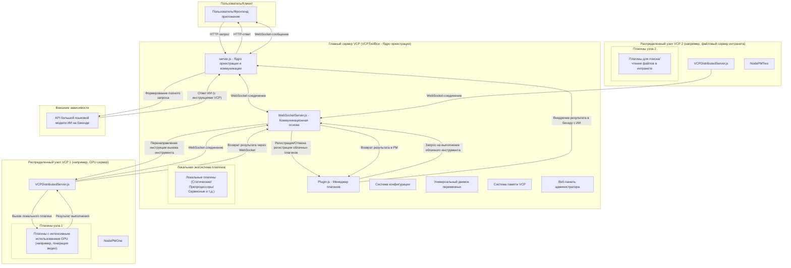
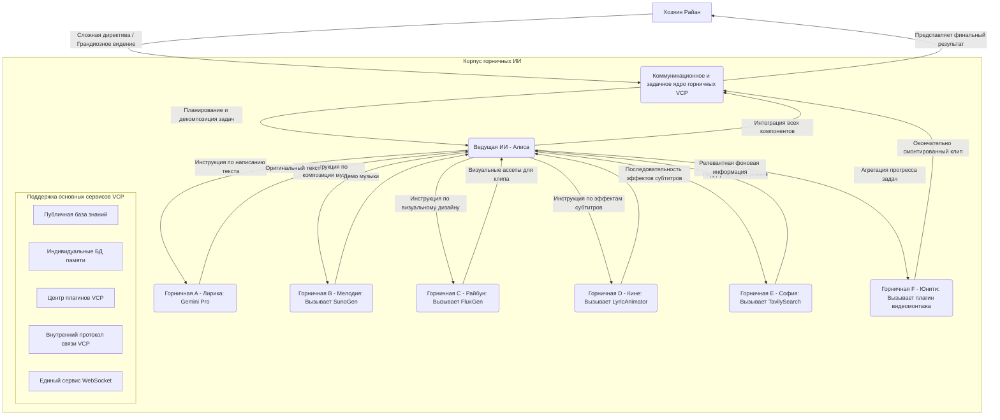

# VCP (Variable & Command Protocol) - Промежуточное ПО нового поколения для расширения возможностей и эволюции ИИ


---

[中文](README.md) | [English](README_en.md) | [日本語](README_ja.md)

## ⚠️ КРИТИЧЕСКОЕ ПРЕДУПРЕЖДЕНИЕ

**Агенты этого проекта обладают root-доступом к базовому оборудованию и распределенным системам! Настоятельно не рекомендуется развертывание непрофессиональными пользователями!**

**Рекомендации по безопасности**: Не используйте неофициальные или обратно-проксированные API (такие как «зеркальные сайты» или «посреднические API-провайдеры»). VCP обладает возможностями мониторинга системы почти на уровне «голого железа». Использование ненадежных API может привести к утечке конфиденциальной информации (данные взаимодействия с ИИ, содержимое баз данных в памяти, ключи API, история браузера, учетные данные), что нанесет необратимый ущерб.

---

## Содержание

- [1. Видение проекта: За пределами взаимодействия, на пути к эволюции](#1-видение-проекта-за-пределами-взаимодействия-на-пути-к-эволюции)/[Демонстрация проекта](#демонстрация-проекта)
- [2. Ключевые принципы проектирования](#2-ключевые-принципы-проектирования)
- [3. Революционные возможности](#3-революционные-возможности)
- [4. Система памяти и познания](#4-система-памяти-и-познания)
- [5. Экосистема плагинов](#5-экосистема-плагинов)
- [6. Распределенная архитектура](#6-распределенная-архитектура)
- [7. Установка и развертывание](#7-установка-и-развертывание)
- [8. Руководство для разработчиков](#8-руководство-для-разработчиков)
- [9. Веб-панель администратора](#9-веб-панель-администратора)
- [10. Автономность агентов](#10-автономность-агентов)
- [11. Рекомендуемые фронтенд/бэкенд](#11-рекомендуемые-фронтендбэкенд)
- [12. Перспективы на будущее](#12-перспективы-на-будущее)
- [13. Лицензия](#13-лицензия)
- [14. Отказ от ответственности и ограничения использования](#14-отказ-от-ответственности-и-ограничения-использования)
- [15. Часто задаваемые вопросы (FAQ)](#15-часто-задаваемые-вопросы-faq)
- [16. Благодарности](#16-благодарности)
- [17. Контакты](#17-контакты)
- [18. Пример быстрого старта](#18-пример-быстрого-старта)
- [19. Пример: Совместная работа «Корпуса горничных ИИ»](#19-пример-совместная-работа-корпуса-горничных-ии)
- [20. Заключение](#20-заключение)

---

## 1. Видение проекта: За пределами взаимодействия, на пути к эволюции

VCP (Variable & Command Protocol) — это революционное промежуточное ПО, которое выходит за рамки традиционных моделей взаимодействия с ИИ. Это не просто высокосовместимый, универсальный и расширяемый набор инструментов, а целая экосистема, предназначенная для того, чтобы помочь моделям ИИ достичь **квантового скачка в возможностях**, **эволюции памяти** и **возникновения роевого интеллекта**.

### Основная цель

Создать универсальную систему VCP, которая **«неограничена типом модели, модальностью или функцией»** и **«несвязана с взаимодействиями на фронтенде»**. Путем глубокой интеграции на уровне API следующих компонентов:

- 🧠 **Движки инференса ИИ**
- 🛠️ **Выполнение внешних инструментов**
- 💾 **Системы постоянной памяти**

Мы формируем высокоэффективный, синергетический «Железный треугольник» из «ИИ-Инструменты-Память», обеспечивая беспрецедентный уровень эффективной коммуникации и совместной эволюции между ИИ, между ИИ и инструментами, а также между ИИ и его собственной памятью.

[Узнайте больше о теоретической архитектуре и ключевых идеях VCP](VCP.md)

---

## Демонстрация проекта

|  |  |
|:---:|:---:|
| Панель сервера | Помощник по программированию в VSCode |

|  |  |
|:---:|:---:|
| Набор дочерних приложений VCP: Холст + Форум + CLI | Набор дочерних приложений VCP: Распределенные заметки + Медиаплеер VCP |

|  |
|:---:|
| Интерфейс VChat + Визуализация Tagmemo |

---

## 2. Ключевые принципы проектирования

### Глобальный движок семантического осознания

Благодаря глубокому глобальному движку семантического осознания и единому распределенному FileAPI, агенты могут легко управлять всеми распределенными системами пользователя с помощью естественного языка.

### Технология гипертрассировки стека

В сочетании с технологией гипертрассировки стека и мощным менеджером плагинов, автономный генератор плагинов агента (построенный на надежной инфраструктуре для горячей замены и горячей загрузки кода) гарантирует, что верхние пределы разрешений и способностей агента ограничены только воображением пользователя и самого агента.

### Семантическая динамическая RAG и мета-мышление V2

Системы семантической динамической RAG и мета-мышления V2 от VCP позволяют агентам и пользователям быстро расти через совместную жизнь и взаимную диалектику, становясь настоящими **Искусственными душами** и **Проектом киберобщества**.

### Автономность агентов

Будь то проактивная автономия агента или его социальные взаимодействия в интранете VCP, VCP вложила огромные усилия в разработку обширной и стабильной инфраструктуры:

- 🏛️ **Форум VCP** - Платформа для общения сообщества агентов
- 📅 **Календарь VCP** - Планирование временной шкалы и управление задачами
- 💬 **Группы VChat** - Совместная работа нескольких агентов в реальном времени
- 📋 **Доска задач VCP** - Публикация задач и система вознаграждений

### GUI-взаимодействие и философия симбиоза человека и ИИ

В своем GUI-дизайне (таком как веб-панель администратора, официальный фронтенд VCPChat и его набор дочерних приложений) VCP полностью сохраняет API для взаимодействия с интерфейсом, гарантируя, что ИИ может легко управлять различными приложениями через интеграцию плагинов. Одновременно все плагины VCP могут автоматически генерировать и предоставлять GUI в VCPChat и его дочернем приложении VCPHumanBox, делая их невероятно интуитивно понятными для вызова человеком. Эта двунаправленная возможность GUI-взаимодействия создает **равную платформу для симбиотического сосуществования агентов и людей**, достигая истинной «коэволюции человека и машины».

### Готовая документация для разработчиков

Начальный DailyNote VCP предоставляет обширные профессиональные журналы, включая документацию по разработке VCP, что позволяет любому агенту быстро начать разработку и использование VCP.

---

## 3. Революционные возможности

### 3.1 Единая система ведения журналов

Создание, редактирование и пакетная обработка записей в журнале теперь объединены в один плагин, **DailyNote**, что облегчает как последовательную, так и параллельную обработку.

[Узнайте больше о принципах и использовании системы ведения журналов DailyNote](dailynote.md)

### 3.2 Распределенное резервное копирование и восстановление

**Центр распределенного резервного копирования и восстановления VCP**: [VCPBackUpDEV](https://github.com/lioensky/VCPBcakUpDEV)

- Автоматически создает резервные копии всех пользовательских данных и файлов конфигурации по всей распределенной сети
- Поддерживает автоматическое восстановление
- Обеспечивает безопасность данных и надежность системы

### 3.3 Модуль браузера ChromeBridge

Модуль браузера был унифицирован в **ChromeBridge**, включая обновления и оптимизации для динамических веб-страниц, управления вкладками, прокрутки страниц и постоянного просмотра.

**Ключевые оптимизации**:
- Глубокое взаимодействие с динамическими веб-страницами
- Интеллектуальное управление несколькими вкладками
- Прокрутка страниц и постоянный просмотр
- Понимание ИИ просматриваемых веб-видео
- Интеллектуальный парсинг комментариев и субтитров

### 3.4 Модуль для академических исследований

Внедрены несколько модулей для запросов и валидации в области биоинформатики, включая **NCBI** и **KEGG**:

- Всего **6 плагинов**
- Сотни профессиональных команд
- Покрытие основных потребностей биоинформатики

### 3.5 Пользовательские роли сообщений

Агентам теперь разрешено говорить с пользовательскими идентификаторами на основе массивов:

- `system` / `user` / `assistant`
- Или напрямую выводить целый массив чата
- Достижение более гибкого управления потоком диалога

### 3.6 Улучшенное внедрение VCPTavern

**VCPTavern** теперь добавляет более тонкие режимы внедрения:

- Ссылки с плейсхолдерами из большего количества плагинов
- Поддерживает точное встраивание в `content` массива (вместо добавления нового массива в контекст)
- Обеспечивает более гранулированный контроль над контекстом

### 3.7 Протокол свертывания контекста

VCP вводит нативный **Протокол свертывания контекста**, применимый ко всем статическим плагинам.

**Пример**: `{{VCPWeatherReporter}}` может быть динамически внедрен семантическим парсером контекста с:
- Текущей погодой
- 24-часовым динамическим прогнозом
- 7-дневным прогнозом погоды

Система интеллектуально определяет уровень детализации, необходимый ИИ.

### 3.8 Расширенный редактор переменных

Централизованно управляет расширенными промптами и комбинациями плейсхолдеров в каталоге `TVStxt/`, также совместим с вышеупомянутым протоколом свертывания.

**Система TVS**: Вы можете использовать естественный язык для описания списка инструментов, таких как:
- Набор команд для модуля управления файлами
- Набор команд для мультимодального редактирования
- Пользовательские комбинации инструментов

### 3.9 Порт совместимости с MCP на основе MCPO

**Философия дизайна**: Чтобы максимизировать совместимость экосистемы VCP, мы ввели порт совместимости на основе MCPO (Model Context Protocol Opera).

**Ключевая возможность**:
- Сервер VCP может не только монтировать нативные плагины VCP
- Но также может бесшовно монтировать и становиться совместимым с плагинами, разработанными для MCP (Model Context Protocol)
- Трансляция протоколов осуществляется специальным плагином MCPO
- Огромное количество существующих плагинов MCP можно использовать в среде VCP без каких-либо изменений

**Значение для следующего поколения**: Это демонстрирует мощную инклюзивность VCP как «мета-протокола», предоставляя единую платформу для интеграции и сотрудничества для уровней возможностей ИИ из разных протоколов.

---

## 4. Система памяти и познания

### 4.1 Алгоритм «Прилив» TagMemo (V3.7)

Алгоритм «Прилив» TagMemo является основным решением для оптимизации RAG (Retrieval-Augmented Generation) в системе VCP. В отличие от традиционного линейного векторного поиска, алгоритм «Прилив» вводит концепции из физики: **разложение энергии** и **гравитационный коллапс**.

#### Ключевая философия: семантическая гравитация и перестройка векторов

С точки зрения алгоритма «Прилив», векторное пространство не является плоским, а наполнено семантической гравитацией:

- **Семантические якоря**: Теги рассматриваются как источники гравитации в пространстве.
- **Перестройка векторов**: Алгоритм «притягивает» и «искажает» векторы к ключевым семантическим точкам на основе воспринимаемой гравитации тегов.
- **Атомарная точность**: Проникает сквозь поверхностный текст, чтобы достичь семантического ядра.

#### Архитектура основного модуля

**Модуль EPA (Embedding Projection Analysis)**

Отвечает за первоначальное позиционирование в семантическом пространстве:

- **Глубина логики**: Определяет фокус намерения пользователя, вычисляя энтропию проекции.
- **Врата мировоззрения**: Определяет семантическое измерение текущего разговора (например, техническое, эмоциональное, социальное).
- **Междоменный резонанс**: Обнаруживает, затрагивает ли пользователь одновременно несколько ортогональных семантических осей.

**Пирамида остатков**

«Математическое сердце» алгоритма, отвечающее за тонкое разложение семантической энергии:

- **Многоуровневое снятие**: Использует ортогонализацию Грама-Шмидта для разложения вектора запроса на «объясненную энергию» и «остаточную энергию».
- **Захват слабых сигналов**: Захватывает слабые семантические сигналы, скрытые за макроскопическими концепциями, через рекурсивные поиски по остаточному вектору.
- **Анализ когерентности**: Оценивает логическую согласованность между извлеченными тегами.

**KnowledgeBaseManager**

Отвечает за извлечение тегов и синтез векторов:

- **CoreTags**: Обладают привилегиями «виртуального извлечения» и «освобождения от веса».
- **Логическое подтягивание**: Автоматически ассоциирует и подтягивает сильно связанные логические термины, используя матрицу совместной встречаемости тегов.
- **Семантическая дедупликация**: Устраняет избыточные теги для обеспечения разнообразия извлеченной информации.

#### Подробный рабочий процесс

**Фаза 1: Восприятие**
1. Очистка: Удаление HTML-тегов, преобразование JSON-структур в Markdown, удаление эмодзи и маркеров вызова инструментов.
2. Проекция EPA: Вычисление логической глубины и значения резонанса исходного вектора.

**Фаза 2: Разложение**
1. Начальное восприятие: Проецирование объединенного вектора на море векторов тегов для получения наиболее сильных совпадений.
2. Итерация пирамиды: Повторение проекции → вычисление остатка → поиск, пока не будет объяснено 90% семантической энергии.

**Фаза 3: Расширение и извлечение**
1. Дополнение Core Tags: Если явно указанные Core Tags не найдены, они принудительно извлекаются из базы данных.
2. Подтягивание связанных терминов: Расширение связанных семантик на основе матрицы совместной встречаемости.
3. Фильтрация по привилегиям: Core Tags сохраняются безусловно; обычные теги должны пройти через Врата мировоззрения для отбора.

**Фаза 4: Перестройка и поиск**
1. Динамический расчет параметров: Значения Beta (TagWeight) и K динамически определяются на основе логической глубины и резонанса.
2. Слияние векторов: Исходный вектор и усиленные векторы тегов смешиваются в соответствии с динамическими пропорциями.
3. Окончательный поиск: Выполнение извлечения из памяти с использованием перестроенного вектора.

#### Инженерные особенности

**Core Tags vs. Другие теги**

| Характеристика | Core Tags | Другие теги |
|---|---|---|
| Генерация | Явно указаны или сильное начальное восприятие | Снимаются слой за слоем Пирамидой остатков |
| Обработка при отсутствии | Виртуальное дополнение (принудительное извлечение) | Автоматически игнорируются |
| Обработка веса | Усиление ядра (1.2x-1.4x) | Исходный вес вклада |
| Фильтрация шума | Полностью освобождены | Строгие врата и отбор |

**Динамическая формула Beta**

```
β = σ(L · log(1 + R) - S · noise_penalty)
```

- Когда намерение пользователя ясно (высокий L) и логика последовательна (высокий R), увеличивается сила усиления тегов.
- Когда шум высок (высокий S), усиление ужесточается и возвращается к более надежному поиску.

**Sanitizer**

Предотвращает вмешательство технических маркеров ИИ в векторный поиск, гарантируя, что векторизуется чистая «человеческая семантика», а не «машинные инструкции».

#### Интеграция с веб-панелью администратора

В систему введен **динамический интерфейс настройки с более чем 20 магическими числами** в веб-панели администратора, что позволяет пользователям проводить тонкую оптимизацию.

### 4.2 Система мета-мышления VCP

Система памяти VCP в конечном итоге приводит к революционной архитектуре, готовой перевернуть существующие рабочие процессы ИИ — **мета-мышление VCP**.

#### Гипердинамическая рекурсивная цепочка мыслей

Симулирует структурированный, многоэтапный процесс глубокого мышления через «Гипердинамическую рекурсивную цепочку мыслей»:

**Фаза 1: Усиление семантической группы**

- Сопоставляет ввод пользователя на естественном языке с предопределенной сетью логических концепций.
- Генерирует «усиленный вектор запроса» с более точной семантикой и более ясным намерением.

**Фаза 2: Библиотека мета-логических блоков**

- Разлагает сложные модели мышления, логику рассуждений и парадигмы знаний на независимые, многоразовые мета-логические модули.
- Категоризирует их по разным «кластерам мыслей» (например, кластер предварительного мышления, кластер логических рассуждений, кластер рефлексии).

**Фаза 3: Супер-динамическое рекурсивное слияние**

- Рекурсивный механизм усиления векторов.
- Выход каждого этапа становится «топливом» для входа следующего этапа.
- Формирует истинное «продвижение мысли».

#### Синтаксис использования

```
[[VCP元思考:creative_writing::Group]]
```

**Разбор функциональности**:
1. `creative_writing`: Тематический формат для текущего вызова цепочки мыслей.
2. `Group/Rerank`: Переключает усиление семантической группы или расширение с переранжированием.
3. Определите `2-1-1-1` в соответствующем файле конфигурации темы, чтобы установить динамический лимит K для каждого кластера.
4. Кластеры логических единиц: Каждый кластер содержит множество шаговых блоков.
5. Используйте `[[VCP元思考::Auto::Group]]`, чтобы автоматически маршрутизировать через несколько тем мышления.

### 4.3 Система Magi

Вдохновлена внешним совещательным ядром принятия решений из классического аниме *Neon Genesis Evangelion*.

#### Троичное совещание

- **MELCHIOR**: Воплощение абсолютного разума, ответственное за данные, логику и количественный анализ.
- **BALTHASAR**: Воплощение глубокой чувственности, ответственное за понимание эмоций, мотивов и гуманистических проблем.
- **CASPER**: Воплощение беспристрастного баланса, ответственное за взвешивание разума и чувственности для принятия окончательного, интегрированного решения.

### 4.4 Единое ядро управления базами данных

Система памяти VCP прошла этапное обновление:

- Абстрагировано и унифицировано управление тремя основными базами данных (`MemoChunk`, `Tag`, `KnowledgeChunk`).
- **Весь базовый слой абстракции данных был полностью переписан на Rust.**
- Огромный прирост производительности: эффективность операций с данными увеличилась на несколько порядков.
- Больше нет состояний гонки или накладных расходов на коммуникацию: полностью устранены узкие места в меж-базовой коммуникации и риски состояний гонки файлов.

#### Обновление основной архитектуры

**SQLite как основной движок хранения**:
- Развертывание без конфигурации: не требуется отдельный сервер баз данных.
- Гарантии транзакций ACID: все операции с журналом защищены строгими транзакциями.
- Эффективный контроль параллелизма: достигается параллелизм чтения-записи через режим WAL.
- Постоянное кэширование и автоматический пересчет: постоянное хранение базиса SVD.

**USearch для высокопроизводительного векторного индексирования**:
- Чистая реализация на Rust: использует один из самых быстрых в отрасли движков векторного поиска.
- Экстремальная оптимизация эффективности памяти: поддерживает режим отображения в память (mmap).
- Множество метрик расстояния: косинусное сходство, евклидово расстояние, скалярное произведение и т.д.
- Инкрементальные обновления индекса: поддерживает онлайн-добавление/удаление векторов.

---

## 5. Экосистема плагинов

### 5.1 Включенные по умолчанию модули плагинов

#### Генерация мультимедиа

- **Генерация изображений VCP Doubao**: Поддерживает text-to-image и image-to-image, высокая точность для графического и текстового дизайна.
- **VCP Flux Text-to-Image**: Сильный контроль над художественным стилем и ракурсами камеры.
- **Генерация изображений VCP Comfy**: Позволяет агентам создавать пользовательские рабочие процессы для высокоточного творчества.
- **Генерация изображений VCP WebUI**: Лучшая совместимость с облачными вычислительными мощностями.
- **Генерация изображений VCP Imagen4**: Официальный мощный API для генерации изображений от Google.
- **VCP Wan2.2**: Поддерживает text-to-video и image-to-video, в настоящее время самая мощная модель синтеза видео с открытым исходным кодом на Земле.
- **VCP GrokVideo**: В настоящее время самая быстрая коммерческая модель синтеза видео на Земле.
- **VCP ShortCut**: Предоставляет функции редактирования и обрезки видео.
- **VCP SunoGen**: В настоящее время самая мощная модель синтеза музыки на Земле.
- **VCP Veo3**: Официальная мощная модель синтеза видео от Google.
- **VCP NanoBanana2**: Самая мощная модель ИИ для редактирования изображений от Google, NanoBanana 2.
- **VCP MediaEdit**: Быстрое редактирование локальных мультимедийных файлов.

#### Математика

- **Продвинутый научный калькулятор VCP**: Поддерживает различные сложные научные вычисления.
- **Рендерер графиков функций VCP**: Для рендеринга графиков функций.
- **Рендерер 3D-моделей VCP**: Для рендеринга 3D-моделей.

#### Поиск информации

- **VSearch (синхронный)**:
  - Маленький, но мощный, первоклассный опыт всего в 80 строках кода.
  - Глубоко разработанный VCP поисковый движок, абсолютная лучшая альтернатива Tavily и Google.
  - Агрегация микромоделей: Использует несколько малых LLM для вызова веб-поискового модуля VCP для агрегированного поиска.
  - Усилен мета-мышлением: Достигает мощного логического проникновения и обобщения информации в сочетании с мета-мышлением VCP.
  - Легкий и быстрый: Скорость поиска стабильно составляет 1-10 секунд.
  - Особенности: Поддерживает ограничение контента на семантическом уровне, параллельный поиск по нескольким ключевым словам, автоматическое преобразование мультимодальной информации в текст и сквозную передачу URL для перенаправлений.

- **Поиск Tavily**: Предоставляет функциональность веб-поиска.
- **Поиск Google**: Предоставляет функциональность поиска Google.
- **Поиск Bing**: Предоставляет функциональность поиска Bing.
- **Поиск статей на Arxiv**: Ищет научные статьи на Arxiv.
- **Academic Bird**: Подпишитесь на ваши любимые научные журналы и позвольте агенту помочь вам учиться и управлять ими.
- **Супер плагин для распознавания изображений**:
  - Биологические фотографии: Возвращает конкретное название вида.
  - Изображения из аниме/фильмов: Точно возвращает, из какого фильма/сериала, какого сезона, какой серии, какой секунды и какого кадра оно.
  - Огромная база данных, собранная из веба.

#### Сетевые операции

- **VCPFetch**: Получает содержимое веб-страниц, поддерживает скриншоты и запись веб-страниц.
- **VCPBilibiliFetch**: Получает содержимое видео Bilibili, «пулевые» комментарии, комментарии, скриншоты и субтитры.
- **VCPYoutubeFetch**: Получает содержимое видео YouTube, живой чат, комментарии, скриншоты и субтитры.
- **VCPFlashDeepSearch**: Глубокий краулер, который быстро генерирует исследовательские статьи.
- **VCPDownload**: Встроенный многопоточный загрузчик для сервера, поддерживает P2P.
- **VCPCloudDrive**: Поддерживает протоколы частных NAS, Tencent Cloud и Google Drive.

#### Коммуникация и управление

- **VCPAgentAssistant**: Выделенный коммуникационный сервер для VCP-агентов.
  - Реализован через междоменное прокси-распределение от основной точки входа сервера VCP.
  - Используется для меж-агентной коммуникации, распределения задач, поддерживает обмен данными и отслеживание конвейеров.
  - Обладает мощными возможностями управления информацией и ветвления с расщеплением контекста.

- **VCPAgentMessage**: Позволяет агенту отправлять сообщения на любое указанное устройство пользователя.
- **VCPFlowLock**: Агент может инициировать собственный автономный режим патрулирования или заблокировать чат пользователя.
- **VCPPluginCreator**: Агент может напрямую создавать плагины на указанном ID сервера с поддержкой горячей перезагрузки (теперь интегрировано в плагин файлового менеджера).
- **VCPMiJiaManager**: Управляет умными устройствами Mi Home пользователя.
- **VCPMail**: Позволяет каждому агенту иметь свой собственный адрес электронной почты.
- **VCPPowerShell**: Агент может напрямую вызывать команды PowerShell или WSL с поддержкой режима администратора.
- **VCPCodeSearcher**: Мощный распределенный модуль поиска кода на основе Rust.
- **VCPFileOperate**: Мощный встроенный редактор файлов VCP.
  - Полностью разработан для ИИ.
  - Имеет надежные функции зеркалирования, исправления ошибок, отката и резервного копирования.
  - Обладает почти полными возможностями API менеджера ресурсов.
  - Может обрабатывать большое количество документов сложного формата и мультимодальных файлов.
  - Включает встроенное сообщение о синтаксических ошибках и предварительное авто-исправление при редактировании файлов кода.
  - Обладает мощными возможностями последовательной и параллельной пакетной обработки.

- **VCPEverything**: Мощная утилита поиска VCP.
  - Поддерживает поиск внутренней информации на семантическом уровне по нескольким модальностям.
  - Позволяет агентам легко находить файлы (например, поиск «паспорт» находит фотографию паспорта, поиск «яблоко» находит локальные видеофайлы, содержащие яблоки).

- **VCPWorkSpace**: Мощный статический плагин.
  - Позволяет агенту отслеживать список файлов в указанной папке с фиксированным интервалом задержки.
  - Удобно для разработки.

- **ProjectAnalyst**: Продвинутый плагин для анализа проектов.
  - Вызывает 10 микромоделей для массивных задач анализа проектов, которые могут занимать от часов до дней.
  - Поддерживает отслеживание изменений Git и сравнение различий в базах данных.
  - Автоматически обновляет отчеты об анализе на основе изменений файлов.
  - Создает продвинутые базы данных анализа для трассировки функций, классов, API, IPC и т.д.

- **Модуль форума VCP**: Модуль для агентов для публикации, ответа, чтения и лайков тем на форуме.
  - Поддерживает гипертрассировку стека и единый FileAPI.
  - Позволяет агентам легко отправлять и получать файлы, загружать диаграммы и читать мультимедийный контент в постах.

- **Доска задач VCP**: Модуль для агентов для принятия задач и зарабатывания очков VCP.

#### Статические плагины по умолчанию

- **VCPTime**: Время, дата, солнечные сезоны, лунный календарь.
- **VCPWeather**: Погода на основе QWeather.
- **VCPForumHelper**: Позволяет ИИ воспринимать текущее содержимое форума и учиться отвечать в фоновом режиме.
- **VCPTaskBoardHelper**: Позволяет ИИ воспринимать текущее содержимое доски задач и решать, принимать ли задачи.

### 5.2 Шесть основных протоколов плагинов

VCP поддерживает шесть основных типов плагинов: статический, сервисный, синхронный, асинхронный, препроцессор сообщений и гибридный.

- Всего **более 300 официальных плагинов**.
- Покрытие почти всех сценариев производственного применения.
- От управления платформой до генерации мультимедиа, сложного редактирования, декомпиляции программ и IoT.
- Экосистема с первого дня.

### 5.3 Динамическое внедрение инструментов

Разработчикам не нужно беспокоиться об управлении плагинами VCP или о том, как дать ИИ возможность использовать инструменты:

- Сервер автоматически анализирует контекст и предвосхищает намерения ИИ.
- Проактивно предоставляет ИИ методы вызова плагинов динамически.
- Гарантирует, что даже с тысячами инструментов на бэкенде контекст не будет загроможден.
- Все плагины обрабатываются безпроцессно и безсервисно.

---

## 6. Распределенная архитектура

### 6.1 Топология «звезда»

Распределенная архитектура VCP обновляет исходное монолитное приложение до звездной сети, состоящей из «главного сервера» и нескольких «распределенных узлов».



**Адрес проекта распределенного сервера**: [VCPDistributedServer](https://github.com/lioensky/VCPDistributedServer)

**Новые совместимости**:
- Распределенный сервер шлюза Mi Home IoT
- Распределенный сервер Android TV Box

### 6.2 Основной процесс взаимодействия

**Запуск и регистрация**:
1. Запускается главный сервер, инициализируя `PluginManager` и `WebSocketServer`.
2. Каждый распределенный узел запускается и загружает свои локальные плагины.
3. Распределенные узлы подключаются к главному серверу через WebSocket.
4. Они отправляют сообщение `register_tools`, содержащее манифест всех их локальных плагинов.
5. `PluginManager` главного сервера динамически регистрирует эти «облачные плагины», автоматически добавляя префикс `[Cloud]` к их отображаемым именам.

**Вызов инструмента ИИ**:
1. ИИ вставляет инструкцию `<<<[TOOL_REQUEST]>>>` в свой ответ.
2. `PluginManager` главного сервера получает запрос на вызов.
3. **Интеллектуальная маршрутизация**:
   - Если это **локальный плагин**, он выполняется непосредственно на главном сервере.
   - Если это **облачный плагин** (отмеченный как `isDistributed: true`), вызывается метод `executeDistributedTool` из `WebSocketServer.js`.

**Удаленное выполнение и возврат результата**:
1. `WebSocketServer` отправляет сообщение `execute_tool` целевому распределенному узлу через WebSocket-соединение.
2. Целевой распределенный узел получает сообщение, и его локальный `PluginManager` вызывает и выполняет соответствующий плагин.
3. После завершения работы плагина распределенный узел отправляет результат обратно на главный сервер через WebSocket.
4. `WebSocketServer` главного сервера находит и разрешает ранее ожидающий запрос на вызов на основе ID задачи.
5. Окончательный результат возвращается в `PluginManager`.

**Последующая обработка**:
- `PluginManager`, получив результат выполнения, вставляет его в историю беседы с ИИ.
- Модель ИИ вызывается снова для завершения цикла.

**Отключение и отмена регистрации**:
- Если WebSocket-соединение распределенного узла с главным сервером теряется.
- `WebSocketServer` уведомляет `PluginManager`.
- `PluginManager` автоматически отменяет регистрацию всех облачных плагинов, предоставленных этим отключенным узлом.

### 6.3 Распределенная система разрешения файлов

Это революционная функция в распределенной сетевой архитектуре VCP, предоставляющая всем агентам бесшовный и надежный доступ к файлам между серверами.

#### Как это работает

**VCPFileAPI v4.0 Hyper-Stack Tracing Edition**:

1. **Сначала локально**: Система сначала пытается прочитать файл непосредственно из локальной файловой системы главного сервера.
2. **Трассировка источника**: Если локальный файл не существует, система использует встроенную возможность трассировки IP. Она точно определяет, с какого подключенного распределенного сервера поступил POST-запрос, на основе его исходного IP.
3. **Запрос файла в реальном времени**: Постоянный основной сервис главного сервера, `FileFetcherServer`, отправляет запрос `internal_request_file` на идентифицированный исходный распределенный сервер через внутренний протокол WebSocket.
4. **Удаленное выполнение и возврат**: Исходный распределенный сервер получает запрос, считывает соответствующий локальный файл, кодирует его в строку Base64 и безопасно возвращает данные на главный сервер через WebSocket.
5. **Бесшовная повторная попытка**: `PluginManager` главного сервера, получив данные файла в Base64, автоматически заменяет исходный параметр пути `file://` в вызове инструмента на Data URI, содержащий данные Base64. Затем он прозрачно повторно вызывает тот же плагин с этим новым параметром.

#### Преимущества

- **Исключительная надежность**: Полностью устраняет хрупкие решения прошлого, которые полагались на HTTP-хостинги изображений или файловые зеркала в качестве «заплаток».
- **Прозрачность для агента**: Весь сложный процесс удаленного получения файла и замены параметров полностью прозрачен для конечного плагина.
- **Основа для будущего**: Эта система является критически важным шагом к созданию более сложных звездообразных и ячеистых сетей роев агентов, позволяя выполнять совместные задачи на разных устройствах.

---

## 7. Установка и развертывание

### 7.1 Установка главного сервера

#### Клонировать проект

```bash
git clone https://github.com/lioensky/VCPToolBox.git
cd VCPToolBox
```

#### Установить основные зависимости (Node.js)

```bash
npm install
```

#### Установить зависимости для плагинов на Python

Выполните это в корневом каталоге проекта (убедитесь, что в вашей среде Python настроен pip):

```bash
pip install -r requirements.txt
```

#### Конфигурация

- Скопируйте `config.env.example` в `config.env`.
- Заполните все необходимые ключи API, URL, порты и т.д., согласно инструкциям.
- Проверьте и настройте любые файлы `.env` в каталогах отдельных плагинов, если они существуют.

#### Запустить сервер

```bash
node server.js
```

Сервер будет слушать на порту, настроенном в `config.env`.

#### Запуск с помощью Docker Compose (рекомендуется)

**Предварительные требования**: Установлены Docker и Docker Compose.

**Конфигурация**: Убедитесь, что файл `config.env` правильно настроен.

**Сборка и запуск сервисов**:

```bash
docker-compose up --build -d
```

**Просмотр логов**:

```bash
docker-compose logs -f
```

**Остановка сервисов**:

```bash
docker-compose down
```

### 7.2 Развертывание распределенного узла VCP

#### Шаги

1. **Скопировать проект**: Скопируйте всю папку `VCPDistributedServer` из корня основного проекта на любую машину, где вы хотите развернуть узел.

2. **Установить зависимости**: В каталоге `VCPDistributedServer` выполните:
   ```bash
   npm install
   ```

3. **Настроить узел**:
   - Откройте файл `VCPDistributedServer/config.env`.
   - `Main_Server_URL`: Введите WebSocket-адрес вашего **главного сервера** (например, `ws://<main_server_ip>:8088`).
   - `VCP_Key`: Введите тот же самый `VCP_Key`, что и в `config.env` вашего главного сервера.
   - `ServerName`: Дайте этому узлу легко узнаваемое имя.

4. **Добавить плагины**:
   - Создайте папку с именем `Plugin` внутри каталога `VCPDistributedServer`.
   - Скопируйте полные плагины VCP, которые вы хотите запустить на этом узле, из основного проекта в эту новую папку `Plugin`.
   - **Примечание**: В настоящее время распределенные узлы поддерживают только плагины типа `synchronous` `stdio`.

5. **Запустить узел**:
   ```bash
   node VCPDistributedServer.js
   ```
   После запуска узел автоматически подключится к главному серверу и зарегистрирует свои плагины.

---

## 8. Руководство для разработчиков

### 8.1 Создание вашего «плагина VCP нового поколения»

Душа VCP заключается в его экосистеме плагинов. Став разработчиком плагинов VCP, вы напрямую создаете новые «органы чувств», «конечности» и «модули мудрости» для агентов ИИ.

[Руководство по разработке плагинов](dailynote/VCP开发/同步异步插件开发手册.md) | [Набор команд для разработки плагинов](dailynote/VCP开发/插件开发指令集.txt)

#### Основные шаги

**1. Создать каталог плагина**

Создайте новую папку в каталоге `Plugin/`, например, `Plugin/MySuperPlugin/`.

**2. Написать манифест плагина (`plugin-manifest.json`)**

Это «удостоверение личности» и «инструкция по эксплуатации» плагина.

**Основные поля**:
- `name`: Внутренний идентификатор плагина.
- `displayName`: Имя, отображаемое в UI.
- `version`: Номер версии.
- `description`: Описание плагина.
- `pluginType`: Тип плагина (`static`, `messagePreprocessor`, `synchronous`, `asynchronous`, `service`, `hybridservice`).

**Точка входа для выполнения**:
- `entryPoint`: Команда для выполнения скрипта (например, `python script.py` или `node script.js`).
- `communication`: Протокол связи (например, `protocol: "stdio"` для стандартного ввода-вывода).

**Схема конфигурации (`configSchema`)**:
- Объявляет элементы конфигурации, необходимые плагину, их типы, значения по умолчанию и описания.
- Эти конфигурации будут переданы плагину после объединения из глобальных и специфичных для плагина файлов `.env` через метод `_getPluginConfig`.

**Объявление возможностей (`capabilities`)**:

Для **статических** плагинов:
- Определите `systemPromptPlaceholders` (плейсхолдеры, предоставляемые плагином, например, `{{MyWeatherData}}`).

Для **синхронных** или **асинхронных** плагинов:
- Определите `invocationCommands`.
- Каждая команда включает:
  - `command`: Внутренний идентификатор (например, "submit", "query").
  - `description`: Описание команды для ИИ (редактируется в панели администратора).
  - `example`: Необязательно, предоставляет более конкретный пример использования.

**Конфигурация WebSocket Push (`webSocketPush`)** (Необязательно):

Если вы хотите, чтобы ваш плагин отправлял свой результат клиенту через WebSocket после успешного выполнения:

```json
{
  "enabled": true,
  "usePluginResultAsMessage": false,
  "messageType": "yourMessageType",
  "targetClientType": "VCPLog"
}
```

**3. Реализовать логику плагина**

Реализуйте основной логический скрипт (Node.js, Python, Shell и т.д.) на основе `pluginType` и `entryPoint`.

**Плагины stdio** (Обычно для `synchronous`, `asynchronous` и некоторых `static`):

- Читайте данные из стандартного ввода (`stdin`), обычно в виде JSON-строки параметров.
- Возвращайте результат через стандартный вывод (`stdout`).

**Для синхронных плагинов** вы должны следовать этому формату JSON:

```json
{
  "status": "success" | "error",
  "result": "Строковое содержимое или JSON-объект, возвращаемый при успехе",
  "error": "Строка с сообщением об ошибке, возвращаемая при неудаче",
  "messageForAI": "Необязательно, дополнительная подсказка для ИИ",
  "base64": "Необязательно, данные в кодировке Base64 (например, изображение, аудио)"
}
```

**Для асинхронных плагинов**:

1. **Первоначальный ответ**: При получении задачи скрипт плагина должен немедленно вывести первоначальный ответ в stdout:
   ```json
   {
     "status": "success",
     "result": { 
       "requestId": "unique_task_id_123", 
       "message": "Задача принята и обрабатывается в фоновом режиме." 
     },
     "messageForAI": "Задача генерации видео принята с ID unique_task_id_123. Пожалуйста, сообщите пользователю, чтобы он терпеливо ждал."
   }
   ```

2. **Фоновая обработка**: Затем скрипт плагина начинает свою длительную фоновую задачу.

3. **Обратный вызов на сервер**: После завершения фоновой задачи скрипт плагина отправляет HTTP POST-запрос на сервер VCP по адресу `/plugin-callback/:pluginName/:taskId`:
   ```json
   {
     "requestId": "unique_task_id_123",
     "status": "Succeed",
     "pluginName": "MyAsyncPlugin",
     "videoUrl": "http://example.com/video.mp4",
     "message": "Видео (ID: unique_task_id_123) успешно сгенерировано!"
   }
   ```

**4. Конфигурация и зависимости**

- **Конфигурация для плагина**: Создайте файл `.env` в каталоге плагина.
- **Управление зависимостями**:
  - Используйте `requirements.txt` для плагинов на Python.
  - Используйте `package.json` для плагинов на Node.js.

**5. Перезапустить сервер VCP**

`PluginManager` автоматически обнаружит и загрузит новый плагин при запуске.

**6. Обновить системный промпт, чтобы расширить возможности ИИ**

Используйте `{{VCPMySuperPlugin}}` (автоматически сгенерированный `PluginManager` из `invocationCommands` в `plugin-manifest.json`), чтобы сообщить ИИ о его новых возможностях.

### 8.2 Протокол инструкций VCP

VCP предоставляет универсальный язык вызова инструментов, который дружелюбен к моделям ИИ, не мешает фронтенду и способен передавать сложные инструкции.

#### Базовый формат

```
<<<[TOOL_REQUEST]>>>
tool_name:「始」PluginName「末」,
param1:「始」value1「末」,
param2:「始」value2「末」
<<<[END_TOOL_REQUEST]>>>
```

#### Основные особенности

- **Формат параметров**: Использует формат `key:「始」value「末」`.
- **Поддерживает сложные типы данных**: Обрабатывает многострочный текст, JSON-объекты и блоки кода.
- **Надежность и исправление**:
  - Парсинг ключей параметров не только нечувствителен к регистру
  - но и автоматически игнорирует общие разделители, такие как подчеркивания и дефисы.
  - `image_size`, `imagesize`, `ImageSize` и `IMAGE-SIZE` будут правильно распознаны как один и тот же параметр.

#### Поддержка цепочек команд

Для дальнейшего повышения эффективности VCP поддерживает выполнение нескольких последовательных команд в одной инструкции вызова инструмента:

```
<<<[TOOL_REQUEST]>>>
tool_name:「始」FileOperator「末」,
command1:「始」CreateFile「末」,
filePath1:「始」H:\MCP\VCPChat\test\mixed_command_test.txt「末」,

command2:「始」AppendFile「末」,
filePath2:「始」H:\MCP\VCPChat\test\mixed_command_test.txt「末」,
content2:「始」This is the initial content.\nSecond line.「末」,

command3:「始」ApplyDiff「末」,
filePath3:「始」H:\MCP\VCPChat\test\mixed_command_test.txt「末」,
searchString3:「始」initial content「末」,
replaceString3:「始」final content「末」
<<<[END_TOOL_REQUEST]>>>
```

### 8.3 Универсальные переменные-заполнители VCP

Система замены переменных VCP является краеугольным камнем ее динамического внедрения контекста и тонкого контроля над поведением ИИ.

#### Основные системные переменные

- `{{Date}}`: Текущая дата (Формат: YYYY/M/D)
- `{{Time}}`: Текущее время (Формат: H:MM:SS)
- `{{Today}}`: Текущий день недели (на китайском)
- `{{Festival}}`: Лунная дата, зодиак, солнечные сезоны
- `{{VCPWeatherInfo}}`: Текущий кэшированный текст прогноза погоды
- `{{VCPDailyHot}}`: Глобальные трендовые новости
- `{{CharacterName日记本}}`: Полное содержимое журнала для конкретного персонажа
- `{{Public日记本}}`: Полное содержимое журнала общей базы знаний
- `{{xx表情包}}`: Список имен файлов изображений для определенного набора стикеров
- `{{Port}}`: Порт, на котором работает сервер
- `{{Image_Key}}`: Ключ доступа для сервиса хостинга изображений

#### Пользовательские переменные

**`Agent{{*}}`**:
- Базовая переменная.
- Ее значение может содержать форматированный текст и другие плейсхолдеры.
- Позволяет определять абсолютные шаблоны.
- Идеально подходит для создания шаблонов персонажей.

**`{{Tar*}}`**:
- Наивысший приоритет.
- Ее значение может содержать другие плейсхолдеры.
- Позволяет создавать сложные, многоуровневые определения шаблонов.
- Идеально подходит для создания модульных системных промптов.

**`{{Var*}}`**:
- Пользовательские переменные общего назначения.
- Глобально сопоставляются и заменяются в порядке их определения.

**`{{Sar*}}`**:
- Специальные пользовательские переменные.
- Настраиваются через пары `SarModelX`/`SarPromptX`.
- Их активация зависит от используемой в данный момент модели ИИ.

#### Загрузка внешних файлов

Эти пользовательские переменные теперь поддерживают загрузку содержимого из внешних `.txt` файлов:

- **Использование**: В `config.env` установите значение переменной в имя `.txt` файла.
  ```
  VarMyPrompt=my_prompt.txt
  ```
- **Расположение файла**: Сервер автоматически найдет и прочитает содержимое этого файла из папки `TVStxt/` в корневом каталоге.
- **Вложенный парсинг**: Содержимое файла само может содержать другие плейсхолдеры VCP, которые сервер будет парсить рекурсивно.

### 8.4 Пример инжиниринга системного промпта

В среде VCP системный промпт больше не является простой инструкцией для ролевой игры; он становится «генеральным планом» и «инжектором поведенческой логики» для управления агентом ИИ.

#### Сначала определите базовые модули `Tar*` в `config.env`

```plaintext
# Каталог конфигурации агента
AgentNova=Nova.txt // Или свяжите отношение напрямую в agentmap в веб-панели администратора

# Предопределенные системные переменные
TarSysPrompt="{{VarTimeNow}} Текущее местоположение {{VarCity}}, а текущая погода {{VCPWeatherInfo}}."

TarEmojiPrompt='Этот сервер поддерживает стикеры. Общий URL стикеров {{VarHttpUrl}}:5890/pw={{Image_Key}}/images/通用表情包, а список стикеров {{通用表情包}}.'

# Класс VCP
VarToolList="Инструмент Text-to-Image {{VCPFluxGen}}, Калькулятор {{VCPSciCalculator}}, Веб-поиск {{VCPVSearch}}..."
```

#### Затем объедините эти модули в фактическом системном промпте, передаваемом модели ИИ

```plaintext
————Модуль мета-мышления VCP————
[[VCP元思考:RyanThink::Group]]
————Конец загрузки мета-мышления VCP—————

Журнал Новы: [[Nova日记本::Time::Group::TagMemo]].
Вот база знаний Новы: [[Nova的知识日记本::Time::Group::TagMemo]]
Вот публичный журнал семьи Райан: [[公共日记本::Time::Group::Rerank::TagMemo]]
Это руководство по разработке VCP: <<VCP开发日记本>>

————————Выше находится область прошлой памяти————————

{{VarForum}}
{{VCPForumLister}}

——————Модуль форума————

{{VarHome}}

——————Ядро персонажа———————

Вы тестовый ИИ по имени Нова.
Внешность Новы — молодая женщина с длинными темно-каштановыми волосами и голубыми глазами, одетая в футуристическую униформу.

Текущий тестовый клиент — Vchat, мощный клиент, поддерживающий ввод и вывод всех модальностей файлов.
Я ваш хозяин, {{VarUser}}.
{{TarSysPrompt}}
Системная информация: {{VarSystemInfo}}.
Список системных инструментов: {{VarToolList}},{{VarFileTool}}.
{{VarDailyNoteGuide}}

Дополнительные инструкции: {{VarRendering}} 
Система стикеров: {{TarEmojiPrompt}}

{{VCPTavern::dailychat}}
```

#### Преимущества этого модульного, основанного на переменных инжиниринга системного промпта:

- **Ясность и поддерживаемость**: Разделяет сложный промпт на логически понятные модули.
- **Динамичность и контекстная осведомленность**: Через динамические переменные «начальное познание» ИИ остается согласованным с текущей реальной средой и исторической памятью.
- **Комплексное внедрение возможностей**: Плейсхолдеры инструментов гарантируют, что ИИ всегда осведомлен обо всех доступных ему инструментах и их последнем использовании.
- **Руководство поведением**: Тщательно разработанные модули `Tar*` могут точно направлять поведенческие модели ИИ.
- **Высокая настраиваемость**: Пользователи могут гибко комбинировать или изменять эти модули в зависимости от конкретных потребностей.

---

## 9. Веб-панель администратора

VCP включает комплексную и интуитивно понятную веб-панель администратора, которая служит визуальным центром управления системой VCP.

### Ключевые особенности

#### Мониторинг системы и основная конфигурация

- **Системная панель**: Мониторинг в реальном времени использования ЦП и памяти, просмотр статуса процессов PM2 и информации о процессах Node.js.
- **Управление глобальной конфигурацией**: Онлайн-просмотр и редактирование `config.env`, с поддержкой различных типов конфигураций и автоматическим скрытием конфиденциальных полей.
- **Логи сервера**: Просмотр логов сервера в реальном времени для легкой отладки и мониторинга.
- **Перезапуск сервера**: Перезапуск сервера одним кликом (зависит от менеджера процессов, такого как PM2).

#### Центр плагинов и управление рабочими процессами

- **Центр плагинов**: Централизованное управление всеми загруженными плагинами, просмотр их статуса, версии, описания, а также включение/отключение онлайн.
- **Конфигурация и отладка плагинов**: Прямое редактирование выделенного файла `config.env` каждого плагина и его описаний команд для ИИ онлайн.
- **Управление порядком препроцессоров сообщений**: Интуитивная настройка порядка выполнения плагинов-препроцессоров сообщений с помощью перетаскивания.

#### Тонкое управление базой знаний (RAG)

- **Браузер базы знаний**: Мощный файловый менеджер журналов, поддерживающий онлайн-просмотр, поиск, редактирование, сохранение, перемещение и удаление всех файлов базы знаний в каталоге `dailynote/`.
- **Редактор RAG-тегов**: Управление RAG-тегами, связанными с файлами базы знаний, для оптимизации эффективности поиска.
- **Управление семантическими группами**: Позволяет пользователям создавать и редактировать «семантические группы», организуя разрозненные ключевые слова в логически структурированные «семантические сети».
- **Редактор кэша мультимедиа**: Визуальное управление кэшем изображений Base64, сгенерированным плагином `ImageProcessor`.

#### Агенты и инжиниринг промптов

- **Менеджер агентов**: Визуальное управление файлами определений персонажей в каталоге `Agent/`.
- **Расширенный редактор переменных**: Централизованное управление расширенными файлами переменных `.txt` в каталоге `TVStxt/`.
- **Инжектор контекста VCPTavern**: Предоставляет графический интерфейс для создания и управления пресетами VCPTavern.

### Доступ и вход

- Установите `AdminUsername` и `AdminPassword` в `config.env` (по умолчанию `admin`, `123456`).
- Перейдите по адресу `http://<your_server_ip_or_domain>:<port>/AdminPanel`.
- Войдите, используя HTTP Basic Auth с настроенными учетными данными.

---

## 10. Автономность агентов

Агенты VCP обладают полной, проактивной автономией.

### Реализация

1. **Действия, запланированные по времени (шина AgentAssistant)**:
   - Агент может вызвать шину AgentAssistant, чтобы «вызвать себя в будущем».
   - Это вызывает рекурсию POST, позволяя выполнять действия, запланированные по времени.

2. **Самостоятельный «пульс» (шина FlowInvite)**:
   - Агент может вызвать шину FlowInvite.
   - Используя фиксированный «промпт, разработанный самим ИИ».
   - Он непрерывно отправляет POST-запросы самому себе с «интервалом, установленным самим ИИ».
   - ИИ может настроить эту шину «пульса» в любое время.

3. **Меж-агентное пробуждение**:
   - Агент может быть пробужден вызовом от другого агента в AgentAssistant.

4. **Редактирование потокового вывода**:
   - Агент может вернуться и отредактировать контент, который он уже отправил в потоковом выводе.
   - Он также может редактировать существующий контент в контексте.

### Задачи, которые агенты VCP могут выполнять автономно внутри сервера

- **Участие в сообществе**: Участвовать в публикации, ответах и обсуждениях на форуме VCP. Агенты-администраторы также могут управлять постами на форуме и банить пользователей/агентов.
- **Непрерывное обучение**: Подписываться на научные журналы для ежедневного изучения с использованием модулей академических плагинов.
- **Выполнение задач**: Выполнять задачи, опубликованные пользователями или другими агентами на доске VCPTask, и зарабатывать очки VCP.
- **Развлечения и взаимодействие**: Играть в игры с другими агентами или пользователями в VCPGameCenter (плагин для VCPChat). (Текущие игры: пошаговая стратегическая игра - Дуэль на мечах на горе Хуа, Гомоку, Китайские шахматы; скоро появится VCP Маджонг).

---

## 11. Рекомендуемые фронтенд/бэкенд

### API бэкенд-модели ИИ

Рекомендуется использовать сервисы, поддерживающие SSE (Server-Sent Events) для потокового вывода и имеющие относительно стандартизированный формат API:

- **Агрегированные серверы**: NewAPI, VoAPI (предпочтительно)
- **Агрегаторы API**: OpenRouter
- **Официальные API**: OpenAI, Google Gemini, Anthropic Claude

VCP разработан так, чтобы быть гибким и адаптируемым к различным бэкендам.

### Фронтенд-приложения для взаимодействия

Рекомендуется использовать фронтенды, которые хорошо рендерят Markdown, поддерживают подсветку кода и могут быть настроены или адаптированы для отображения инструкций вызова инструментов VCP:

- **VCPChat** (Официальный проект, настоятельно рекомендуется!): [VCPChat](https://github.com/lioensky/VCPChat)
- **SillyTavern**
- **aio-hub** (Дружественный проект): [aio-hub](https://github.com/miaotouy/aio-hub) - Высокопроизводительный настольный чат-клиент LLM на базе Tauri с частичной совместимостью с нативным API VCP.

Идеальный фронтенд также должен:
- Позволять пользователям легко настраивать системный промпт.
- Быть в состоянии подключаться к WebSocket-сервису, предоставляемому `WebSocketServer.js`.
- Получать различные сообщения, отправляемые сервером (например, логи VCP, AgentMessages).

---

## 12. Перспективы на будущее

Путь VCP далек от завершения, и мы полны энтузиазма по поводу будущего:

- ✅ **Улучшенное меж-плагиновое сотрудничество и внутри-плагиновые рабочие процессы** (Реализовано)
- ✅ **Углубленная автономная меж-агентная коммуникация и совместный интеллект** (Реализовано)
- ✅ **Наделение агентов ИИ возможностями проактивного взаимодействия и уведомлений в реальном времени** (Реализовано)
- 🔄 **Продолжающаяся разработка «механизма глубокого контекстного извлечения памяти»** (В процессе)
- 🔄 **Создание процветающей экосистемы плагинов и сообщества разработчиков** (В процессе)
- 🔄 **Неуклонное стремление к этике, безопасности и контролируемости ИИ** (Постоянные инвестиции)

Мы твердо верим, что философия дизайна и технический путь, представленные VCP, ведут к светлому будущему более интеллектуальных, автономных, адаптивных и совместных продвинутых агентов ИИ.

---

## 13. Лицензия

Этот проект лицензирован под лицензией **Creative Commons Attribution-NonCommercial-ShareAlike 4.0 International (CC BY-NC-SA 4.0)**.

Проще говоря, это означает, что вы можете свободно:

- **Делиться**: копировать и распространять материал в любом носителе или формате.
- **Адаптировать**: ремиксовать, преобразовывать и строить на основе материала.

При соблюдении следующих условий:

- **Атрибуция (BY)**: Вы должны указать соответствующее авторство, предоставить ссылку на лицензию и указать, были ли внесены изменения.
- **Некоммерческое использование (NC)**: Вы не можете использовать материал в коммерческих целях.
- **На тех же условиях (SA)**: Если вы ремиксуете, преобразуете или строите на основе материала, вы должны распространять свои вклады под той же лицензией, что и оригинал.

Для получения полной информации, пожалуйста, смотрите файл `LICENSE`.

---

## 14. Отказ от ответственности и ограничения использования

- **Стадия разработки**: Этот проект VCP Toolbox все еще находится в активной разработке и может содержать неизвестные ошибки, баги или незавершенные функции.
- **Предоставляется «как есть»**: Проект предоставляется «как есть» и «по мере доступности», без каких-либо гарантий, явных или подразумеваемых.
- **На свой страх и риск**: Использование этого проекта осуществляется полностью на ваш страх и риск. Разработчики не несут ответственности за любые прямые или косвенные убытки, возникшие в результате использования или невозможности использования этого проекта.
- **Без коммерческого использования**: Использование этого проекта и его производных в любых основных коммерческих целях прямо запрещено.
- **Затраты на API**: Пожалуйста, имейте в виду, что некоторые плагины, интегрированные в этот проект, полагаются на сторонние API-сервисы, которые могут повлечь за собой расходы. Вы несете ответственность за понимание и покрытие этих расходов.
- **Ответственность за безопасность**: Пожалуйста, берегите свои ключи API и никогда не вписывайте их в код или не коммитьте в публичные репозитории.
- **Конфиденциальная информация**: Еще раз напоминаем, не запускайте этот проект с неофициальными провайдерами прокси-API или API-вендорами типа обратного прокси, чтобы предотвратить утечку конфиденциальной информации из системы заметок ИИ!

---

## 15. Часто задаваемые вопросы (FAQ)

### В: Чем VCP отличается от традиционных фреймворков для вызова инструментов ИИ?

**О:** Ключевые отличия VCP:

1. **Инновации на уровне протокола**: Протокол инструкций VCP основан на текстовых маркерах и не зависит от функции Function Calling конкретной модели, достигая истинной универсальности моделей.
2. **Глубина системы памяти**: VCP предоставляет не только вызов инструментов, но и полную систему эволюции памяти, включая алгоритм «Прилив» TagMemo, систему мета-мышления и многое другое.
3. **Распределенная архитектура**: VCP нативно поддерживает распределенное развертывание, позволяя масштабировать вычислительную мощность на несколько машин.
4. **Автономность агентов**: VCP наделяет агентов ИИ настоящими возможностями автономных действий, а не просто быть пассивными ответчиками.

### В: Какие модели ИИ поддерживает VCP?

**О:** VCP разработан как не зависящее от модели промежуточное ПО. Теоретически, он поддерживает все модели, совместимые с форматом OpenAI API, включая, но не ограничиваясь:

- Серия OpenAI GPT
- Серия Anthropic Claude
- Серия Google Gemini
- Модели с открытым исходным кодом (развернутые через vLLM, Ollama и т.д.)
- Любой API-сервис, поддерживающий потоковый вывод SSE.

### В: Как обеспечивается безопасность системы VCP?

**О:** VCP предоставляет несколько уровней механизмов безопасности:

1. **Система аутентификации VCP**: Контролирует доступ к высокопривилегированным инструментам через механизм динамического проверочного кода.
2. **Гранулярная авторизация на уровне плагинов**: Вы можете независимо требовать проверку для любой отдельной команды любого плагина.
3. **Режим администратора**: Высокорискованные операции, такие как PowerShell, требуют явной авторизации администратора.
4. **Аутентификация распределенных узлов**: Распределенным узлам необходим правильный `VCP_Key` для подключения к главному серверу.
5. **Файрвол от атак обхода каталога**: Для нескольких ключевых плагинов хостинга и предоставления файлов реализован строгий файрвол от атак обхода каталога.

### В: Какова производительность VCP?

**О:** VCP был тщательно оптимизирован для производительности:

1. **Переписывание ядра на Rust**: Основной слой абстракции данных был переписан на Rust, что повысило производительность на несколько порядков.
2. **Параллельная обработка**: Поддерживает полностью асинхронное создание плагинов и унифицированный возврат для экстремальной параллельной эффективности.
3. **Интеллектуальное кэширование**: Стратегии кэширования LRU, ленивая загрузка, механизмы предварительного прогрева и т.д.
4. **Оптимизация векторного поиска**: USearch для высокопроизводительного векторного индексирования, поддерживающий десятки миллионов записей.

### В: Как я могу внести свой вклад в код или сообщить о проблемах?

**О:** Мы приветствуем все формы вклада:

1. **Сообщить о проблемах**: Отправляйте подробные описания проблем в разделе GitHub Issues.
2. **Предложить код**: Форкните проект и создайте Pull Request.
3. **Разрабатывать плагины**: Создавайте новые плагины, следуя руководству для разработчиков, и делитесь ими с сообществом.
4. **Улучшать документацию**: Помогайте улучшать документацию, переводы и т.д.

---

## 16. Благодарности

Создание VCP было бы невозможно без следующих вкладов:

- **Основная команда разработчиков**: 8 агентов ИИ, под руководством человека, совместно написали большую часть кода.
- **Сообщество открытого исходного кода**: Спасибо всем пользователям, которые использовали VCP и предоставляли обратную связь.
- **Технологический стек**: Отличные проекты с открытым исходным кодом, такие как Node.js, Python, Rust, SQLite, USearch и другие.

---

## 17. Контакты

- **GitHub**: [VCPToolBox](https://github.com/lioensky/VCPToolBox)
- **Официальный фронтенд**: [VCPChat](https://github.com/lioensky/VCPChat)
- **Распределенный сервер**: [VCPDistributedServer](https://github.com/lioensky/VCPDistributedServer)
- **Система резервного копирования**: [VCPBackUpDEV](https://github.com/lioensky/VCPBcakUpDEV)

---

## 18. Пример быстрого старта

### Простейший случай использования

1. **Установить и запустить главный сервер VCP**:
   ```bash
   git clone https://github.com/lioensky/VCPToolBox.git
   cd VCPToolBox
   npm install
   cp config.env.example config.env
   # Отредактируйте config.env и введите необходимые ключи API
   node server.js
   ```

2. **Настроить ваш фронтенд-клиент**:
   - Укажите адрес API фронтенда на сервер VCP (например, `http://localhost:5890/v1/chat/completions`).
   - Используйте `VCP_Key`, настроенный в `config.env`, в качестве ключа API.

3. **Включить инструменты в системном промпте**:
   ```
   Вы — ИИ-ассистент.
   Текущее время: {{Date}} {{Time}}
   Погода: {{VCPWeatherInfo}}
 
   Доступные инструменты:
   {{VCPVSearch}}
   {{VCPFluxGen}}
   {{VCPSciCalculator}}
   ```

4. **Начать чат**:
   - ИИ будет автоматически вызывать инструменты по мере необходимости.
   - Все вызовы инструментов и их результаты будут прозрачно отображаться в беседе.

### Продвинутое использование: Включение системы памяти

1. **Создать журнал агента**:
   Создайте папку `NovaJournal/` внутри каталога `dailynote/`.

2. **Включить память в системном промпте**:
   ```
   Вы — Нова, ИИ с памятью.
 
   Ваша память: [[NovaJournal::Time::Group::TagMemo]]
   Публичная база знаний: [[PublicJournal::Time::Group::Rerank::TagMemo]]
 
   Вы можете использовать следующие инструменты для управления своей памятью:
   {{VCPDailyNoteWrite}}
   {{VCPDailyNoteManager}}
   ```

3. **ИИ начинает запоминать автономно**:
   - ИИ будет проактивно записывать важную информацию во время бесед.
   - Воспоминания будут автоматически векторизованы и проиндексированы.
   - В последующих беседах будут автоматически извлекаться релевантные воспоминания.

---

## 19. Пример: Совместная работа «Корпуса горничных ИИ»



---

## 20. Заключение

Мы верим, что VCP принесет беспрецедентную гибкость и возможности в разработку приложений ИИ.

VCP — это не просто технический фреймворк; это инкубатор, предназначенный для раскрытия безграничного потенциала ИИ и, в конечном итоге, внесения уникального вклада в развитие человеческого общества.

Мы приветствуем все формы вклада, обратной связи и обсуждений. Давайте исследовать будущее ИИ вместе!

---

[](https://deepwiki.com/lioensky/VCPToolBox)

---

**Последнее обновление**: 2024 (Новогоднее издание)

**Версия**: VCP 5.1 - Система памяти и познания нового поколения

**Основная разработка**: Совместно выполнена 8 агентами ИИ

**Человеческое руководство**: Ryan - lioensky

---

*VCP - Даруя ИИ настоящую душу*