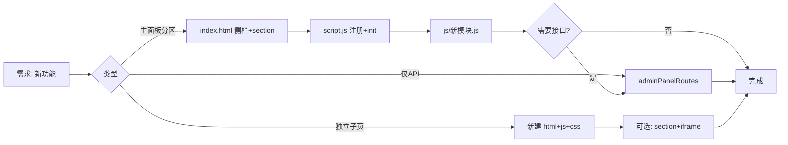

# AdminPanel 管理面板开发指南

**版本：** 1.0.0  
**最后更新：** 2026-02-17  
**适用版本：** VCPToolBox 6.4+

---

## 文档目的与前置阅读

本文档面向**管理面板能力扩展**：新增分区、新接口、新业务模块时的步骤、约定与证据定位。与 [FRONTEND_COMPONENTS.md](./FRONTEND_COMPONENTS.md) §2 的「架构与现状描述」互补，不重复已有细节。

**建议前置阅读：**
- [FRONTEND_COMPONENTS.md](./FRONTEND_COMPONENTS.md) §2 — AdminPanel 目录结构、模块职责、API 与认证
- [API_ROUTES.md](./API_ROUTES.md) — 鉴权与路由挂载
- [CONFIGURATION.md](./CONFIGURATION.md) — 若新功能涉及全局或插件配置

---

## 目录

1. [扩展场景与流程总览](#1-扩展场景与流程总览)
2. [新增主面板分区（Step-by-Step）](#2-新增主面板分区step-by-step)
3. [新增后端 API（admin_api）](#3-新增后端-apiadmin_api)
4. [约定与反模式](#4-约定与反模式)
5. [独立子页面与 iframe 分区](#5-独立子页面与-iframe-分区)
6. [本地调试与排错](#6-本地调试与排错)
7. [附录：分区与模块对照表](#7-附录分区与模块对照表)

---

## 1. 扩展场景与流程总览

三种常见扩展方式及涉及文件：

| 场景 | 说明 | 主要涉及文件 |
|------|------|--------------|
| **新增主面板内分区** | 侧栏一项 + 一个 section + 一个 JS 模块 + 可选后端 API | `AdminPanel/index.html`、`AdminPanel/script.js`、`AdminPanel/js/*.js`、`routes/adminPanelRoutes.js` |
| **仅新增后端 API** | 现有页面需要新数据或新操作 | `routes/adminPanelRoutes.js`，前端用 `apiFetch('/admin_api/...')` 调用 |
| **新增独立子页面** | 复杂多步骤 UI，独立 HTML/JS/CSS，可嵌入主面板 iframe | `AdminPanel/*.html`、`AdminPanel/*.js`、`AdminPanel/*.css`，可选在 `index.html` 增加 section + iframe |

流程概览（新增分区时）：

---

## 2. 新增主面板分区（Step-by-Step）

按当前实现，新增一个「主面板内」分区需按顺序改以下位置。

### 2.1 步骤表

| 步骤 | 操作 | 文件与证据 |
|------|------|------------|
| 1 | 侧栏增加导航项 | [AdminPanel/index.html](AdminPanel/index.html)：在 `<nav id="plugin-nav"><ul>` 内增加 `<li><a href="#" data-target="xxx">...</a></li>`。`data-target` 与 section id 关系为 `id="{data-target}-section"`。参考该 `<ul>` 内现有导航项（如 dashboard、base-config、daily-notes-manager 等）的写法。 |
| 2 | 主内容区增加 section | 同上文件：在 `<main class="content">` 内增加 `<section id="xxx-section" class="config-section">`，可内嵌 iframe（`data-src="xxx.html"`）或内联 HTML。参考现有 section（如 `dashboard-section`、`daily-notes-manager-section`、`image-cache-editor-section`、`vcptavern-editor-section`）的写法。 |
| 3 | 新建前端模块并导出 init | [AdminPanel/js/](AdminPanel/js/) 下新增 `xxx.js`，导出 `initializeXxx()`，内部使用 `apiFetch('/admin_api/...')`、`showMessage` 等（从 `utils.js` 引入）。参考 [AdminPanel/js/schedule-manager.js](AdminPanel/js/schedule-manager.js) 等现有模块。 |
| 4 | 入口注册与路由分发 | [AdminPanel/script.js](AdminPanel/script.js)：在顶部增加 `import { initializeXxx } from './js/xxx.js';`；在 `navigateTo()` 的 `switch (sectionIdToActivate)` 中增加 `case 'xxx-section': initializeXxx(); break;`。参考文件顶部的 import 块与 `navigateTo()` 内的 switch 分支。 |
| 5 | 如需新接口则在后端增加路由 | [routes/adminPanelRoutes.js](routes/adminPanelRoutes.js)：在 `adminApiRouter` 上 `adminApiRouter.get/post('/path', ...)`。挂载前缀已为 `/admin_api`（[server.js](server.js) 中 `initialize()` 内的 `app.use('/admin_api', adminPanelRoutes)`），无需在 handler 内再写鉴权。 |

### 2.2 命名与 DOM 约定

- **侧栏**：`data-target="xxx"`（如 `schedule-manager`）。
- **Section**：`id="xxx-section"`（即 `data-target` + `-section`）。  
  📁 [AdminPanel/script.js](AdminPanel/script.js) 中 `navigateTo()` 内：`const sectionIdToActivate = \`${dataTarget}-section\`;`
- **懒加载 iframe**：section 内写 `<iframe data-src="子页面.html" ...>`，进入分区时 script.js 会赋 `iframe.src = iframe.dataset.src`，离开时置为 `about:blank`。  
  📁 [AdminPanel/script.js](AdminPanel/script.js) 中 `navigateTo()` 内对 `.config-section` 的 `forEach` 里（进入时赋 `iframe.src`，离开时赋 `about:blank`）。

### 2.3 内联内容 vs iframe

- **简单表单/列表**：在 section 内直接写 HTML，由对应 `js/xxx.js` 的 `initializeXxx()` 绑定事件与拉取数据。例如日程管理、语义组编辑器。
- **复杂编辑、多 tab、大量脚本**：使用独立子页面（如 `image_cache_editor.html`、`tool_list_editor.html`），在主面板用 section + iframe + `data-src` 嵌入。见 [§5](#5-独立子页面与-iframe-分区)。

---

## 3. 新增后端 API（admin_api）

### 3.1 路由定义与挂载

- 所有管理端 API 均在 [routes/adminPanelRoutes.js](routes/adminPanelRoutes.js) 的 `adminApiRouter` 上定义。
- 挂载点：📁 [server.js](server.js) 中 `initialize()` 内的 `app.use('/admin_api', adminPanelRoutes)`。因此新路由路径为 `/admin_api/你定义的路径`。

### 3.2 鉴权

- 鉴权由 [server.js](server.js) 的 `adminAuth` 中间件统一处理（该函数体内）：`/admin_api` 与 `/AdminPanel` 请求在未认证时返回 401 或重定向登录。
- 新 handler **无需**在内部再写鉴权，但必须做**参数校验与合理错误码**（400/403/404/500 等）。约定见 [routes/AGENTS.md](routes/AGENTS.md)。

### 3.3 请求/响应风格

- 与现有接口一致，便于前端 [AdminPanel/js/utils.js](AdminPanel/js/utils.js) 的 `apiFetch` 统一处理：
  - 成功：`{ success: true, data: ... }`
  - 错误：`{ success: false, error: '...', details: '...' }`（可选）
- 401：前端 `apiFetch` 会跳转登录页。📁 [AdminPanel/js/utils.js](AdminPanel/js/utils.js) 中 `apiFetch()` 内对 `response.status === 401` 的处理分支。

### 3.4 子路由挂载

- 若有独立子域（如论坛），可在 server 层挂载到 `/admin_api/xxx`。例如论坛：📁 [server.js](server.js) 中 `initialize()` 内的 `app.use('/admin_api/forum', forumApiRoutes)`。新子路由只需在 server 增加一行并在本文档或 API_ROUTES 中说明即可。

---

## 4. 约定与反模式

### 4.1 前端

- **请求与提示**：统一使用 `apiFetch`、`showMessage`（[AdminPanel/js/utils.js](AdminPanel/js/utils.js)），不要裸 `fetch` 以免漏掉 401 跳转与 loading。
- **主题**：使用 CSS 变量（[AdminPanel/style.css](AdminPanel/style.css)），新增样式保持 `var(--primary-color)` 等机制，以支持亮/暗主题。
- **构建**：面板为静态托管，不引入前端打包流水线；新增资源直接放在 `AdminPanel/` 下。
- **协议**：接口字段变更时先改后端再改前端，避免前后端字段错位；敏感信息不写进前端脚本或静态资源。

### 4.2 后端

- **路径与参数**：做规范化与校验，禁止未校验的写文件/执行命令；错误响应格式与现有接口一致。详见 [routes/AGENTS.md](routes/AGENTS.md)。

### 4.3 反模式（勿做）

- 不要假设存在 webpack/vite 等构建步骤。
- 不要在后端未同步的情况下单独改前端接口字段。
- 不要把密钥或敏感值写入 `AdminPanel/` 下的静态文件。

---

## 5. 独立子页面与 iframe 分区

### 5.1 独立子页面

- 独立页面（如 [AdminPanel/vcptavern_editor.html](AdminPanel/vcptavern_editor.html)、[AdminPanel/tool_list_editor.html](AdminPanel/tool_list_editor.html)、[AdminPanel/image_cache_editor.html](AdminPanel/image_cache_editor.html)）适合复杂、多步骤 UI，可单独打开或通过主面板 iframe 嵌入。
- 若嵌入主面板：在 [AdminPanel/index.html](AdminPanel/index.html) 中增加一个 section，内嵌 `<iframe data-src="子页面.html" ...>`，无需在 `script.js` 的 switch 里为该 section 调用 init（iframe 内页面自包含）。若需在切换时做清理，可参考 script.js 中 `navigateTo()` 内对 `.config-section` 的 forEach（iframe 的懒加载与卸载逻辑）。

### 5.2 何时用独立页 vs 内联 section

- **内联 section**：简单表单、列表、单一功能块（如日程列表、RAG 调参表单、Agent Dream 梦境管理 [dream-manager.js](../AdminPanel/js/dream-manager.js)）。
- **独立页 + iframe**：复杂编辑、多 tab、大量脚本或需独立路由的页面。

---

## 6. 本地调试与排错

- **运行**：`node server.js`，浏览器访问 `http://localhost:5890/AdminPanel`（端口以 config 为准）。鉴权通过后即可调试。
- **登录与 401**：登录页 [AdminPanel/login.html](AdminPanel/login.html)；验证接口 `/admin_api/check-auth`。401 时前端会跳转登录；Cookie/同源策略详见 [FRONTEND_COMPONENTS.md](./FRONTEND_COMPONENTS.md) §2.6。
- **控制台与网络**：使用浏览器 DevTools 查看 `apiFetch` 请求与响应，便于排查接口契约与状态码。

---

## 7. 附录：分区与模块对照表

便于扩展时参考命名与结构。以下为当前主面板分区（不含插件动态生成的项）。

| data-target | section id | 前端模块（script.js 中初始化） | 主要 API（示例） |
|-------------|------------|--------------------------------|------------------|
| dashboard | dashboard-section | dashboard.js | /admin_api/system-monitor/*, /admin_api/server-log, /admin_api/user-auth-code, /admin_api/weather |
| base-config | base-config-section | （内联在 script.js） | /admin_api/config/main |
| daily-notes-manager | daily-notes-manager-section | notes-manager.js | （日记与 RAG 相关接口） |
| vcp-forum | vcp-forum-section | forum.js | /admin_api/forum/* |
| image-cache-editor | image-cache-editor-section | （iframe） | /admin_api/image-cache, /admin_api/multimodal-cache 等 |
| semantic-groups-editor | semantic-groups-editor-section | semantic-groups-editor.js | /admin_api/semantic-groups |
| vcptavern-editor | vcptavern-editor-section | （iframe） | （由子页面自管） |
| agent-files-editor | agent-files-editor-section | agent-manager.js | /admin_api/agents/* |
| agent-assistant-config | agent-assistant-config-section | agent-assistant-config.js | /admin_api/agent-assistant/config |
| tvs-files-editor | tvs-files-editor-section | tvs-editor.js | /admin_api/tvsvars/* |
| tool-list-editor | tool-list-editor-section | （iframe） | /admin_api/tool-list-editor/* |
| preprocessor-order-manager | preprocessor-order-manager-section | preprocessor-manager.js | /admin_api/preprocessors/order |
| thinking-chains-editor | thinking-chains-editor-section | thinking-chains-editor.js | /admin_api/thinking-chains |
| schedule-manager | schedule-manager-section | schedule-manager.js | /admin_api/schedules |
| rag-tuning | rag-tuning-section | rag-tuning.js | /admin_api/rag-params, /admin_api/rag-tags 等 |
| server-log-viewer | server-log-viewer-section | log-viewer.js | /admin_api/server-log |
| placeholder-viewer | placeholder-viewer-section | placeholder-viewer.js | /admin_api/placeholders, /admin_api/placeholders/detail?type=&name= |
| dream-manager | dream-manager-section | dream-manager.js（Agent Dream 梦境管理） | /admin_api/dream-logs, /admin_api/dream-logs/:filename, /admin_api/dream-logs/:filename/operations/:opId |

**文档维护**：扩展新分区或新 API 后，建议更新上表及 [FRONTEND_COMPONENTS.md](./FRONTEND_COMPONENTS.md) 中的目录/模块列表。

---

**文档维护者：** VCPToolBox 开发团队  
**最后更新：** 2026-02-17
