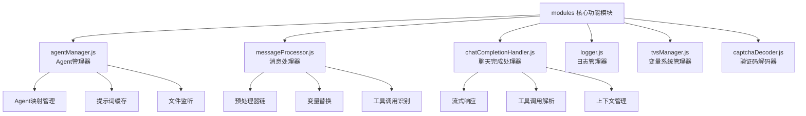
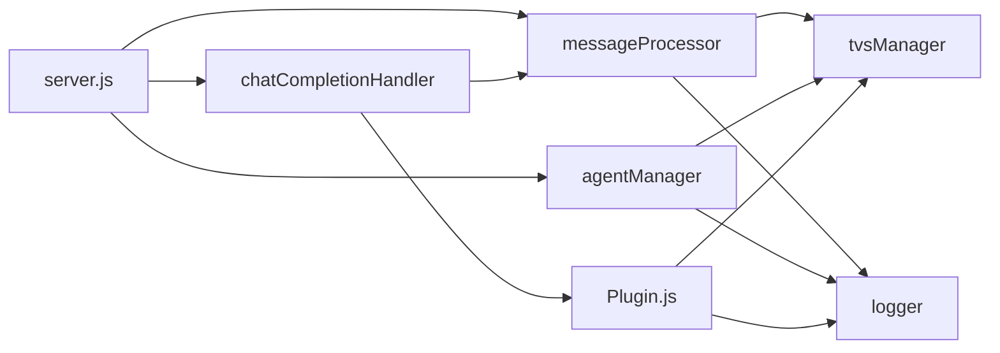

[根目录](../CLAUDE.md) > **modules** > **核心功能模块**

# modules 核心功能模块

## 模块职责

modules 目录包含 VCPToolBox 的核心功能模块，负责系统的核心业务逻辑处理，包括Agent管理、消息处理、聊天完成处理、日志管理、变量系统和验证码解码等关键功能。

## 模块概览



## 核心模块详解

### 1. agentManager.js - Agent管理器

**职责**: 管理所有AI Agent的配置、加载和生命周期

#### 核心功能
- **Agent映射**: 维护Agent名称到文件的映射关系
- **配置缓存**: 缓存Agent配置文件内容
- **文件监听**: 监听Agent配置文件变化
- **热重载**: 支持Agent配置的动态更新

#### 对外接口
```javascript
class AgentManager {
  async loadAgent(name)           // 加载Agent配置
  async reloadAgent(name)         // 重新加载Agent
  getAllAgents()                  // 获取所有Agent列表
  getAgent(name)                  // 获取特定Agent配置
  startFileWatcher()              // 启动文件监听
}
```

#### 数据结构
- **Agent映射**: `{ name: { file: 'path', config: {...} } }`
- **缓存策略**: 内存缓存 + 文件监听
- **错误处理**: 配置文件解析错误恢复

### 2. messageProcessor.js - 消息处理器

**职责**: 处理用户消息的预处理、变量替换和工具调用识别

#### 处理流水线
1. **预处理**: 调用消息预处理器插件
2. **变量替换**: 执行{{Var*}}、{{Tar*}}、{{Sar*}}变量替换
3. **工具识别**: 识别VCP工具调用协议
4. **格式化**: 为AI模型格式化消息

#### 核心算法
```javascript
async processMessage(message, context) {
  // 1. 预处理器链执行
  let processedMessage = await this.runPreprocessors(message);

  // 2. 变量系统处理
  processedMessage = await this.replaceVariables(processedMessage, context);

  // 3. 工具调用识别
  const toolCalls = this.extractToolCalls(processedMessage);

  // 4. 返回处理结果
  return {
    message: processedMessage,
    toolCalls: toolCalls,
    metadata: { ... }
  };
}
```

### 3. chatCompletionHandler.js - 聊天完成处理器

**职责**: 处理AI聊天完成的核心逻辑，包括流式响应、工具调用执行和上下文管理

#### 主要功能模块
- **流式响应**: 支持SSE格式的流式聊天响应
- **工具调用**: 解析并执行VCP工具调用协议
- **多模态支持**: 处理文本、图像、音频等多种输入
- **上下文管理**: 维护对话上下文和历史记录

#### 关键方法
```javascript
class ChatCompletionHandler {
  async handleChatCompletion(req, res)
  async processStreamResponse(stream, res)
  async executeToolCall(toolCall, context)
  async handleMultimodalContent(content)
  manageConversationContext(conversationId)
}
```

### 4. logger.js - 日志管理器

**职责**: 统一的日志记录和管理系统

#### 日志级别
- **ERROR**: 错误信息，需要立即关注
- **WARN**: 警告信息，潜在问题
- **INFO**: 信息记录，一般操作日志
- **DEBUG**: 调试信息，开发阶段使用

#### 日志输出
- **控制台输出**: 带颜色编码的控制台日志
- **文件输出**: 按日期轮转的日志文件
- **WebSocket输出**: 实时日志推送到管理面板
- **结构化日志**: JSON格式的结构化日志

### 5. tvsManager.js - 变量系统管理器

**职责**: 管理VCP的变量系统，包括变量定义、解析和缓存

#### 变量类型
- **{{Var*}}**: 全局文本替换变量
- **{{Tar*}}**: 最高优先级变量，支持嵌套
- **{{Sar*}}**: 模型特定条件变量
- **{{VCP*}}**: 系统提供的插件描述和数据

#### 解析优先级
1. **{{Tar*}}**: 最高优先级，支持递归解析
2. **{{Sar*}}**: 模型条件变量
3. **{{VCP*}}**: 系统变量
4. **{{Var*}}**: 全局变量

### 6. captchaDecoder.js - 验证码解码器

**职责**: 处理图像验证码的识别和解码

#### 支持类型
- **数字验证码**: 0-9数字组合
- **字母验证码**: 大小写字母组合
- **混合验证码**: 数字字母混合
- **中文验证码**: 中文汉字识别

#### 技术实现
- **OCR识别**: 使用Tesseract OCR引擎
- **预处理**: 图像降噪、二值化、字符分割
- **模型优化**: 针对验证码的优化识别模型

## 模块间依赖关系



## 性能优化策略

### 缓存机制
- **Agent配置缓存**: 减少文件I/O操作
- **变量解析缓存**: 缓存变量替换结果
- **工具调用缓存**: 缓存常用工具调用结果

### 异步处理
- **消息预处理**: 异步执行预处理器链
- **工具调用**: 非阻塞的工具执行
- **日志输出**: 异步批量日志写入

### 内存管理
- **LRU缓存**: 限制缓存大小防止内存溢出
- **定期清理**: 清理过期的缓存和日志
- **流式处理**: 大文件采用流式处理减少内存占用

## 错误处理与恢复

### 容错机制
- **配置文件错误**: 自动回退到默认配置
- **插件执行失败**: 优雅降级处理
- **网络连接异常**: 自动重试机制
- **内存不足**: 自动清理缓存

### 监控告警
- **错误阈值监控**: 错误率超过阈值自动告警
- **性能指标监控**: 响应时间、吞吐量监控
- **资源使用监控**: CPU、内存、磁盘使用监控

## 相关文件清单

```
modules/
├── agentManager.js              # Agent管理器
├── messageProcessor.js          # 消息处理器
├── chatCompletionHandler.js     # 聊天完成处理器
├── logger.js                    # 日志管理器
├── tvsManager.js                # 变量系统管理器
├── captchaDecoder.js            # 验证码解码器
├── cache/                       # 缓存目录
│   ├── agent-cache.json       # Agent配置缓存
│   ├── variable-cache.json    # 变量解析缓存
│   └── tool-cache.json        # 工具调用缓存
└── README.md                   # 模块说明文档
```

## 变更记录 (Changelog)

### 2025-10-30 20:05:05 - AI上下文初始化
- 创建modules核心功能模块文档
- 添加模块依赖关系图
- 完善性能优化和错误处理说明